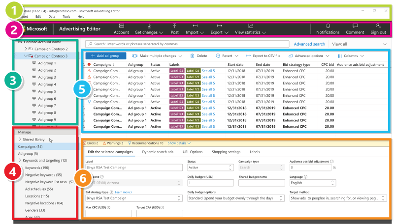

# Understand the Microsoft Advertising Editor user interface

We’ve updated Microsoft Advertising Editor's visual experience to help you stay organized and on top of your accounts. Aside from looks, we updated the names of some sections on our interface. Be sure to reacquaint yourself with their placement and descriptions below:

## 1. Application menu
In Windows, the application menu is at the top of the Microsoft Advertising Editor interface. In Mac OS, the application menu is at the very top of your screen.
## 2. Toolbar
The toolbar includes a set of commands that enable you to upload (post) and download (get) data, import, research keywords, and more.
## 3. Tree view
The tree view in the left panel is where you select your accounts, campaigns, or ad groups that you want to work with. Details about the item selected in the tree view are displayed in the data view.
## 4. Type list
The type list in the left panel contains items from your selected account, campaign, or ad group. Like the tree view items, details about the item selected from the type list are displayed in the data view.
## 5. Data view
The data view is a workspace for viewing and editing campaign data. You can choose whether to view detailed information about campaigns, ad groups, ads, or keywords here by making a selection in the tree view or type list. For more information, see [Customize the data view](./hlp_BAE_PROC_CustomizeManagerPane.md).
## 6. Edit panel
The edit panel is where you bulk-edit information in campaigns, ad groups, ads, and keywords. When you select more than one item in the data view the Editor pane opens automatically.

For more information, see a
<bing_video id="video_bae">video overview of Microsoft Advertising Editor</bing_video>
.

