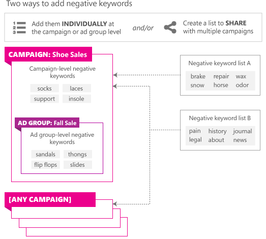

# Learn about using negative keywords to get to the right customers

You can use negative keywords or keyword phrases to help prevent your ad from being displayed when a search query or other input contains your keywords but is irrelevant to your landing page content in Microsoft Advertising Editor.

For step-by-step instructions on adding negative keywords, see [this article](./hlp_BAE_PROC_AddNegativeKeywords.md).

For example, if your ad sells shoes and you have specified *tennis shoes* as a keyword, you can prevent your ad from being displayed in response to a search on **tennis courts** by using **courts** as a negative keyword.

You can add negative keywords to:

- **Campaigns.** Campaign-level keywords apply to all keywords in a campaign. Be aware that negative keywords assigned at the campaign level will also be applied at the ad group level (in addition to any ad group-specific negative keywords). Each campaign can contain thousands of negative keywords.
- **Ad groups.** These negative keywords will be applied to the ad group in addition to any negative keywords set up at the campaign level. Each ad group can contain thousands of negative keywords.
- **A negative keyword list.** With a shared negative keyword list, you can apply entire lists of negative keywords to multiple campaigns and make changes across campaigns by editing a single list.

## Will my ad show up or not?

To answer this, think of the negative keyword process as **two steps**:

## Step 1: Match keywords to the search query

If you bid on a keyword and you have a match (broad, phrase or exact) with the customer's search query or other input, it means your ads are eligible to be displayed and you move to step 2. If there is not a match, stop here. Your ads are not eligible to be displayed.

## Step 2: Filter using negative keywords

Microsoft Advertising now takes a look at the search query or other input and compares it to your negative keywords. If there's a match (phrase or exact - depending on what you set up for your negative keywords), that particular keyword is filtered out and your ad will not be eligible for display.

The following diagram is an example of what happens in step 2. On the left are several queries that have moved through step 1, so are eligible to move to step 2. Now we filter those queries through your negative keyword list. In this case we use just one negative keyword entry: *womens shoes*. The table shows the result of setting that keyword to either a phrase match or an exact match. Using a phrase match for your negative keyword has a more significant impact on your potential ad displays, with only two of the original four queries being eligible to trigger a display.

## Example

**Bidded keyword (broad match)** : wide shoes

**Negative keyword** : womens shoes

|Search query|Negative EXACT|Negative PHRASE|
|---|---|---|
|mens wide shoes|||
|womens wide shoes|||
|womens shoes|||
|wide womens shoes|||

 = Ad eligible to display

 = Ad will not display

For more information, watch
<bing_video id="video_gs5_optimize">our video about negative keywords</bing_video>
.

> [!NOTE]
> You can import negative keywords from an Excel file or a .csv file.
> Microsoft Advertising does not support keyword-level negative keywords. If you're using third-party or custom applications to add negative keywords, those applications might allow you to enter keyword-level negative keywords. However, Microsoft Advertising will not use them when filtering queries. It is therefore important that you avoid using keyword-level negative keywords and instead add those negative keywords to the ad group or campaign level.
> You cannot use the following characters and character combinations in your negative keywords: *,* (comma), *\n*, *\t*, *\r*.

