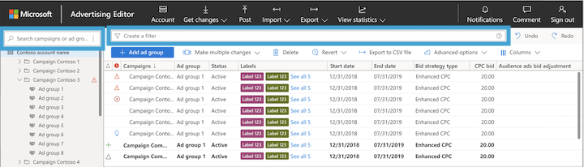

# About advanced search and filtering

[!INCLUDE [ComingSoon](./includes/ComingSoon.md)]
Microsoft Advertising Editor has combined both simple and advanced search into a tree view on the left pane and a search box at the center, directly under the toolbar. The tree view allows you to refine your search to ad groups, campaigns, or both and the search box allows you to apply filters to search an account for items that match the criteria you specify.

## Filter ad groups and campaigns in the tree view

You can filter your search of ad groups and campaigns in the box at the top of the tree view on the left pane. This is especially helpful when there are several campaigns and ad groups to navigate through.

In the **Search campaigns** box on the left pane, select the three vertical dots on the right side of the box. This will generate a dropdown menu from which you can choose **Search on campaign and ad group name**, **Search on campaign name**, or **Search on ad group name**. Select whichever option would best help narrow your search and type your search phrase into the box. All relevant campaign and/or ad group names will be shown, whether they are active or paused.

## Apply additional filters to narrow your search

Upon selecting the search box, filter suggestions will automatically appear in a dropdown menu. You can filter by: Campaign type, bid strategy, ad group status, items with errors, warning type, recommendation type, and many more. Up to 20 filter types can be used at one time.

You can even apply multiple filters to get very specific results. Let’s say you want to find all search campaigns that use a manual CPC bid strategy.

1. In the tree view, choose the campaign you’d like to search.
1. In the search box that says **Create a filter**, select **Campaign type**.
1. In the dropdown menu, select **Search** and then select **Apply**.
1. In the search box next to the filter you just created, select **Bid strategy type**.
1. In the dropdown menu, select **Manual CPC **and then select **Apply**.

Here are a few ways you can use filters for your searches:

## How to apply “contains” filters
Let’s say you want to find all the ad groups that contain a certain word.

1. In the search box that says ** Create a filter**, select **Ad group**.
1. In the dropdown menu, select **contains** and enter the word in the box.
1. Select **Apply**.

## How to apply "does not contain any of" filters
Let’s say you want to find expanded text ads that don’t contain a certain word in the headline.

1. In the search box that says **Create a filter**, select **Title Part 1**.
1. In the dropdown menu, select **does not contain** and enter the word in the box.
1. Select **Apply**.

## Save a search so you can use it again

After entering a search, select the save icon and enter a name for your saved search. To use your saved search, select the search box and select the name of your search. While you can save filters as often as you'd like, we'll always include the 10 most recent saved searches in the dropdown menu on the search bar.

