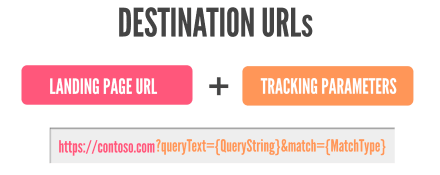

# What are Upgraded URLs and how do I upgrade?

If you have set up tracking in Microsoft Advertising Editor by adding URL parameters to your destination URLs, you will be interested in Upgraded URLs.

Upgraded URLs separate the landing page URL from the tracking or URL parameters so if you want to edit your URL parameters, your ad doesn't have to go through another editorial review. It also allows you to define a separate mobile landing page URL if you have a website that is optimized for smaller devices.

     **To replay animation, in your browser, click Refresh or Reload.**

The 4 new fields added with Upgraded URLs are **final URL**, **mobile URL**, **tracking template**, and **custom parameters**. A tracking template can be added to an account, campaign, ad group, ad, keyword and Sitelink Extension. When your ad is served the lowest level tracking template will be appended to your landing page URL.

## Benefits of Upgraded URLs

- **More efficient tracking management:**  Manage and update tracking information of multiple URLs with a single shared tracking template. Turn hundreds or thousands of URL edits into one quick change.
- **Less down time; more conversions and clicks:**  Updates to tracking templates don't require an editorial review. This means your ads keep on running, so you don’t lose out on potential conversions.
- **Additional tracking insights:**  Ability to add both URL parameters and custom parameters to your tracking template   to gain additional insights about the source of your ad clicks.

## How to upgrade

If you are using Microsoft Advertising Editor 10.9.1 or later, there is already built in support for Upgraded URLs.    Microsoft Advertising Editor makes it easy to look at all your URLs at once, export and edit in Microsoft Excel, and then import changes.

1. Select **Export** and then **Export whole account**.
1. In the file, make sure you can see the **Destination URL**, **Final URL**, **Tracking Template** columns. If you don't see the columns, you can add the columns to the file.
1. In the **Destination URL** column, copy the landing page URL and paste them into the **Final URL** column.
1. In the **Destination URL** column, copy the URL parameters and paste them into the **Tracking template** column. You need to add ?{lpurl} to the beginning of each tracking template.
1. Optional: Enter the mobile URL in the **Mobile Final URL** column.
1. Optional: Enter the custom parameters in the **Custom parameter** column.
1. Clear the destination URL column and save the file.
1. In Microsoft Advertising Editor, select **Import** and then **Import from file**.
1. Verify that the Upgraded URL columns are correctly mapped to the Microsoft Advertising Editor fields.
1. Select **Post** to save Upgraded URLs to Microsoft Advertising.

> [!IMPORTANT]
> If you use a tool provider or agency to manage your ads, check with them to take advantage of any upgrade support and documentation they might offer specific to their platform and service.

