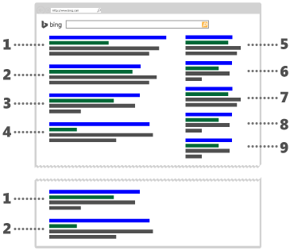

# What is "ad position"?

**Ad position** is the position of your ad on a Bing, AOL, or Yahoo search results page or content-based webpage. It's determined by how your ad ranks against competing ads. Rank is determined by many factors, including:

- The amount you bid for your keyword.
- Your ad's relevance.
- Your ad's performance, or click-through rate (CTR), on webpages. To get an idea of how your ad is performing, run an ad performance report and check its CTR.

Since webpages have a limited number of spaces to show ads, we auction those spaces. You are bidding against other advertisers to get your ads in those spaces. So, if you sell shoes and bid on the keyword "shoe," you’ll have to beat the bids of the other shoe sellers who are also bidding on "shoe." If your bid is not high enough, you might not get the space you want, such as on the first page of search results.

For example, to appear at the top of the ad results on Bing.com in position 1, 2, 3, or 4, (also called the **mainline**), your ad must meet a minimum level of performance. (In some markets, the top two ads are repeated at the bottom of the web page at no additional cost). If the ad doesn't meet that minimum level, it appears on the right side of the web page (also called the **sidebar**). There's nothing wrong with appearing on the sidebar, but most advertisers strive to get one of those coveted mainline spots. For suggestions on how to improve your ad position, see [Quality score and campaign optimization FAQ](./hlp_BAE_CONC_OptimizingCampaigns.md). Note that not all webpages display ads in the same locations as the example given here.

You can run an account, campaign, ad group, ad, or keyword performance report and select the **Top vs. other** column to see performance differences (such as CPC and CTR) between mainline and sidebar ads. This can help you optimize your keyword bids to improve performance and increase your ROI.

> [!NOTE]
> Top vs. other position information is not available for dates prior to March 14, 2013.

