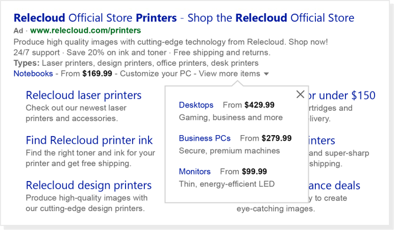

# Add Price Extensions to your ad

> [!IMPORTANT]
> Not everyone has this feature yet. If you don't, don't worry—it's coming soon!

Price Extensions are a pay-per-click extension that display your products or services, along with their corresponding prices, to searchers. Price Extensions will only show on ads listed at the very top of the results page. This allows searchers to see to exactly what they’re looking for when they’re looking for it. This helps to increase your clicks and drive potential customers straight to your converting experiences.

An account, campaign, or ad group can have up to 20 Price Extensions. Like any extension, Price Extensions are free to add to your ad and may not always show for every query. You only pay the standard ad headline cost-per-click for clicks you receive on Price Extensions.

> [!NOTE]
> All Price Extensions are subject to an editorial review to ensure that the listed prices match the price shown on your landing pages. [Learn more](https://go.microsoft.com/fwlink?LinkId=746651) about editorial reviews.

Here are the definitions for the different fields you need to fill in for your Price Extensions.

|Field|Definition|
|---|---|
|Language|The language you'll write your Price Extension text. The Price Qualifier (optional) and Unit (optional) will be automatically translated into this language.|
|Type|The category that best defines your Price Extension items and specifies the corresponding editorial checks which will be applied to them.|
|Currency|The currency symbol that will be displayed in the ad (for example, $ for USD).|
|Header|Similar to ad headline, the header introduces your products or services and appears as a clickable link that directs customers to your final URL. Your header can have up to 25 characters.|
|Description|Additional information about your products or services. Your description can have up to 25 characters. Please note, that you can include 3rd party retailers in your price extension by using the following text pattern: Product name. Product type. – 3rd party retailer name. Price.|
|Price Qualifier (optional)|Indicate prices for a given product or service, starting from a specific price and up to a maximum price. Please note, that you can choose any price value starting at zero. Negative values, however, are restricted.|
|Unit (optional)|Allows you to specify the service cost in terms of hour, day, week, etc.|
|Final URL|The landing page where customers will be taken after clicking your header. Prices on this page should accurately reflect the prices specified in the extension.|
|Mobile final URL|An optional landing page link that is only displayed on mobile devices. If no mobile final URL is provided, the default final URL will be used.|

**Availability**: All Bing markets, except China, Taiwan, and Hong Kong.

> [!IMPORTANT]
> All extension details must adhere to our [Price Extension policies](https://go.microsoft.com/fwlink?LinkId=746651).
> Each Price Extension must have a minimum of 3 items and a maximum of 8 items (Header, Description, Price qualifier, Price, Unit, Final URL, or Mobile final URL).

## How do I create a new Price Extension?
1. Click **Shared Library** in the left panel and make sure you're in the **Shared Price Extensions** view.
1. Click **Add Price Extension**.
1. In the **Edit the selected Price Extension** pane, select the **Language, Currency, Type,** and **Price qualifier**.
1. Select the **Start date** and **End date**.
1. (Optional) Add an **Ad schedule** for when you want the Price Extensions to appear by clicking **Edit** and filling out the details.
1. Select the **Time zone** you want the Price Extension to appear in.
1. Enter the details for **Header, Description, Price qualifier, Price, Unit, Final URL,** and **Mobile final URL** (optional). You must have a minimum of 3 items for each Price Extension.

## How do I associate an existing Price Extension to a campaign or ad group?
1. Select the campaign from the tree view in the left panel.
1. Select **Price Extensions** under **Ads and extensions** from the type list in the left panel.
1. In the data view, click **Add associations** and select **Add ad group Price Extension association** or **Add campaign Price Extension association**.
1. Select the ad group or campaign you want to add a Price Extension and click **Next**.
1. Select the Price Extension to use.
1. Click **OK**.

## How do I associate an existing Price Extension to an account?
1. Select the campaign from the tree view in the left panel.
1. In the data view, click **Add associations** and select **Add account Price Extension association**.
1. Select the Price Extension to use.
1. Click **OK**.

## How do I edit an existing Price Extension?
1. Select the campaign or ad group from the tree view in the left panel.
1. Select **Price Extensions** under **Ads and extensions** from the type list in the left panel.
1. In the data view, click the Price Extension you want to edit.
1. In the edit panel, edit the Price Extension details.

## How do I make multiple changes to Price Extensions?
1. Select the campaign from the tree view in the left panel you want to add Price Extensions to.
1. Select **Price Extensions** under **Ads and extensions** from the type list in the left panel.
1. Click **Make multiple changes** in the data view and select **Add/update multiple ad group Price Extensions** or **Add/update multiple campaign Price Extensions**.
1. In the **Add.update multiple changes dialog box, do one of the following:**
   - If the data you are going to add includes campaign names, select **My ad group/campaign Price Extensions data includes campaign names**.
   - If the data you are going to add does not include campaign names, in the **Select location** box, select the campaigns that you want to add the Price Extensions to.

1. If you want to use the suggested headings, click **Insert headings**. f you want to use your own headings, in the first row of the text box, type the heading of each column.
1. In the text box, either paste your Price Extensions data into the box using tabs as delimiters or type the data for one link per line, using tabs to move to the next column.
1. If you want to change the headings, click **Edit headings...** and select the desired headings in the dropdown boxes.
1. Click **Next**.
1. On the **Import completed** dialog box, after you review your changes, click **Close**.

 

