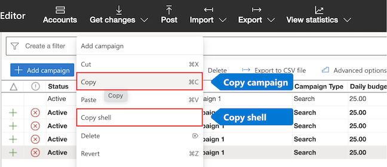

# Copy campaigns

When you want to create new campaigns that are similar to current campaigns or create several campaigns at once, you can save time by copying one or more campaigns. The copied campaigns can be pasted into any account while retaining their settings, ad groups, ads, and keywords. You can also opt to copy campaign shells, which include settings without ads or keywords, leaving you the opportunity to create new ones.

You can copy campaigns or campaign shells by following these steps:

1. In the tree view from the left pane, select the account that contains the campaign(s) you want to copy.
1. In the data view, select one or more campaigns you want to copy.
1. Select and hold (or right-click) the campaign(s).
1. Choose either **Copy** or **Copy shell** from the menu.

1. In the blank space underneath your campaigns, select and hold (or right-click) again > select **Paste** from the menu.
> 
> [!NOTE]
> To copy and paste between accounts, you’ll need to open up the Account manager:
> After copying either the campaign or campaign shell, select **Accounts** from the top menu. Open up the account you’d like to paste into. Then, in the blank space underneath your campaigns, select and hold (or right-click) > select **Paste** from the menu.

