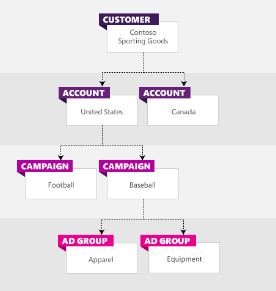

# How should I organize my accounts and campaigns?

Getting the most out of your advertising campaign means understanding how Microsoft Advertising is structured. Once you understand the structure, you can organize your accounts and campaigns in a way that makes sense for your business and in a way that gets your ads in front of the right people.

## How Microsoft Advertising is structured

Microsoft Advertising has four levels of organization: manager account, accounts, campaigns, and ad groups. These four levels and their related components need to be in place to run your online advertising campaign.

- A **Manager account**  contains one or more accounts. A manager account has a manager account number, which is associated with your business name and your address. At the manager account level, at least one person is designated as the Super Admin. Super Admins have administrative access to all accounts.
- **Accounts**  contain one or more campaigns and include information about currency, time zone, whether you want to pay in advance (prepay) or pay later (postpay), your form of payment (primary payment method), and the people who have access to each account (users).
- **Campaigns**  contain one or more ad groups, which share a campaign budget.
- **Ad groups**  contain one or more closely related ads and the keywords associated with those ads.

## Organizing your accounts and campaigns

When you sign up for Microsoft Advertising, you will be given a manager account ID and your first account will be created. You can create additional accounts at any time. Generally, one account is all you will need. However, you might want to set up separate accounts if you:
- Have more than one business
- Want to market your products in multiple countries and languages
- Are an agency managing accounts for other businesses

Here are some suggestions on organizing your account:

- A good place to look when you are organizing your ad groups is at the structure of your website, since it already reflects how you organize and sell your products.
- Are you a Google Ads customer? If so, the organization of your advertising campaign is essentially the same, except in Microsoft Advertising you can have multiple accounts under one manager account.

## Example: A manager account with multiple accounts
Let’s say you own a sporting goods store and want to start an online advertising campaign. Since you have businesses in both the US and Canada, you’ll set up a US account (with US dollars as your currency) and a Canadian account (with Canadian dollars as your currency). Having separate accounts let's you pay with different payment methods in  different currencies.

Creating online advertising campaigns is a lot like creating traditional advertising campaigns, you create campaigns around a particular product, set of products, or events. For your sporting goods store, you could have campaigns that are organized around specific sports (for example, football and baseball), and ad groups that are organized by product type. Here is an example of how the account structure could look for your sporting goods store.

 
<anchor id="Limits" />

## Limits for accounts, campaigns, and ad groups

Here are the limits on the number of items you can have at each level. This information is useful in organizing your advertising campaigns, particularly if you plan on  [importing from Google Ads](./hlp_BA_PROC_ImportCampaign.md).

 		    [!INCLUDE [EntityLimits](./includes/EntityLimits.md)]

