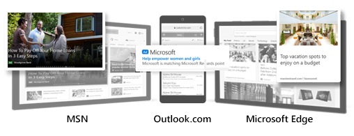

# About audience marketing and the Microsoft Audience Network

> [!NOTE]
> Audience campaigns are available for all advertisers in the US, open beta in the UK and CA, and closed beta in AU, NZ, FR, and DE.

While search engine marketing is focused on showing the best ad for a search query, audience marketing is all about showing the best ad for an individual person. With audience marketing, you can reach people in the right place at the right moment by showing them your ad wherever they are, on whatever device.

## Meet the Microsoft Audience Network

The Microsoft Audience Network uses Microsoft's deep understanding of customers and proprietary artificial intelligence (AI) to place Microsoft Audience Ads on Microsoft properties and other premium platforms. Microsoft Audience Ads are high-quality, cross-device, native placements in sites like MSN, Outlook.com, Microsoft Edge, and many more.

## Microsoft Audience Ads

Microsoft Audience Ads are responsive, automatically adjusting to various sizes and shapes to naturally blend in with the fundamental experience of the page they are placed in. The Microsoft Audience Network supports two ad formats: image-based ads and feed-based ads.

Great images grab people's attention. And you can use any existing image assets you're already using on the Google Display Network or the Facebook Audience Network. Here's an example of what an image-based ad could look like:

You can also use [dynamic remarketing lists](./hlp_BA_CONC_Audiences_ProductAudience.md) to remarket to users based on the specific product IDs that they have interacted with and promote these ads to them using the same product IDs. Here's an example of what product-feed-based ad could look like:

## How does it work?

Audience marketing on the Microsoft Audience Network is driven by the Microsoft Graph. The Microsoft Graph is the technology that integrates Microsoft services and products such as Windows, Office, Outlook.com, and Azure.

Our AI takes the wealth of Microsoft Graph data and learns about individual consumers: What they're searching for, what they read on the web, what they purchase, what information they've shared on LinkedIn and other sites, and countless more variables. Then it matches individual consumers with Microsoft Audience Ads that are just right for them, and that appear right where we knew they were going to look.

## Let's get started!

[Learn how to create an audience campaign](./hlp_BA_PROC_CreateAudienceCampaign.md)

