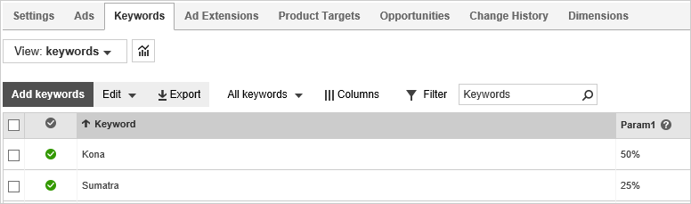

# Automatically customize your ads with dynamic text parameters

You can automatically customize what shows in your ad based on what people search for by inserting dynamic text parameters {keyword}, {param1}, {param2}, and {param3} into different parts of the ad. This means your ads are updated on the fly to match what people are looking for. By making your ads more relevant,      dynamic text can help improve your ads' click-through rate (CTR) and conversion rate, quality score, and ad placement on the page.

Here are some things you can do with dynamic text and the steps to do each one:

## Insert keywords into your ads
The above example shows your keyword being inserted into an ad. Here’s how to do this:

1. Click **Campaigns** along the top of the page, then click the **Ads** tab (or from the main menu on the left, click **All campaigns** > **Campaigns**. Then, click **Ads &amp; extensions**).
1. Click **Create ad**.
1. Below **Title Part 1**, **Title Part 2**, or **Ad text**, click **dynamic text**, and then select **Placeholder {KeyWord}**. You can add **{KeyWord}** to multiple places in your ad.
1. Each {keyword} dynamic text parameter must include default text — as in "{keyword:DefaultTextGoesHere}". [See below for examples and more information about default text](#DefaultText)
1. Click **Save**.

> [!NOTE]
> You can [control how the keyword is capitalized](./hlp_BA_CONC_AboutParametersKeyWord.md) when it appears in your ad.

## Insert custom text, based on specific keywords, into your ads
In addition to dynamically inserting the keyword (the first example), you can also add some custom text for each keyword.

Say you have different discounts for different products:
|Product|Discount|Desired ad|
|---|---|---|
|Kona|50%|Our Kona coffee is 50% off!|
|Sumatra|25%|Our Sumatra coffee is 25% off!|

You can display the desired text with just a single ad. To do this, you use the parameters: {param1}, {param2} or {param3}. Values for these parameters get assigned to specific keywords.

Combining this with the {keyword} variable, you would create your ad text like this:

"**Our {keyword} coffee is {param1} off!**"

Here is how to do this:
1. Click **Campaigns** along the top of the page, then click the **Ads** tab.
1. Click **Create ad**.
1. Below the **Title Part 1**, **Title Part 2**, or **Ad text**, click **dynamic text**, and then select **Placeholder {param1}**, **Placeholder {param2}**, and **Placeholder {param3}**. You can add them to multiple places in your ad.
1. Add default text to the {param1}, {param2}, and {param3} dynamic text parameter. For example, {param1:default} [Learn about default text](#DefaultText)
1. Click **Save**.
1. Click the **Keywords** tab.
1. Click **Columns** and then **Modify columns** to ensure that Param1, Param2, and/or Param3 are selected to display.
1. Find the keyword where you want to add the dynamic text, then hover over the empty space in the appropriate **Param** column. A small pen icon will appear.
1. Click the pen icon and enter the text for that parameter. Repeat for each keyword and each parameter as appropriate.
1. Click **Save**.

 
<anchor id="DefaultText" />

## One more thing: The importance of using default text

When implementing dynamic text in your ad copy you should provide a default string —for example, {Param1:default} — that the system will use if Param1 for a keyword is null or empty, or if including the Param1 substitution value will cause the expanded string to exceed the element’s limit; otherwise the ad will not serve. In some cases, if your default text is deemed more relevant than your substituted text the system can use that instead.

When you use any dynamic text, such as *{param1}* or *{keyword}*, make sure you don't end up with ads that exceed the character limits:

- Ad title: A total of 90 characters combined (excluding separators) across all 3 parts
- Ad text: A total of 180 characters combined across both parts

Ads with dynamic text longer than the character limits won't display. Using default text in your ad title (or the ad text) can keep your ad text within the allowable character limit.

You define defaults for dynamic text by typing a colon and the default text after the placeholder name: *{param1:default}*. The default text appears in your ad whenever the ad would otherwise exceed character limits.

If **any** default value appears in your ads in this way, then default values for **all** parameters are displayed in the ad.  The ad will not use default text for one parameter while using substituted text for another.

## Default text example

Let's say you create an ad that includes dynamic text in the ad title and ad text:

|<c_data><![CDATA[<u>All the Best {keyword:Coffee}</u>]]></c_data> We have the very best selection! Buy {keyword:coffee} starting at {param1:$7} per pound.                 <c_data><![CDATA[www.fourthcoffee.com]]></c_data>|
|---|

On the **Keywords** tab, you enter the following variables for these keywords:

|Keyword|{param1}|
|---|---|
|Sumatra|$9|
|Decaffeinated Arabica|$15|

 
If someone searches for "sumatra" and your keyword bid is high enough, your ads are displayed like this:

|<c_data><![CDATA[<u>All the Best Sumatra</u>]]></c_data>                 We have the very best selection! Buy Sumatra starting at $9 per pound.                 <c_data><![CDATA[www.fourthcoffee.com]]></c_data>|
|---|

However, for a search on "decaffeinated arabica," your ad title part would exceed 30 characters, and your ad text would exceed 71 characters. But if you have set up default text, it would display as:

|<c_data><![CDATA[<u>All the Best Coffee</u>]]></c_data> We have the very best selection! Buy coffee starting at $7 per pound.                 <c_data><![CDATA[www.fourthcoffee.com]]></c_data>|
|---|

Note that the {param1} default value was used also. Remember, if default text is used anywhere in the ad (here it was used for {keyword}), it will be used for all parameters in the ad. Thus it was used for {param1} also.

> [!NOTE]
> Want expert advice on your ads? [Schedule a no-cost session with a personal Microsoft Advertising consultant](https://go.microsoft.com/fwlink?LinkId=837456)

