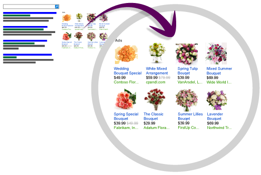

# What are product ads?

[!INCLUDE [MSCampaignsandProductAdsAvailableinCountries](./includes/MSCampaignsandProductAdsAvailableinCountries.md)]
Microsoft Advertising provides multiple [ad types](./hlp_BA_CONC_AdOptions.md). This article describes product ads.

Products ads include custom images from your    own product catalogs (created in the Microsoft Merchant Center), plus pricing and seller details. A title to the product ads block is also included, helping to bring attention to your products.

Product ads use your specific product information    to determine who sees your ads. If someone's    search query is relevant to your products, your    product ad can show up on the search results.

      
This rich visual presentation helps catch    a search user's interest, and helps them make purchase    decisions even before they click your ad.    This can translate into greater engagement, higher    click-through rates, and higher conversion rates.

The process for creating product ads is slightly different than what you might be used to when creating a text or mobile ad. Be sure to read [this article](./hlp_BA_CONC_BSC_GetStarted.md) to learn how to get going.

