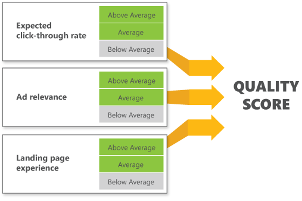

# Quality score in depth

The Microsoft Advertising quality score shows you how competitive your ads are in the marketplace by measuring how relevant your keywords, ads, and landing pages are to customers' search queries and other input.

The quality score can range from 1 to 10, with 10 being the highest. You can see the quality score on the **Keywords**, **Campaigns**, and **Ad Groups** tables.

Use your quality score to help determine where to focus your optimization efforts and improve your ROI.

## View your keyword quality score
1. From the **Campaigns** page, click the **Keywords** tab (or from the main menu on the left, click **All campaigns**&nbsp;&gt;&nbsp;**Keywords**).
1. Either:
   1. Select **Columns** and select the **Qual. score** column if it isn't already in the table. The **Qual. score** column displays the score for each keyword.
   1. Select the ellipsis icon  in a keyword's **Delivery** column (or hover over the delivery status) to see its quality score and ratings for each performance measure.

## View your historic quality scores

1. Select **Reports** at the top of the page.
1. Select the **Keywords** performance report. For more info on the basics of creating a report, see [Create a report](./hlp_BA_PROC_CreateReport.md).
To view historic quality scores at the campaign or ad group level, select the **Campaign** or **Ad group** performance report. You can select specific campaigns or ad groups in the **What to report on** list.

1. Select **Day** as the unit of time.
1. In the **Choose your columns** section, select **Historic quality score** and any other historic attributes you want.
1. Select **Run**.

 
## Quality score values

Here's what the numbers mean:

|Quality Score|Description|
|---|---|
|1-5|The keyword is **underperforming** in the marketplace, so your ads are less likely to appear on the Microsoft Search Network when that keyword is matched. If one or more of the three components of quality score are Below Average, most likely your score will be 5 or below. If you want to improve your quality score, you need to make changes to improve the poor performing component.|
|6|The keyword is competitive, but no better than average compared to other keywords targeting the same traffic. If all three components are Average, or a combination of Average and Above Average, most likely your score will be 6 or higher. If you want to improve your quality score, you need to make changes to get all three components to Above Average.|
|7-10|The keyword is **very competitive** in the marketplace, and its CTR is higher than the average CTR of keywords targeting the same traffic. If all three components are Above Average, most likely your score will be 7 or above.|

> [!IMPORTANT]
> Quality score is an evaluation of your ads, keywords, and landing pages based on historical performance in past auctions. It is not used at auction time to determine ad rank, and does not affect cost or spend.

## How quality score is calculated

The quality score has three components, and each in turn has a score.

## Expected click-through rate score
The expected click-through rate score reflects how likely your ads will be clicked and how well your keyword competes against other keywords targeting the same traffic. This score predicts whether your keyword is likely to lead to a click on your ads, taking into account how well your keyword has performed in the past relative to your ad's position. A score of 3 is Above Average; a score of 2 is Average; and a score of 1 is considered Below Average.

Here are some ideas to improve the score:

|Improve your click-through rate (CTR)|
|---|
|**How** : There are several ways to potentially improve your CTR, such as improving your ad copy, properly organizing your campaign, and improving your ad position. For details on each of these options and more, see [How do I improve my ad campaign performance?](./hlp_BA_CONC_AboutImprovingCampaignPerformance.md)|
|Make sure your ad grabs the attention of your audience|
|**How** : Speak to your customers, use their language, and be specific about what you are offering. For more suggestions, see [What makes an effective ad?](./hlp_BA_CONC_AboutWritingEffectiveAds.md)|
|Remove underperforming ads and keywords|
|**How** : Track how ads and keywords are performing using performance reports every two to four weeks. Delete ads and keywords that have a low click-through rates, especially if they also do not have a good conversion rate. For details on using reports, see [Create a report](./hlp_BA_PROC_CreateReport.md).|
|Add relevant keywords|
|**How** : Use the Microsoft Advertising&nbsp;[keyword  research tools](./hlp_BA_CONC_AboutKWResearch.md) to identify new keywords that are relevant to your site content. You'll find the Research Keyword tool on the Microsoft Advertising Tools menu. You can also [            download and install the Microsoft Advertising Intelligence add-in for Microsoft Excel          ](https://go.microsoft.com/fwlink?LinkId=398311).|

## Ad relevance score
The ad relevance score indicates how relevant your ad is to the customer's search query or other input. A score of 3 is Above Average; a score of 2 is Average; and a score of 1 is considered Below Average.

Here are some ideas to improve the score:

|Keep related keywords and ads together|
|---|
|**How** : Group related keywords and ads into their own ad groups, and then create a unique landing page for each group of ads and keywords. For example, if you're a tea retailer you could have separate ad groups with keywords and ads for green tea, black tea, and herbal tea.|
|Make sure your ad is relevant|
|**How** : Ads that are relevant to searchers' queries or other input are more likely to have a higher click-through rate and, therefore, a greater positive effect on your quality score. For example, write an ad for green teas that includes appropriate keywords (green tea, sencha, dragonwell) and that sends your customers to a landing page optimized for those keywords. For more information, see [About improving ad relevance](./hlp_BA_CONC_AboutIncreasingAdRelevance.md).|
|One landing page per product|
|**How** : If your business sells different products or offers a suite of services, create individual landing pages for each of your products or services (such as green teas, black teas, and herbal teas). Then be sure to use these landing page URLs for your final URLs. For more information on how to do this, see [Send your customers to a specific landing page](./hlp_BA_PROC_ChangeLandingPage.md).|

## Landing page experience score
The landing page experience score describes whether your landing page is likely to provide a good experience to customers who click your ad and land on your website. It is based on how many times customers leave your ad's landing page shortly after arriving. A score of 3 is Above Average; a score of 2 is Average; and a score of 1 is considered Below Average.

Here are some ideas to improve the score:

|Make sure your landing page loads quickly|
|---|
|**Why and how** : If a potential customer thinks your website is down because it is taking too long to load, they are more likely to leave your website. Make sure your landing page loads quickly once someone clicks on your ad from any device.|
|Give customers an overview|
|**How** : Create a landing page that gives potential customers an overview of your products or services (for example, the different types of tea you sell).|
|Improve your website quality|
|**Why and how** : If your website is slow and difficult to understand, your potential customers will go elsewhere.  Make sure your landing page is easy to read. Try reducing the number of graphic images, for example, or taking other appropriate measures to help it load faster. Also, it's best to use image alt tags and header tags to make sure the Microsoft Advertising quality score checker has access to the information regardless of whether or not your image or video links are crawled.|
|Link your final URLs to the correct webpages|
|**Why and how** : Customers aren't pleased if they click your ad title and end up on a page unrelated to the ad content. So if your ad is selling green teas, users should land on a page about green teas instead of one about teapots.|
|Keep advertising links on your webpages to a minimum|
|**Why and how** : Websites whose content includes a large amount of advertising, without offering any other significant value to site visitors, are not attractive to customers. Instead, focus your content on what potential customers really want to know about: **your** services or products.|
|Use original, in-depth content|
|**Why and how** : Landing pages with original content (not copied from other sites) can improve your quality score and landing page user experience score, and may help improve your conversion rates.|

 
## Common questions about quality score

 
## How can I track my quality score changes over time?
You can use the historic quality score options in performance reports to review historic averages of expected click-through rate, ad relevance, landing page experience, and quality scores going back as far as 18 months from the current date.
## Why did my quality score suddenly change? I haven’t done anything to my campaign!
If your competitors keep optimizing their campaigns to make them more competitive, that could affect your quality score. Also the quality score is updated every day so changes to any of the components (expected click-through rate, ad relevance, landing page relevance) can impact your quality score. So track your historic quality score in performance reports to monitor changes in your quality score over time. Then respond by making some of the changes recommended above.
## Are the quality scores I see listed for my campaigns and ad groups the same as for keywords?
Microsoft Advertising provides quality scores at the ad group and campaign level by aggregating the quality scores of the keywords, which have received impressions in the last 30 days,  associated with those ad groups and campaigns. You can learn more about them and how they can help you in [The Importance of Aggregated Quality Score in Microsoft Advertising](https://go.microsoft.com/fwlink?LinkId=398364). [Note: this blog uses the older names of the components  and sub scores but the explanation is still accurate.] You can track aggregated quality scores over time by [running campaign and ad group performance reports](./hlp_BA_PROC_CreateReport.md) that include historic quality score.
## Why are there blank values in my Quality Scores report?
Quality scores are calculated only based on Search Traffic. You may find blank values in the following areas of your report: Quality score, Ad relevance, Expected click-through rate, Landing page relevance, Historical ad relevance, Historical expected click-through rate, Historical landing page relevance, Historical quality score.

 
To learn how to ensure high quality ads, relevant landing pages, and create a great advertising experience for your customers, watch this video:
<bing_video id="video_qandr_pt1">The importance of being relevant</bing_video>
.

> [!NOTE]
> The Microsoft Advertising quality score is based on customers' search queries and other input that matched keywords exactly in the last 30 days. In international markets, you may see a decrease in quality score coverage for phrase match and broad match keywords. Microsoft Advertising is working to improve the quality score coverage to international markets and will update this topic when available.
> Traffic in the Bing, AOL, and Yahoo&nbsp;[syndicated search partner sites](./hlp_BA_CONC_SearchNetContentNet.md) are not included when calculating your quality score.
> The quality score is usually updated between 2 and 6 p.m., GMT (Greenwich Mean Time).
> If you want to learn more about impression share, see [The share of voice report shows how well you're competing](./hlp_BA_CONC_ImprShareReports.md).

