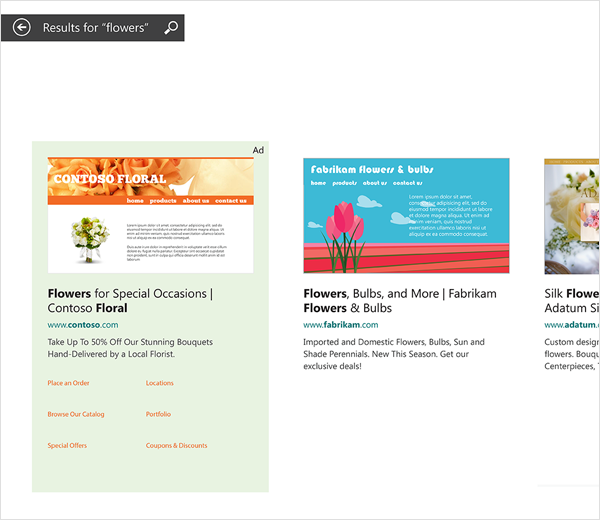

# Microsoft Advertising in Bing Smart Search

> [!IMPORTANT]
> Microsoft Advertising in Bing Smart Search are available in Canada (English), France, Germany, the United Kingdom and the United States.

Pay-per-click search ads created in Microsoft Advertising can be displayed in the Bing Smart Search results.

Bing Smart Search ads are similar to your text ads on the Microsoft Search Network, but formatted for the modern touch experience.  For example, when possible, the Bing Smart Search ads will include a preview of your landing page as shown above.

## Landing page preview
Microsoft Advertising periodically takes a snapshot of your landing page in order to create the landing page preview. Therefore, you’ll want to create the best customer experience on your landing page. It should feature relevant, compelling copy that delivers the information your potential customers need. Following this advice should help you achieve a high quality score. If a landing page is unavailable, Microsoft Advertising will instead take a snapshot of your display URL.

There may be circumstances where it's not possible to include a preview image. For example, a preview might not be displayed if:
- Bing hasn't yet crawled and stored a preview image for your site, or if an error occurs which prevents Bing from collecting or storing preview.
- Your ads are for highly regulated industries, such as pharmaceuticals, where industry regulations prohibit the display of a web preview.
- The preview would display an adult site.
- Your pages make heavy use of Adobe Flash or HTML5.

If Microsoft Advertising cannot display a preview, an empty gray box will be shown instead. In the case of a page using Adobe Flash or HTML5, a partial preview might be displayed.

Because ads without a preview are less engaging to search users, we recommend avoiding, when possible, situations such as those above that would prevent the preview from displaying.

## Creating ads for Bing Smart Search
Bing Smart Search ads use the same ad copy and ad extensions you create for your ads on the Microsoft Search Network. Sitelink Extensions, Merchant Ratings and Location Extensions are all integrated into search listings so customers can easily connect with your business. No additional action is needed from you in order to get your ads displayed in the Bing Smart Search results. The landing page image is automatically added by Microsoft Advertising based on the landing page you specify in your ad.

All targeting criteria defined for your text ads are supported by the Bing Smart Search ads. All ad extensions will be supported with the final release of Windows 8.1. In fact, given the larger format of Bing Smart Search ads, we recommend you take advantage of the many types of ad extensions available. These extensions give your ad more visual appeal and enable consumers to complete their tasks with a single click.

## Getting your ad shown in the Bing Smart Search results
The best part for advertisers is that their ads are automatically eligible for inclusion in Smart Search results across Windows 8.1 PCs and tablets. For the best results, be sure to optimize your campaign focusing on your quality score. To learn about quality score, see [Quality score in depth](./hlp_BA_CONC_AboutQualityScore.md).     Further, ads triggered by exact match keywords will be much more likely to be displayed than those associated with phrase or broad match keywords.

Including ad extensions also increases the likelihood of your ad being displayed in the Bing Smart Search results.

## Reporting
Data for Bing Smart Search ads are included in Microsoft Advertising reports for all supported metrics. Conversion tracking is available for these ads as well.

 

