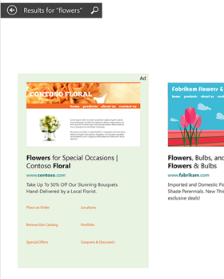
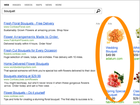

# Ad types that you can create with Microsoft Advertising

An ad is an individual online advertisement displayed to a potential customer. You'll often see ads referred to in the context of an ad group or a campaign. An ad group contains one or more ads and keywords, while a campaign contains one or more ad groups.

> [!NOTE]
> Microsoft Advertising also has several ad extensions that you can use to enhance your ads. To learn more, see [About ad extensions](./hlp_BA_CONC_AboutAdExtensions.md) and [Enhance ads with Automated Extensions](./hlp_BA_CONC_AutomatedExtensions.md)

## Ad types

## App Install Ads
App Install Ads are similar to text ads but provide direct links to your apps with a button, sending customers directly to the applicable store to download the application. This is an ideal solution for advertisers wanting to manage and drive downloads of their apps, rather than website traffic.

App Install Ads automatically detect the customer’s mobile device and operating system, sending them to the corresponding Apple App Store or Google Play. You can also track conversions with the same conversion tracking partners as [App Extensions](./hlp_BA_CONC_AdExtensionAppExtension.md): AppsFlyer, Kochava, Tune, Singular, Adjust, and Branch.

To learn more, see [App install ads: Drive app downloads](./hlp_BA_CONC_AppInstallAds.md)

## Expanded Text Ads
The expanded text ad consists of several parts:
|Ad part and character limit|Example (see above)|
|---|---|
|Ad title (supports three headlines, up to 30 characters each, separated by a space, vertical bar, and space (" | ")).|Flowers for any occasion | Delivered right to your door!|
|Ad text (supports two descriptions, up to two 90 characters each).              To maximize impressions across all ad formats, the descriptions might not always be shown in your ad.|Sustainably grown flowers on sale and ready to ship within 4 hours.|
|Display URL (Domain and subdomain automatically generated from your final URL, plus two customizable URL paths).|www.contoso.com/Seattle/Flowers|
|Final URL (2,048 characters).|www.contoso.com/Floral/SeaWa/default.aspx|

When you create your ad, Microsoft Advertising  shows you a preview of what your ad will look like on desktops,  mobile devices, and tablets on Bing  search results pages. This could change depending on how Bing  formats your ads. Bing  does experiment with ad formats to provide the best ad experience possible to customers.

[Learn how to create an Expanded Text Ad](./hlp_BA_PROC_CreateEXTA.md)

## Dynamic search ads
Dynamic search ads look just like Expanded Text Ads, but they're automatically targeted to relevant search queries based on the content of your website, and are dynamically created to respond to these search queries. Using them will:

- **Create targeted and relevant ads automatically** : New, dynamically-created ads for every search query based on your entire website, or on specific pages or categories of your site.
- **Reduce your workload** : No need to maintain keyword lists, manage bids, or update and customize ad titles.
- **Find missed opportunities** : Automatically adapt to new queries to drive additional conversions.

To learn more, see [About dynamic search ads](./hlp_BA_CONC_DynamicSearchAds.md).

## Microsoft Advertising in Bing Smart Search

Bing Smart Search ads are similar to text ads on the Bing AOL, and Yahoo search network sites, but formatted for the modern touch experience and displayed in the Windows 8.1 Smart Search results. When possible, these ads will include a preview of your landing page.

Microsoft Advertising in Windows 8.1 Smart Search are available in the United States, United Kingdom, and Canada (English). To learn more, see [Microsoft Advertising in Bing Smart Search](./hlp_BA_CONC_AboutSearchCharmAds.md).

## Microsoft Audience Ads
Microsoft Audience Ads is a native advertising solution optimized for search advertisers. This feature enables advertisers to get additional high-quality traffic from non-search placements. Microsoft Audience Ads experiences, such as ads placed within articles, are engaging for users, integrate naturally into page content, and deliver visually rich ads for advertisers.

Microsoft Audience Ads appear on the Microsoft Audience Network. These ad placements are cross-device and include premium sites like MSN, Outlook.com, Microsoft Edge, and other partners (with more to come).

To learn more, see [About Microsoft Audience Ads](./hlp_BA_CONC_NativeAds.md).

## Multimedia Ads
Multimedia ads capture a potential customer's attention with large visual imagery that showcases your brand and products to increase traffic and sales on your website. Multimedia Ads will be shown in distinct mainline and sidebar [ad positions](./hlp_BA_CONC_WhatIsAdPosition.md) and will not replace your text ad placements.

To learn more, see [Multimedia ads](./hlp_BA_CONC_MMA_Search.md)

## Product ads
Products ads include custom images from your         own product catalogs (created in Microsoft Merchant Center), plus specific promotional         text, pricing, and seller details. For more information about Product ads, check out [What are product ads?](./hlp_BA_CONC_AboutProductAds.md)

For more information about Product ads, check out [What are product ads?](./hlp_BA_CONC_AboutProductAds.md)

## Responsive search ads
Responsive search ads make creating ads easier by eliminating the need to figure out which headlines and descriptions work well together.

You provide up to 15 headlines and 4 descriptions; and using these, Microsoft Advertising will mix and match the most optimal combinations to create effective ads for potential customers. The best performing ad combinations are automatically identified and reported to you, while ineffective ads aren’t shown again.

Adapting your ad’s content to match what potential customers are searching for can help to improve your campaign’s performance.

To maximize impressions across all ad formats, the descriptions might not always be shown in your ad.

[Learn more about responsive search ads](./hlp_BA_CONC_ResponsiveSearchAds.md).

