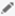

# How do I add UTM tags to my landing page URL?

Microsoft Advertising can automatically add UTM tags to your landing page URL so you can use a third-party tracking tool, for example Google Analytics, to track how people got to your website. [!INCLUDE [AutoTagging](./includes/AutoTagging.md)]

## Turn on auto-tagging

You turn on auto-tagging at the account level, and then Microsoft Advertising automatically adds the UTM tags to the landing page URLs for text ads, keywords, Microsoft Shopping Campaigns, Image Extensions, and Sitelink Extensions.

1. [!INCLUDE [PreferencesAccountSettings](./includes/PreferencesAccountSettings.md)]
1. Next to the **Account settings** page title, click the edit icon&nbsp;.
1. Next to **Auto-tagging**, select **Add UTM tags to my landing page URLs**.
1. Choose to either replace all existing tags, or instead keep the tags you already have and have Microsoft Advertising just add any that are missing.
The first option will remove any UTM tags you already have and add the tags described below. The second option will simply add the tags below to your existing tags.

1. Click **Save**.

## Available UTM tags

Microsoft Advertising automatically attaches the following UTM tags (parameters) to your landing page URL when it loads.    The tags are added in the order shown below from top to bottom until the maximum length of the URL is reached.

|Tag|Tells you|
|---|---|
|utm_source|The site that sent traffic to your page. Microsoft Advertising sets this to Bing.|
|utm_medium|Which channel was used. Microsoft Advertising sets this to cpc.|
|utm_campaign|Which campaign the keyword came from.|
|utm_content|Which ad group the keyword came from.|
|utm_term|Which keyword brought people to your website.          For product ads, what Microsoft Shopping product group (Criterion ID) brought people to your ad.|

## An example

Here’s what a URL with appended UTM tags would look like:

*      http://www.landingpageURL.com?utm_source=bing&amp;utm_medium=cpc&amp;utm_campaign=Sales&amp;utm_content=Clearance&amp;utm_term=Shoes    *

And it tells you that:

- The person came from Bing. **utm_source=bing**
- The channel or type of ad was cpc (cost-per-click). **utm_medium=cpc**
- The keyword was from the campaign **Sales**. **utm_campaign=Sales**
- The keyword was from the ad group **Clearance**. **utm_content=Clearance**
- The keyword **Shoes** triggered the ad that was clicked. **utm_term=Shoes**

> [!NOTE]
> Auto-tagging appends the UTM tags at the end of the URL, after any URL parameters. To learn more, see [What is URL tracking in Microsoft Advertising?](./hlp_BA_CONC_UpgradeURL_WhatIsTracking.md)
> Auto-tags are added when the ads are displayed. Regardless if you choose to replace all existing tags or keep existing tags and add any that are missing, you will not see your landing page URL updated with the new tags. Those tags only get appended when the ad is actually displayed to a search user.
> Auto-tagging will only work if your website allows arbitrary URL parameters. Check with your website administrator to verify if this could be an issue for your site. If it is, you can manually add tags instead.
> This structure is the same across all analytics tools. After you have this tracking information added to your URL, you can use your favorite analytics application to review the information. However different analytics tools can have different URL tracking parameters. Refer to the documentation for your own tracking tool to see what is available to you.

Microsoft Advertising also lets you manually add tracking parameters to your landing page URL. To learn more, see [How do I set up final URL tracking?](./hlp_BA_CONC_GoogleAnalytics.md)

