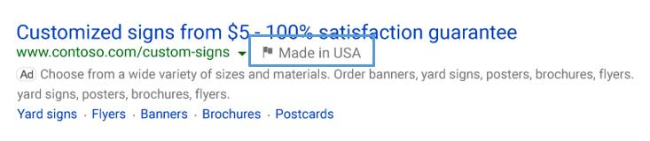
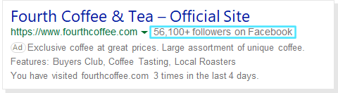
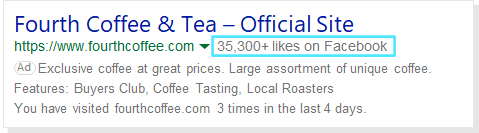
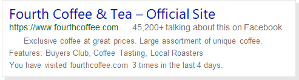
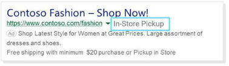
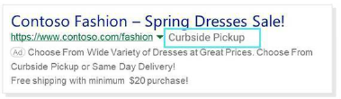
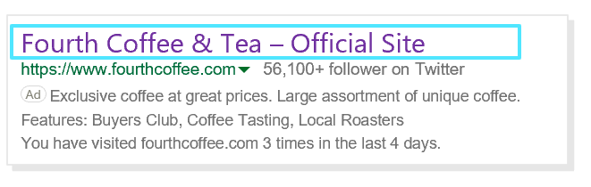

# Enhance ads with Automated Extensions

Microsoft Advertising can enhance your ads with [ad extensions](./hlp_BA_CONC_AboutAdExtensions.md) and Automated Extensions (formerly known as annotations). Both enhancement options help to improve the visibility and performance of your ads by displaying extra information about your business – more clicks means more customer traffic. You can add ad extensions to your ads yourself but for Automated Extensions, there is no action required from you. Automated Extensions are automatically added to your ads if Microsoft Advertising determines that the Automated Extension can improve your ad performance.

Automated Extensions show data from any of the sources – your ad landing pages, ad copies, and domains your ad copy points to. Certain data, like reviews and ratings, may be provided from third-party providers.

All advertisers are eligible for Automated Extensions, however, they are not always guaranteed to show in the ads. If two competing ads have the same bid and quality, the ad with greater expected impact from ad extensions and Automated Extensions will generally appear in a higher ad position than the other.

Here are the different types of Automated Extensions available from Microsoft Advertising. Keep in mind that these are examples only and your ad might look a little different than shown below.

## Consumer Ratings
## Consumer Ratings

Display high consumer ratings for your business to increase customers' confidence in your ad. Consumer Ratings are reviews that are added to eligible ads. When customers click on the link for these ratings, they're taken to a third-party review page. These ratings attract more clicks, increasing confidence in your ads, and create a more engaging customer experience.

We base ratings from the following sources:

- ReviewCentre
- ViewPoints
- ShopperApproved
- Bizrate
- MrRebates

**Eligible to serve on ads in the following markets** :

Microsoft Search Network:

- Australia
- Canada
- France
- Germany
- United Kingdom
- United States

**Devices** : Desktop, Mobile, Tablet

## Consumer Sentiment

Show relevant reviews with positive comments about your business. Adding Consumer Sentiments can increase customers’ trust in your website, as well as your click-through rates.

**Eligible to serve on ads in the following markets** :

Microsoft Search Network:

- Australia
- Canada
- France
- Germany
- Switzerland
- United Kingdom
- United States

**Devices** : Mobile, Desktop

## Dynamic Ad Enhancements
## Dynamic Descriptions

Dynamic Description enriches your ads with Bing-generated descriptions that are relevant to customers' search queries, based on content from your ad's landing page. This can build consumer confidence in the relevance of your ad, which can help to increase clicks.

**Eligible to serve on ads in the following markets** :

Microsoft Search Network:

- Australia
- Austria
- Canada
- Denmark
- Finland
- Germany
- Ireland
- Italy
- Norway
- Netherlands
- Spain
- Sweden
- Switzerland
- United Kingdom
- United States

**Devices** : Desktop, Tablet

## Events

Events are automatically included as a single line of text from current or timely event-related content highlighted on your website. For example, if you’re having a Mother’s Day special, you may see the Event Extension highlighting that.

This non-clickable line of text encourages clicks by providing a quick glimpse of an event-related offer found on your website. Events may appear on the mainline or sidebar. Also, specific event date parameters are applied. For example, Bing will crawl for Valentine’s Day-related content from January 31 to February 14.

**Eligible to serve on ads in the following markets** :

Microsoft Search Network:

- Canada
- United States

**Devices** : Desktop

## Smart Landing Page Title

Smart Landing Page Title highlights specific products and brands that are featured on your website. This informs users of the variety of products and services your website has to offer. Bing scans the landing page of your website to see if it contains product categories, features, or brand names that match the content of the search terms. It can also leverage the landing page title.

**Eligible to serve on ads in the following markets** :

Microsoft Search Network:

- Australia
- Canada
- France
- Germany
- United Kingdom
- United States

**Devices** : Desktop, Mobile, Tablet

## Dynamic Callouts
## Dynamic Callouts

Dynamic Callouts provide an extra snippet of text that highlights your website’s products or offers. Learn more about [Callout Extensions](./hlp_BA_PROC_AddCalloutExtension.md).

The non-clickable callout text is generated from copy highlighted on your website’s landing page, including key business details, highlighted services, and products offered. If you’re already using Callout Extensions, Dynamic Callouts will not show.

**Eligible to serve on ads in the following markets** :

Microsoft Search Network:

- Australia
- Canada
- United Kingdom
- United States

**Devices** : Desktop

## Automated Promotions (text ads only)

The Automated Promotion Extension is available for text ads only. Automated Promotion Extensions use your product ads Merchant Promotions data to automatically generate a promotional message for relevant ads. Promotions may include a promotion title, offer code, or expiration details.

This extension is only available if you are enrolled in Merchant Promotions. It’s also important to know that only site-wide online promotions will be displayed and that product-level or local promotions will be included.

**Eligible to serve on ads in the following markets** :

Microsoft Search Network:

- Canada
- United States

**Devices** : Desktop, Tablet

## Dynamic Partner Data Enhancements
## Country of Origin Badge

Highlight your products' country of origin to potential customers to help differentiate your products from your competitors'.

**Eligible to serve on ads in the following markets** :

Microsoft Search Network:

- United States

**Devices** : Desktop, Tablet

## Deal Badge

Highlight promotional aspects of your ad to increase customer engagement and drive more clicks. The Deal Badge will only be eligible to serve during specified date ranges for various holidays or events.

**Eligible to serve on ads in the following markets** :

Microsoft Search Network:

- Canada
- United States

**Devices** : Desktop, Tablet

## Free Shipping for text ads

The Free Shipping for text ads badge is enabled when you offer free shipping for products or orders. This can help to increase traffic to your ads, as it encourages shoppers to click your ad.

**Eligible to serve on ads in the following markets** :

Microsoft Search Network:

- Australia
- Canada
- France
- United Kingdom
- United States

**Devices** : Desktop, Tablet

## Facebook Badge

Uses your brand's Facebook presence to build trust and encourage ad engagement.

**Eligible to serve on ads in the following markets** :

Microsoft Search Network:

- Canada
- United States

**Devices** : Desktop, Tablet

## Official Site Badge

Build user confidence by affirming that your ad is for a brand's official website.

**Eligible to serve on ads in the following markets** :

Microsoft Search Network:

- Canada
- United States

**Devices** : Desktop, Tablet

## Store Pickup Badge

Highlight store pickup options to your shoppers.

**Eligible to serve on ads in the following markets** :

Microsoft Search Network:

- Canada
- United States

**Devices** : Desktop, Tablet

## Dynamic Sitelinks
## Dynamic ESL Descriptions

Dynamic ESL Description Extensions automatically turn your Sitelink Extensions (links that take people to specific pages on your website) to enhanced Sitelink Extensions (descriptive text under each sitelink). Descriptions are generated from relevant text pulled from your sitelink’s landing page. Learn more about [Sitelink Extensions](./hlp_BA_PROC_AddSitelinkExtension.md).

**Eligible to serve on ads in the following markets** :

Microsoft Search Network:

- Austria
- Canada
- Denmark
- Finland
- Ireland
- Norway
- United Kingdom
- United States

**Devices** : Desktop, Tablet

## Dynamic Sitelinks

Display Dynamic Sitelink Extensions, which are links to other pages of your website, at the bottom of your ad. This gives customers another way to evaluate what your site has to offer. Learn more about [Sitelink Extensions](./hlp_BA_PROC_AddSitelinkExtension.md).

**Eligible to serve on ads in the following markets** :

Microsoft Search Network:

- Australia
- Austria
- Canada
- Denmark
- Finland
- France
- Germany
- Ireland
- Italy
- Netherlands
- Norway
- Spain
- Sweden
- Switzerland
- United States

**Devices** : Desktop, Mobile, Tablet

## Automated Dynamic Product

Automated Dynamic Product Extensions match the keyword of your text ad with your product ads catalog data, automatically showing relevant product offers with text ads. You must have an active Microsoft Shopping Campaign Network product feed for Automated Dynamic Product Extensions to display and must not have Dynamic Product Extensions enabled.

**Eligible to serve on ads in the following markets** :

Microsoft Search Network:

- Canada
- United States

**Devices** : Desktop, Tablet

## Dynamic Structured Snippets
## Dynamic Structured Snippets

Enrich your ads by automatically adding relevant text based on your website’s landing pages with Dynamic Structured Snippets. This gives customers a look into what they’ll find on your website, while increasing confidence in the relevancy of your ad. Please note that Dynamic Structured Snippets may be clickable. Learn more about [Structured Snippet Extensions](./hlp_BA_PROC_AddStructuredSnippetExtension.md).

**Eligible to serve on ads in the following markets** :

Microsoft Search Network:

- Austria
- Canada
- Denmark
- Finland
- Ireland
- Norway
- Switzerland
- United States

**Devices** : Desktop

## Longer Ad Headlines
Longer Ad Headlines add additional information like your ad description, display URL, or search keywords to the ad title. The additional information can be added before or after your existing ad title with a separator like a hyphen. This longer title provides extra information about your ad and increases visibility and click-through rates. Please note that in some cases, Longer Ad Headlines could replace the ad's title content.

**Eligible to serve on ads in the following markets** :

- Argentina
- Australia\*
- Austria
- Brazil
- Canada\*
- Chile
- Colombia
- Denmark
- Finland
- France\*
- Germany
- Hong Kong S.A.R.
- India
- Indonesia
- Ireland
- Italy
- Malaysia
- Mexico
- Netherlands
- Norway
- Peru
- Philippines
- Singapore
- Spain
- Sweden
- Switzerland
- Taiwan
- Thailand
- United Kingdom\*
- United States\*
- Venezuela
- Vietnam

Query Long Ad Title Extensions are only available in the countries indicated with \*.

**Devices** : Desktop, Mobile, Tablet

## Long Ad Title Callout

Long Ad Title Callout automatically scans for snippets in your extension copy that may be relevant to customers' queries and appends it to your title to make it longer.

## Long Ad Title Description

Long Ad Title Description adds additional information, like your ad description, to the ad title.

## Long Ad Title Landing Page Phrases

Add dominant phrases or visual headings found on your website’s landing page to the title of your ad with Long Ad Title Landing Page Phrases.

## Long Ad Title Query

Long Ad Title Query matches the customer’s exact search query to the ad title.

## Long Ad Title URL

Long Ad Title URL adds your display URL before or after the ad title.

## Previous Visits
## Previous Visits

Previous Visits adds a line of text to your ad that shows customers how many times they have clicked through to your website over the last few months. This makes it easy for customers to recall their experience and encourage them to return to sites they know and trust.

**Eligible to serve on ads in the following markets** :

Microsoft Search Network:

- Australia
- Canada
- France
- Germany
- India
- United Kingdom
- United States

**Devices** : Desktop, Mobile, Tablet

## Visited links

Visited link can change the color of your ad title to show that customers recently visited your site.

**Eligible to serve on ads in the following markets** :

Microsoft Search Network:

- Australia
- Canada
- France
- Germany
- United Kingdom
- United States

**Devices** : Desktop, Tablet

## Top Ads

Top Ads calls out if your website has consistently received high engagement to increase your website’s credibility and trust with customers.

To be eligible for Top Ads, your ad must receive a high click-through rate with a low occurrence of back-button clicks from customers. Because of constant changes in customer engagement, the thresholds for when your ad will show a Top Ad annotation is will vary.

**Eligible to serve on ads in the following markets** :

Microsoft Search Network:

- Australia
- Austria
- Canada
- Denmark
- Finland
- France
- Germany
- India
- Ireland
- Italy
- Netherlands
- Norway
- Spain
- Sweden
- Switzerland
- United Kingdom
- United States

**Devices** : Desktop, Mobile, Tablet

## Seller Ratings
## Merchant Ratings

Merchant Rating displays your business rating and links to highly-rated reviews to show what people are saying about your business. [Learn more](./hlp_BA_CONC_MerchantRatings.md)

We base ratings on a number of sources including:

- Yahoo Shopping
- Epinions
- bizrate
- Trustpilot
- PriceGrabber
- ViewPoints
- Review Centre
- Shopper Approved
- eKomi
- Feefo
- Verified Reviews
- Mr. Rebates
- Ciao.co.uk
- Shopzilla UK
- Reviews.co.uk
- Avis Verifies
- Reevoo
- Trusted Shop

**Eligible to serve on ads in the following markets** :

Microsoft Search Network:

- Australia
- Austria
- Canada
- Denmark
- Finland
- France
- Germany
- India
- Ireland
- Italy
- Netherlands
- Norway
- New Zealand
- Philippines
- Spain
- Sweden
- Switzerland
- Singapore
- United Kingdom
- United States

**Devices** : Desktop, Mobile, Tablet

> [!NOTE]
> All clickable Automated Extensions will be charged for clicks, similar to ad headline clicks.
> Opt-out is only available at the account level.
> Choosing to opt out of an Automated Extension will opt out the account from all features under this extension.
> Historical opt-outs will be honored at the Automated Extension level.
> Reporting is available at the Automated Extension level, and not at each individual feature.
> Automated Extensions may or may not appear in ads, depending on placement and predicted impact.
> If you want to be included in the default opt-out list to be excluded from future Automated Extensions, notify your account manager or [contact support](https://go.microsoft.com/fwlink?LinkId=398371).

