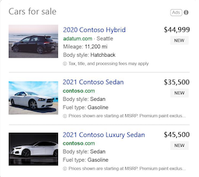

# Automotive ads: Showcase your models and inventory

> [!NOTE]
> This feature is currently available in an open beta for the US and UK.

Showcase real-time inventory of new and used cars to nearby shoppers who are in the comparison and transcation stages. Your ads are dynamically created to feature vehicle photos, special prices, and other relevant details. From third-party sites and auto dealers displaying their new and used inventory to automotive manufacturers advertising their new models, Automotive ads drive performance.



## The benefits of using Automotive ads

- **Customized ads.**  Submit and schedule your feed and based on the attributes you provide, we’ll create relevant, personalized ads.
- **Improved return on ad spend.**  See more volume, increased click-through rates (CTR), and lower cost per click (CPC) rates.
- **Save time with automation.**  With no keywords required, the ads are created by feed files that use Microsoft AI automation and are fully equipped for bulk upload.

## Create Automotive ads with business data feeds

Once you have your campaign(s) set up, you can upload and schedule your feed.

A dynamic feed file is a spreadsheet that contains attributes. This file tells Microsoft Advertising the information you want inserted in your ads and under which condition each attribute should be inserted. Some attributes will be featured in the ad itself.

Note that if you’d like to target specific campaigns or ad groups, you should fill out the Target ad group and Target campaign (see “Optional attributes”); otherwise, we will apply your feed to every campaign in your account.

Your feed file should be tab-delimited plain text with any of the following extensions: CSV, TSV, XLSX, or ZIP.

## Required attributes
Your dynamic data feed file must include the following attributes:

|Attribute|Description|Example|
|---|---|---|
|```Final URL```|The same domain as your website. Must begin with http:// or https://.|```http://www.contoso.com/seattle/id ```|
|```Image URL```|The single URL for the image used in your ad. Must begin with http:// or https://.We support JPEG, PNG, or GIF. Both JPG and GIF must be saved in RGB color code with an ICC profile.                                                                          The recommended minimum resolution is 300x300 pixels and 72 DPI.|```http://www.contoso.com/image1.png```|
|```Make```|The make of the vehicle.|```Contoso```|
|```Model```|The model of the vehicle.|```Contoso Model```|
|```Price```|The cost of the vehicle. Provide the number followed by the currency code (ISO 4217 standards). Use "." as the decimal mark regardless of the local currency.|```25000.00 USD ```|
|```Title```|The full name of the vehicle.|```Subaru Outback Limited Automatic AWD```|
|```Vehicle ID```|Unique ID of the listing comprised of any sequence of letters and digits.                                                                           This will not be shown in the ad.|```1234XYZ```|

## Recommended attributes
Your dynamic data feed file may include any of the following attributes, which are highly recommended:

|Attribute|Description|Example|
|---|---|---|
|```Body style```|The body style of the vehicle.|```SUV```|
|```Drivetrain```|The drivetrain of the vehicle.|```AWD```|
|```Engine```|The engine capacity of the vehicle.|```4 Cyl 2.4 L```|
|```Exterior color```|The exterior color of the vehicle.|```Black```|
|```Fuel type```|The fuel type of the vehicle.|```Gasoline```|
|```Interior color```|The interior color of the vehicle.|```Gray```|
|```Trim```|The trim of the vehicle.|```Limited```|
|```Year```|The year the vehicle was launched in yyyy format.|```2020```|

## Optional attributes
Your dynamic data feed file may include the following optional attributes:

|Attribute|Description|Example|
|---|---|---|
|```Address```|Either provide the first line of the street address or the full address. If only the street address is provided, fill in the city, state, and zip code as other attributes.|```123 Boulevard Street```|
|```Availability```|The status of the vehicle's availability.                                                                          This will not be shown in the ad.|```Available```|
|```City```|The city of the dealership or the car listing.|```Seattle```|
|```Contextual keywords```|Specific vehicle details used to power relevancy matching. Use ";" to separate multiple keywords.                                                                          This will not be shown in the ad.|```Used cars for sale; SUV; Automatic; 5 seats; 4 doors```|
|```Condition```|The condition of the vehicle (e.g., excellent, good, fair, poor, or other).|```Excellent```|
|```Country```|The country of the dealership or car listing.                                                                          This will not be shown in the ad.|```USA```|
|```Custom parameter```|Include up to 3 key and value pairs, which automatically fill up in the click URL.                                                                          List the key and value pairs within braces. Each term should be set in quotation marks. Separate each phrase of the pair with a colon and separate key and value pairs with commas and without any spaces.                                                                          Neither one can exceed 16 characters or 200 bytes.                                                                          This will not be shown in the ad.|```{"Bstyle":"SUV",“state”:”new”,”condition”:”excellent”}```|
|```Daily payment```|The daily payment amount in the local currency. Use "." as the decimal mark regardless of the local currency.|```12.00 USD```|
|```Dealer discount```|Any discount applied to the selling price of the vehicle in the local currency. Use "." as the decimal mark regardless of the local currency.|```2500.00 USD```|
|```Dealer name```|The name of the dealer.|```Contoso Dealername```|
|```Description```|Short text description of the vehicle.|```Supercharged! Automatic! Gasoline!```|
|```Disclaimer```|Any disclaimer on price, payment, or vehicle features.|```The price includes cargo nets and roof rails.```|
|```Down payment```|Finance down payment in dollar value. Use "." as the decimal mark regardless of the local currency.|```2000.00 USD```|
|```Due at signing```|The lease due at signing in dollar value. Use "." as the decimal mark regardless of the local currency.|```2000.00 USD```|
|```Email```|The dealer's email address.|```dealername@example.com```|
|```Final mobile URL```|The mobile-optimized URL of the landing page in your website that people reach when they click your ad from mobile devices. Same domain as your website, begins with http:// or https://.|```http://m.www.contoso.com/seattle/id```|
|```Fuel efficiency average```|The vehicle’s average fuel efficiency between city and highway efficiencies.|```30.7```|
|```Fuel efficiency city```|The vehicle’s fuel efficiency for the city.|```29.0```|
|```Fuel efficiency highway```|The vehicle’s fuel efficiency the for the highway.|```32.5```|
|```Fuel efficiency unit```|The unit of the fuel efficiency: MPG, KPL, or KMPL, etc.|```MPG```|
|```Latitude```|Latitude of the dealership or car listing.                                                                          List in the DDD.DDDDD format.                                                                          This will not be shown in the ad.|```37.94```|
|```Longitude```|Longitude of the dealership or car listing.                                                                          List in the DDD.DDDDD format.                                                                          This will not be shown in the ad.|```-121.69```|
|```Mileage unit```|Mileage units. We support values of MI or KM.|```MI```|
|```Mileage value```|For used vehicles, this is the mileage of the vehicle in miles or kilometers. For new vehicles, use “zero”.|```1200```|
|```Monthly payment```|The monthly payment dollar amount. Use "." as the decimal mark regardless of the local currency.|```350.00 USD```|
|```Payment term```|The length of the agreement in months.|```60 months```|
|```Payment type```|The payment deal type (e.g., lease, finance, balloon).|```Finance```|
|```Phone number```|The phone number of the dealership following ITU E.123 format.|```+1 (425) 111-2222```|
|```Sale price```|The sale or special price. Use "." as the decimal mark regardless of the local currency.|```22000.00 USD```|
|```State```|The state of the dealership or car listing.|```WA```|
|```State of vehicle```|The current state of the vehicle (e.g., new, used, CPO).|```New```|
|```Target ad group```|The ad group name. If you set limits here, you will need to set limits for the campaign as well (see “Target campaign” below).                                                                          This will not be shown in the ad.|```AutosAdGroup```|
|```Target campaign```|The campaign name you want to limit the feed to.                                                                          This will not be shown in the ad.|```AutosCampaign```|
|```Tracking template```|Upgraded URLs. Include ```ValueTrack``` parameters, custom parameters, or tracking redirects for your item URL.                                                                          This will not be shown in your ad.|```http://www.trackingtool.com/?source```|
|```Video URL```|The single URL for the video used in your ad. MP4 format only. http:// or https:// only.|```http://www.contosoexample.com/video.mp4```|
|```VIN```|The VIN number of the vehicle.|```V285N34S543T674```|
|```Zip code```|The postal code of the dealership or car listing.                                                                          This will not be shown in your ad.|```98007```|

## Upload a dynamic data feed file

**How do I upload a feed file?**
1. [!INCLUDE [BusinessDataDynamicDataFeeds](./includes/BusinessDataDynamicDataFeeds.md)]
1. Select **Upload** > **Autos** > **Listing inventory**.
1. Enter the **Name** and select the feed file to upload.
1. You can select **Upload and preview** to view your changes or select **Upload and apply** to create the feed.

**Schedule a feed file**
1. [!INCLUDE [BusinessDataDynamicDataFeeds](./includes/BusinessDataDynamicDataFeeds.md)]
1. Select the feed file you want to create a schedule for.
1. Select the **Schedules** tab.
1. Select the **Schedule feed uploads** and enter the scheduling information and URL for your feed.
1. Select **Save**.


