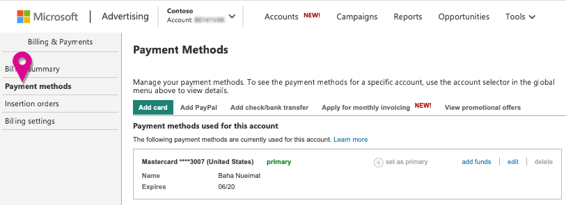
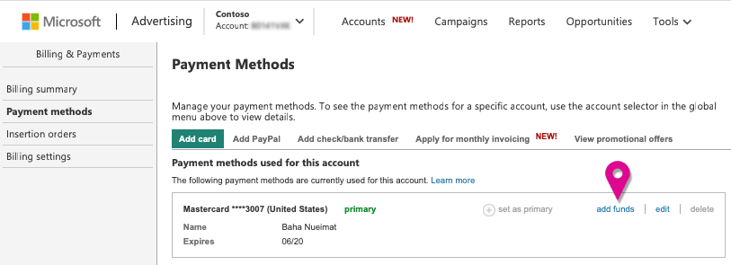

# The Payment Methods page

Payment methods are the forms of payment you can use to pay for your charges in Microsoft Advertising. They include credit and debit cards, PayPal, wire transfers, checks, and more.   The payment methods available to you depend on three things:

- The currency of your account
- The billing address of your account, specifically the country
- Whether you have a postpay threshold account, prepay account, or monthly invoice account

To learn which payment methods you can use, see [Choosing a payment method for Microsoft Advertising](./hlp_BA_CONC_PaymentMethodsV2.md)

You can manage your payment methods from the Payment Methods page.

## How do I find the Payment Methods page?
1. [!INCLUDE [ClickBilling_Tab1](./includes/ClickBilling_Tab1.md)]
1. Select**Payment Methods** from the main menu.
1. [!INCLUDE [SelectAccount_VR](./includes/SelectAccount_VR.md)]

On the Payment Methods page, you have different options depending on whether you have one or multiple accounts and one or multiple payment methods. This article covers some of those options for each type of account: postpay threshold, prepay, and monthly invoice.

## Postpay threshold accounts

**Primary payment method.**  If you have a postpay threshold account, you need to have a primary payment method: a credit or debit card. Your primary payment method will be used to pay your advertising charges when you reach your monthly billing date or your billing threshold, whichever comes first. Although you can add as many payment methods as you like, you can only have one primary payment method for each account. If you want to delete a primary payment method, you must first set a new primary payment method for any accounts that use the payment method you are trying to delete.

**Backup payment method.**  You can set a backup payment method, which will be used to pay for your charges if something happens to your primary payment method: Your credit card expires, it's stolen, or you reach your limit while you are away on vacation. In cases like these, a backup payment method prevents you from having gaps in your advertising campaign when you least expect them.

From the Payment Methods page, you can add and edit your payment methods and select primary and backup for your postpay threshold accounts.

## How do I set a primary or backup payment method?
1. [!INCLUDE [ClickBilling_Tab1](./includes/ClickBilling_Tab1.md)]
1. Select**Payment Methods** from the main menu.
1. [!INCLUDE [SelectAccount_VR](./includes/SelectAccount_VR.md)]
1. Next to the payment method you want to use to pay your account charges, select**Set as primary**.
1. Next to the payment method you want to use if we run into problems with your primary payment method, select **Set as backup**.

## Prepay accounts

Although you need to have a payment method so that you can add funds to your prepay account, you only need to make it primary if you plan on [making automatic recurring payments (auto-recharge)](./hlp_BA_PROC_AutoRecharge.md) or [using a promotional offer](./hlp_BA_CONC_AboutPromoOffers.md).  Just like a backup payment method, auto-recharge prevents your account from running out of money unexpectedly and having your account, campaigns, and ads paused. With auto-recharge, once your account balance reaches 20 percent of the recharge amount, we will automatically charge your primary payment method and add funds to your account.

If you opt for auto-recharge, it's also a good idea to set a backup payment method in case there are issues with your primary payment method.

If you don't have auto-recharge set up, you'll need to manually add funds to your prepay account.

## How do I add funds to a prepay account?
[!INCLUDE [AddFunds_VR2](./includes/AddFunds_VR2.md)]
## How do I set up auto-recharge for my prepay account?
[!INCLUDE [AutoRechargeWhen](./includes/AutoRechargeWhen.md)]      [!INCLUDE [EnableAutoRecharge_VR2](./includes/EnableAutoRecharge_VR2.md)]

## Monthly invoice

If you have monthly invoice accounts, you can pay by wire transfer, check, or ACH. On the Payment Methods page, you will see that your primary payment method is an SAP ID. SAP is the accounting software that we use to manage monthly invoicing. The SAP ID is a unique customer billing number that will be assigned to you when you set up monthly invoice billing. Unlike postpay threshold and prepay accounts, customers with a monthly invoice account must go through a credit check and meet certain spend criteria before they can be set up with an SAP ID by our support team. For more information about monthly invoice accounts, see [What you need to know about monthly invoice billing](./hlp_BA_CONC_MonthlyInvoiceBilling.md).

## Frequently Asked Questions

## How can I tell if my payment method is set up properly?
1. [!INCLUDE [ClickAccounts](./includes/ClickAccounts.md)]
1. From the **Performance** tab in **Accounts Summary**, check your account to see if there are any errors.

If your account has no errors, your payment methods are set up properly, and you are ready to pay for clicks on your ads. For more information, see [Account errors](./hlp_BA_CONC_AccountErrors.md).

## Why don't I see all my payment methods?
If you have multiple accounts, you might need to select **All accounts** from the drop-down list at the top of the page to see all of your payment methods. When you select a single account from the list, you will only see the payment methods that you can use with that account. If you only have one account and have payment methods that you can't use with that account, you will see a section called “Other payment methods.”

## Why is my payment method not available to be used with this account?
There are a number of reasons that a payment method can't be used for a particular account:

- **Account type.**  Some payment methods, such as credit cards, can be used with both postpay threshold and prepay accounts.			  Other payment methods, such as wire transfers, require a prepay account. For information on which payment methods you can use with postpay threshold and prepay			  accounts, see [Choosing a payment method for Microsoft Advertising](./hlp_BA_CONC_PaymentMethodsV2.md)
- **Currency and country.**  Some payment methods can only be used if your account is based in a specific country and uses a specific currency.			  For example, PayPal can only be used for accounts that have the currency set to Canadian dollar, euro, Mexican peso, Norwegian krone, UK pound, or US dollar. For information on which payment methods you can use for your currency and country, see [Choosing a payment method for Microsoft Advertising](./hlp_BA_CONC_PaymentMethodsV2.md)
- **Agency management.**  If your account is managed by an agency and they are responsible for paying the bill, 			  then any payment methods that you have added cannot be used.
- **Inactive accounts.**  When an account is deleted and becomes inactive, no payment methods can be used.

