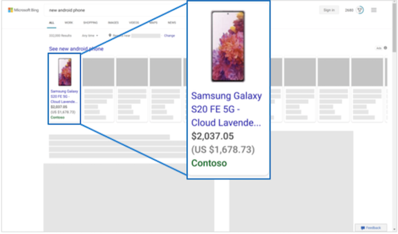

# About Microsoft Shopping Campaigns feed files

<content_tile class="training">      [        New to Microsoft Shopping Campaigns? Learn how to get started in this training course.      ](https://go.microsoft.com/fwlink?LinkId=2129851)    </content_tile>

To run Microsoft Shopping Campaigns, you must create a feed and upload a catalog feed file. A feed file contains a list of your products and attributes that define how they will display on Bing.    Whenever you want to update your feed, you upload an updated feed file. Each store can have more than one feed, but the products in each file must be unique per market.

## Create a feed

After you [verify that you own your URL](./hlp_BA_PROC_ClaimYourDomain.md) and your newly [created store](./hlp_BA_PROC_CreateBingMerchantCenterStore.md) is approved, you create your feed. Note that you will need your feed file ready for feed creation. For more information, see [Create a feed file](#CreateAFeedFile).

1. [!INCLUDE [MerchantCenterFeeds](./includes/MerchantCenterFeeds.md)]
1. Select **Create feed** and enter your feed name. Make sure to select Online product in the **Feed type** dropdown menu.
1. Choose the rest of your options, including the **Country of sale** and any additional countries under **Add more countries (optional)**. To learn more about this option, see [ Show your product in multiple countries](#MultipleCountries).
1. Whether you are adding more countries or not, you need to specify currency under **Default currency**.
1. Under **Input method**, you will see various options for submitting your feed file: [Manually upload](#ManuallyUpload), [Upload via FTP/SFTP](#UploadViaFTP), [Automatically download file from URL](#AutomaticallyDownload), and [Import](#Import).
1. Select **Create feed**.

<anchor id="CreateAFeedFile" />

## Create a feed file

Here is how you create a feed file using a spreadsheet program. If you want to use a text editor, make sure to use [ the required attributes](./hlp_BA_CONC_AboutBingMerchantCenterCatalogFile.md). You can also take a look at this [short example of a feed file](https://go.microsoft.com/fwlink?LinkId=506749).

> [!NOTE]
> Your feed file must be tab delimited plain text with extensions: TXT, ZIP, GZ, .GZIP. We only support XML files if it is an existing Google-formatted XML file.

The feed name is used for identification in **Feeds** and in **Feed reports**. It can be modified at a later time.

1. Open Microsoft Excel or another spreadsheet program.
1. Create a header row in the first row listing the attribute names used to describe products. Each attribute must be in its own column.
Be sure to include all [required attributes](./hlp_BA_CONC_AboutBingMerchantCenterCatalogFile.md).

Remember, if you added additional countries to your feed, you need to add their currency by listing their currency symbols (per ISO 4217). To learn more about this option, see [Show your products in multiple countries](#MultipleCountries).

1. Enter your product offer information in the rows below the header row, using one row for each product.
Each item’s attribute values should be listed in the same column as the corresponding 	header attribute name. This means a product’s ID must be in the column with header attribute “id”.

1. Save your spreadsheet as a tab delimited Excel file (\*TXT).

## Submit a feed file

Feed file submission methods specify how you will transfer the product offer information files to Microsoft Merchant Center. After you have created and perhaps also tested a corresponding feed file, it can be submitted to the associated feed. There are different ways to submit:

<anchor id="ManuallyUpload" />

**Manually upload**
You may use this option if the feed file is smaller than 4MB.

1. [!INCLUDE [MerchantCenterFeeds](./includes/MerchantCenterFeeds.md)]
1. Select **Create feed**.
1. At the bottom of the setup wizard, select **Manually upload**.
1. Browse for feed file and select **Create feed**.

<anchor id="UploadViaFTP" />

**Upload via FTP/SFTP**
You may use this option if the feed file is smaller than 1GB. We recommend this option if the feed file is larger than 4MB.

If uploading via FTP/SFTP, the file name of TXT or XML files must match the file name specified for a feed’s settings. For compressed text format, the compressed TXT file inside the archive and the archive file (ZIP, GZ, GZIP) must have the matching file name. Any feed file that is archived needs to have a single compressed file inside. The max file size should be no more than 3GB (after the file is uncompressed, if the file is compressed).

1. [!INCLUDE [MerchantCenterFeeds](./includes/MerchantCenterFeeds.md)]
1. Select **Create feed**.
1. At the bottom of the setup wizard, select **Upload via FTP/SFTP**.
1. Enter **Update feed**. Do not include the file extension (for example, "merchant").
1. Select **Create feed**.
1. Enter **File name**. Do not include the file extension. For example, “merchant”.
1. If necessary, you can always select **Change the FTP/SFTP account settings** and update your FTP user name and password. To do this, you must follow the [ Update a feed file instructions](#UpdateAFeedFile).
You can now upload the file via the FTP/SFTP tool of your choice using the file name you specified.

FTP/SFTP server requirements:

The recommended FTP/SFTP upload mechanism is via an FTP/SFTP program. It is, however, possible to do so via the command line or custom scripts (such as Python’s ftplib.FTP module). The FileZilla FTP client is recommended for all platforms.

Use the following settings for file transfer with your FTP/SFTP client:

- Host: ftps://feeds.adcenter.microsoft.com
- User name: Your store’s FTP/SFTP user name. Your user name must be 6 - 64 characters and cannot include any special characters. Use only a - z, A- Z, and 0 - 9.
- Password: Your store’s FTP/SFTP password
- Transfer Mode: Passive

Learn more about [FTP/SFTP upload](./hlp_BA_CONC_BMCFTPRequirements.md).

<anchor id="AutomaticallyDownload" />

**Automatically download file from URL**
You may use this option if the feed file is smaller than 1GB and on a publicly accessible server. The feed file will be downloaded once every 24 hours.

1. From the top menu, select **Tools** > ** Microsoft Merchant Center**
1. Select the store name and then the **Feeds** tab.
1. Choose the feed name you wish to edit.
1. Select the **Feed settings** tab.
1. Under **Feed file**, select **Automatically download file from URL**.
1. Enter **Source URL** (for example, https://www.contoso.com/feeds/merchant.txt).
1. If required, enter **User name** and **Password**.
1. Select **Save**.

<anchor id="Import" />

**Import**

**            Download the feed file from Google**
You may also download your feed file from Google Docs. Keep in mind that we only accept CSV or TSV formats for feed files from Google.

1. Open your feed file in Google Docs.
1. Select **File** > **Publish to the web**.
1. Select **Web page** and select either Comma-separated values (CSV) or Tab-separated values (TSV).
1. Select **Publish**.
1. Copy the generated link and use the link as your automatic download URL in your **Microsoft Merchant Center** feed.

**              Use the Google Merchant Center import tool**
You can use the Google Merchant Center import tool, if you already have product ads in your Google Merchant Center. Learn how to [use the Google Merchant Center import tool](./hlp_BA_CONC_BMC_GMCImportIntro.md).

<anchor id="UpdateAFeedFile" />

## Update a feed file

Your feed expires after 30 days, which causes the products to stop publishing; so, you need to update your feed file. To keep your product information fresh, it is good practice to upload your feed daily.

1. [!INCLUDE [MerchantCenterFeeds](./includes/MerchantCenterFeeds.md)]
1. Choose the store you want to update.
1. Select the **Feeds** tab.
1. Choose and select the feed you want to update.
1. Select **Update feed**.
1. Use one of the submission methods detailed above. Note that at this stage, you may change your submission type.
1. Select **Update feed**.

<anchor id="MultipleCountries" />

## Show your products in multiple countries

[!INCLUDE [ComingSoon](./includes/ComingSoon.md)]
You can sell your products from a single feed to multiple countries. As you create your feed, the **Country of sale** specifies which market (country and language) the feed targets. After indicating one country of sale, you have the option to add more countries.

> [!NOTE]
> Your feed can target countries with the same language within your region (for example, the US and Canada or France and Belgium).

For the purposes of eligibility, when you create a shopping campaign, be sure to select the same countries under Campaign targets that are indicated in your feed (using **Let me choose specific locations**) or you can also select the worldwide option (**All available countries/regions**). This is because it’s important that the added countries included in your feed align with those in your campaign location targets. In other words, the information—including details such as product filters—in your feed must align with that in your campaign. See [ What are the benefits of shopping campaigns](./hlp_BA_CONC_BSC_Overview.md) for more information.

**Real-time currency conversion**
If the ad is shown outside the country of sale, we take care of ensuring that the real-time currency appears. This means that as long as you submit currency codes in your feed file, we make sure your ads show the relevant, converted currency with the country of sale’s currency in parentheses. For example, let’s say that the country of sale is the United States and that Canada is the additional country. As depicted below, an ad shown in Canada will include the Canadian Dollar amount and then the US dollar amount in parentheses.

> [!NOTE]
> If you are creating a multi-market feed, the product(s) need to have currency details either in the price field or in the feed setting.

