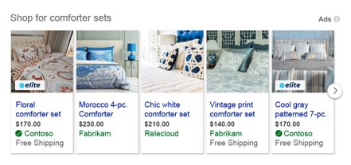

# About Brand Loyalty Extensions

> [!IMPORTANT]
> Not everyone has this feature yet. If you don't, don't worry - it's coming soon!

With Brand Loyalty Extensions, you can add a membership or loyalty-based offering, or a brand or seller-specific offering to your ads. By adding an image asset that customers recognize and associate with your brand to your product ads, your ads will draw more attention from potential customers. Keep in mind that even if a Brand Loyalty Extension is eligible to serve, they're not guaranteed to always serve. Whether an extension serves depends on a number of factors.

## How do I create a Brand Loyalty Extension?
1. On the top menu, click **Tools** and then click ** Microsoft Merchant Center**  (or from the global menu at the top of the page, click **Tools** and then **Microsoft Merchant Center**).
1. Click on the **Promotions** tab in Microsoft Merchant Center.
1. Click **Create** and select **New Brand Loyalty Extension**.
1. Create the **Brand Loyalty Extension ID**. The ID must be alphanumeric, with a maximum of 60 characters.
1. Select the **Country/region &amp; language** you want to target.
1. Enter the **Tool tip** text. The tool tip can have a maximum of 60 characters.
1. Select the products you want the extension to apply to in **Product applicability**.
1. Select the image you want to use in **Upload merchant asset**.
1. Click **Save**.

## Image asset guidelines
- The image asset will be shown on the 5th line of an ad.
- Accepted image file types: .png or .svg
- Minimum image dimensions: 72x24 pixels
- Image aspect ratio range: 3:1 to 6.8:1
- The image asset will be displayed in a space with a fixed height of 12 pixels.
- The image can only have text, only a log, or both.
- Images with stacked text and/or logo are not permitted.
- The recommended maximum character count for images is 10.
- Images with a logo and text must be in a single line.
- Images must have a transparent or white background. Colored backgrounds are not permitted.
- Minimize whitespace in the image asset.

## What I need to know
- For .png images, the minimum size is 24 x 72 pixels. The image size cannot exceed 3.9 MB.				 If the image is larger than 24 x 72 pixels, the aspect ratio range must be 1:3 to 1:6.8.
- A maximum of 10 promotion_IDs can be used. Because the promotion_ID field is also used for Brand Loyalty Extensions, be sure that the Brand Loyalty Extension is within the first 10 promotion_IDs.
- The Brand Loyalty Extension is only available if you have a loyalty program logo running Microsoft Shopping Campaigns.
- The loyalty or membership program must provide a special value to customers, like expedited shipping.
- The logo should represent your program with an icon, badge, or symbol that clearly identifies the program. This logo will have to pass the editorial review. [Learn more](https://go.microsoft.com/fwlink?LinkId=534455)
- The timing and process for pausing, resuming, or deleting a Brand Loyalty Extension can take up to two hours.
- The editorial timing for review of the image asset can take up to two weeks.

## Troubleshoot logo rejections
If you tried to upload a logo but got an error message, what do you do? Take a look at some of the most common reasons why your logo may have gotten rejected and what you can do to fix it.

<table>
  <tr>
    <th scope="col">Logo example</th>
    <th scope="col">Error message</th>
    <th scope="col">How to fix it</th>
  </tr>
  <tr>
    <th style="font-weight:normal;background-color:transparent;border-bottom:solid 1px #ccc" scope="row">
					
				</th>
    <td>The legibility of the asset is too low.</td>
    <td>Upload an asset with text only and no logo, or an asset with a logo and a shorter name.</td>
  </tr>
  <tr>
    <th style="font-weight:normal;background-color:transparent;border-bottom:solid 1px #ccc" scope="row">
					
				</th>
    <td>The legibility of the asset is too low.</td>
    <td>Upload an asset that uses the horizontal space for the text instead of stacking them.</td>
  </tr>
  <tr>
    <th style="font-weight:normal;background-color:transparent;border-bottom:solid 1px #ccc" scope="row">
					
				</th>
    <td>The legibility of the asset is too low.</td>
    <td>Upload an asset with a white or transparent background, or an asset with text only and no logo.</td>
  </tr>
  <tr>
    <th style="font-weight:normal;background-color:transparent;border-bottom:solid 1px #ccc" scope="row">
					
				</th>
    <td>Approved</td>
    <td />
  </tr>
</table>

