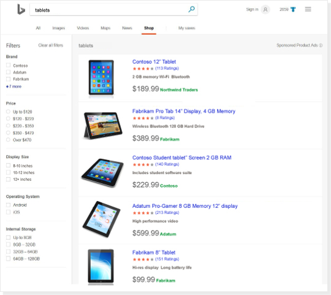

# About the Shopping Tab

> [!IMPORTANT]
> This feature is currently available in France, Germany, the United Kingdom, and the United States.

The Shopping Tab is an exclusive shopping experience, providing customers a way to filter products to get closer to what they want to buy. You can increase traffic to your Microsoft Shopping Campaign by providing product details in your feed to have your ads display in the Shopping Tab. In doing so, you can:

- **Increase traffic to your product ads** . By including GTIN, MPN, Brand, and other product-specific attributes in your product feed, you can help to increase the likelihood of your ads appearing in new retail experiences.
- **Make it easier for customers to find your products** . Adding more attributes to your product feed helps to provide more robust product ads, driving richer ad content.
- **Increase your click-through and conversion rates** . Potential customers are able to narrow their search results with product filters, seeing more targeted product offers.

## What you need in your Microsoft Shopping Campaigns for the Shopping Tab

- Product identifiers for all product offers in your feed file (GTIN, Brand, and MPN).
- Product category for all Apparel and Accessories offers and provide the following attributes:
   - Color
   - Age group
   - Gender
   - Size type and system (optional)
   - Item group ID (optional)
   - Pattern (optional)
   - Material (optional)

- Product images
   - Up to 10 images, if available
   - The recommended image size is at least 300 x 300 pixels for all products

