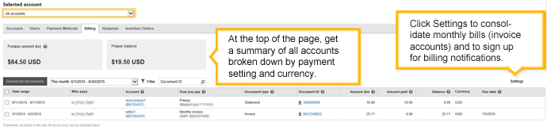
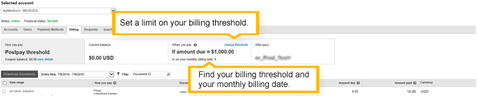
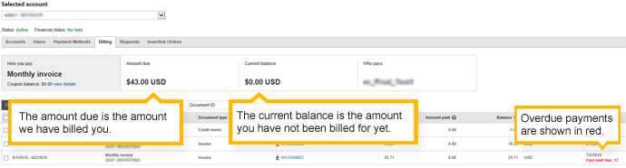
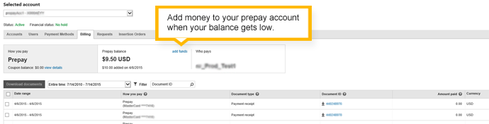

# Billing Summary in depth

Billing Summary gives you a single location for all of your billing information and tasks. On this page, the main things you can do regardless of your account type are:
- Check how much you owe (postpay accounts) or your available balance (prepay accounts).
- Filter the table to find the documents you're looking for. Filter by date, document ID, and other criteria.
- Review and download PDF versions of your billing documents.

## Views by account

Billing Summary offers additional information and tasks, but those vary depending on whether you are viewing multiple accounts or just one account (postpay threshold, monthly invoice, or prepay). The following sections describe what you can see and do in these different account views, so refer to the section that best matches your setup.

## Multiple accounts
If you have more than one account, here's what you can see and do:

- Review a summary of billing information for all of your accounts, including the total amount due for all postpay accounts (postpay threshold and monthly invoice) and the total balance for all your prepay accounts. Totals are broken down by currency.
- Get billing details for individual accounts by clicking the account name and number.
- Review and download PDF versions of your billing documents, including invoices, statements, payment receipts, and credit and debit memos.
- [Set up consolidated billing](#consolidated), all invoices with the same currency are combined into one. (Applies only to monthly invoice billing.)
- Choose whether to [include campaign details](#campdetails) with your bills. (Applies only to monthly invoice billing.)

## Postpay threshold account
When you look at a postpay threshold account on Billing Summary, you'll see a tile towards the top of the page, showing you the amount due for the account and information about your monthly billing date and billing threshold. Here, you can [set a limit on your billing threshold](#limit).

## Monthly invoice account
If you have a monthly invoice account, you'll see the amount due, which is the amount we have billed you, and the current balance, which is the amount you have not been billed for yet.

If you have elected to consolidate your bills, you'll see references to that in the summary and in the table.

## Prepay account
If you are looking at a prepay account in Billing Summary, you'll see your account balance and be able to [add funds](#addfunds) if your balance is getting low.

## Some things to know about Billing Summary

There are a few things that you should know when reviewing and using Billing Summary:

- Filtering the table does not change the amounts that appear in the summaries at the top of the page.
- There can be a delay of up to 4 hours before charges, credits, or payments are shown in Billing Summary.
- There might be small differences in the totals between the table and the summaries, because the table refers to billing documents and not all debits and credits come with a document. For example, Microsoft Advertising collects taxes on advertising costs in some countries/regions. For prepay accounts, those taxes are deducted from the prepay amount. The prepay balance in the summary at the top of the page shows the taxes deducted, but the statement line item in the table shows the total amount of funds you added.
- User roles determine whether you can change the settings or only read the items in Billing Summary. In addition, certain billing-related tasks (such as changing a credit card) can only be done by the bill-to party, regardless of user roles. Learn more [about user roles.](./hlp_BA_CONC_SSUserRoles.md)

> [!NOTE]
> Account owners always have access to billing documents, even if they're not the bill-to customer. Direct managers who are linked to a Microsoft Advertising account may or may not have access to billing documents. It all depends on who is responsible for payments.
> 
> - **If the account owner is the bill-to customer:** The account owner and **all direct managers** can see billing documents.
> - **If a direct manager is the bill-to customer:** Only the account owner and the direct manager responsible for payments can see billing documents. Any other direct managers on the account won't be able to see billing documents
> In the second scenario, this restriction is by design. Although rare, this can happen when multiple ad agencies are linked to a client's Microsoft Advertising account, and one ad agency is responsible for payments.

## Billing tasks

## Download a billing document
[!INCLUDE [ViewBillingStatement_VR](./includes/ViewBillingStatement_VR.md)]
## Set a limit on your billing threshold (postpay threshold account)
You can limit the amount your payment method is charged on your postpay threshold account. To learn more about how billing thresholds work, see [What is billing threshold and how does it work?](./hlp_BA_CONC_BillingThreshold.md)

[!INCLUDE [SetLimitBillingThreshold_VR2](./includes/SetLimitBillingThreshold_VR2.md)]
## Set up consolidated billing (monthly invoice account)
Want to minimize the size of your monthly invoices? With consolidated billing, all of your monthly invoiced accounts that are billed in the same currency and language will be combined into a single invoice.

[!INCLUDE [ConsolidatedBilling_VR2](./includes/ConsolidatedBilling_VR2.md)]
## Include or remove campaign details in your invoices (monthly invoice account)
If you don't need to see your monthly invoice billing broken down by campaign, then you can simplify and shorten your invoices even further.

[!INCLUDE [CampaignDetails_VR2](./includes/CampaignDetails_VR2.md)]
## Add funds (prepay account)
You can manually add funds at any time. Or you can set up recurring payments. Learn more [about auto-recharge](./hlp_BA_PROC_AutoRecharge.md).

[!INCLUDE [AddFunds_VR2](./includes/AddFunds_VR2.md)]
## Receive monthly invoices via email
If you have a monthly invoice account, we send your invoice via email to your accounts payable contacts on file. Make sure their information is up to date.

[!INCLUDE [AccountsPayable_VR2](./includes/AccountsPayable_VR2.md)]
## View monthly invoices in Microsoft Advertising
Invoices are typically posted by the 2nd business day of each month for the previous month's charges. You will be able to see the invoice within Billing Summary once they have been generated.

## Get end-of-month billing notifications
You can choose to get billing notifications through email at the end of each month. If you have a prepay account, a statement will be posted in Billing Summary that summarizes your payments for the month. If you have a postpay threshold account, you will receive a notification that provides a link to Billing Summary where you can see the payments you made for the previous month. If you have a monthly invoice account, you will receive an email with a link to Billing Summary where you can see your invoices.

[!INCLUDE [BillingEmailNotification_VR2](./includes/BillingEmailNotification_VR2.md)]

> [!IMPORTANT]
> Please note that your user role affects what you can see and what you can do in Billing Summary. Learn more [about user roles.](./hlp_BA_CONC_SSUserRoles.md)

