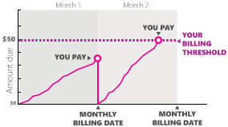

# What is billing threshold and how does it work?

[!INCLUDE [BillingThresholdDef](./includes/BillingThresholdDef.md)] We charge your primary payment method when you reach your billing threshold or your monthly billing date, whichever comes first. The following graph shows an example: In your first 30-day period, your charges are well below your billing threshold of $50, so we charge your primary payment method on your monthly billing date. In the next 30-day period, you hit your billing threshold a few days before your monthly billing date, so we charge your primary payment method at that time.

## Monthly billing date

Your monthly billing date is the date that you signed up for Microsoft Advertising. Your primary payment method will be charged on your monthly billing date with one exception:

- If you have made a successful payment within the past 10 days, either by reaching your billing threshold or by [paying your account balance](./hlp_BA_PROC_MakePayment.md)

## Billing threshold

Billing thresholds start out low (for example, if your account is billed in US dollars, the billing threshold starts at $50) and will automatically increase when you make successful payments. The amount of increase depends on your currency and other factors. Alternatively, Microsoft Advertising automatically decreases your billing threshold if you run into problems paying your charges.

## Example: When you pay
Let’s assume you signed up for Microsoft Advertising on October 22 and have a postpay account billed in U.S. dollars. As a new customer,           your billing threshold is set by default           to $50 and your monthly billing date is the 22nd of each month. From October 22 to November 21, you spend $47.50, so we charge you that amount on           November 22, your first monthly billing date. Your campaign takes off in late November and by December 7, you have $50 in charges. We charge           your payment method on December 8. You reach the billing threshold two more times, and we increase it to $100.

 		  [!INCLUDE [India_E_Mandate](./includes/India_E_Mandate.md)]
## Setting a limit

You can set a limit on the amount Microsoft Advertising can charge your payment method. For example, if your billing threshold is   $2,500, but you don't want charges to your credit card that are greater than $2,000, you can set a limit.

Although you can set a limit that is higher than the current billing threshold, we will continue to charge you when you reach the billing threshold that is defined   by Microsoft Advertising for your account. If the threshold goes up and exceeds your limit, we will charge you when you reach your limit.

> [!IMPORTANT]
> Billing threshold only reflects advertising costs. It does not include any mandatory taxes. You will have to separately factor for taxes in your advertising spend if your business is located in a country/region where online services are taxed. So, using the $2,000 limit as an example,   we'll charge you $2,000 plus any applicable taxes once you hit your billing threshold. See [Tax or VAT information](./hlp_BA_CONC_TaxVATInfo.md) to learn more about taxes in your country/region.

## Example: Setting a limit above the billing threshold
Let’s say your current billing threshold is $50 with a maximum over time of $2,500. You can set your limit at $2000, but we’ll continue to charge you when you           reach the billing threshold until we raise the billing threshold over time and it reaches your limit of $2,000.

 
## Where can I find my billing threshold?

Only a Super Admin or a Standard User can adjust a billing threshold. Learn more [about user roles](./hlp_BA_CONC_SSUserRoles.md).

1. [!INCLUDE [ClickBillingPaymentsTools](./includes/ClickBillingPaymentsTools.md)]
1. [!INCLUDE [SelectAccount_VR](./includes/SelectAccount_VR.md)]
1. Click the **Billing Settings** from the main menu to see your threshold limit.

## How do I set a limit?

[!INCLUDE [SetLimitBillingThreshold_VR2](./includes/SetLimitBillingThreshold_VR2.md)]

