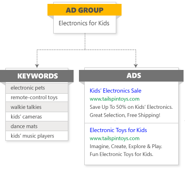

# How do I edit my downloaded spreadsheet for bulk upload?

> [!IMPORTANT]
> Not everyone has this feature. See [this article](./hlp_BA_CONC_AboutBulk.md) for more information.

If you manage multiple Microsoft Advertising accounts you can make updates across any and all of their campaigns at the same time using [bulk upload](./hlp_BA_CONC_AboutBulk.md).

The first thing you need to do is download the campaign information you want to see and change. See [this article](./hlp_BA_CONC_BulkDownload.md) for more information on downloading spreadsheets. Once you have downloaded your spreadsheet, you can edit, add, or remove data, and then upload your changes in bulk.

## How to edit spreadsheets

## General editing tips
- It’s a good idea to save a copy of the original spreadsheet before you make changes.  A copy of the original spreadsheet allows you to review your previous settings and revert changes if necessary.
- Do not modify or remove the row that contains the column names.
- Do not modify or remove the ```**Format Version**``` row. The number in the Name column must be 5 or 6.
- The following columns are required for every spreadsheet: ```**Type**``` (for example, ```Campaign```, ```Ad Group```, or ```Keyword```), ```**ID**```, ```**Parent ID**```, ```**Account ID**```, and ```**Name**``` (the value in the ```**Name**``` column refers to the format version).
You can remove columns that are not required, but make sure you keep the columns that are necessary to the change you are making. For example, if you want to pause keywords, you must include the ```**Status**``` column. If you want to create a new campaign, you will need to include all campaign columns.

Note: To make sure you don't delete any required columns, you could instead hide the unnecessary columns to make navigating the spreadsheet easier.

- Keep your spreadsheet's rows and columns in the same order as in the original downloaded spreadsheet.
- To delete or empty the existing value of an optional field, enter "```delete_value```" in the appropriate cell of the spreadsheet.
- You do not need to mark or otherwise call out the rows or columns you have added or edited. When you upload your spreadsheet, Microsoft Advertising will compare it to your current data and find the changes. You will then be able to preview the changes before they are made.

## Adding entities
To add an ad, keyword, extension, or any other entity:

1. Download an existing campaign that contains the entities you want to add.
1. Use these entities' rows as templates for your new entitles, altering information as necessary.

> [!NOTE]
> You could instead simply create a new row in your downloaded spreadsheet and fill in all the necessary columns, but starting with an existing campaign's information as a template is advised.

## Removing entities
To remove an ad, keyword, extension, or any other entity:

1. Find the entity's row in your downloaded spreadsheet.
1. Enter *```Deleted```* in the ```**Status**``` column.

> [!IMPORTANT]
> Deleted entities cannot be restored after you upload the edited spreadsheet.

 
## Understanding your spreadsheet

## What do the rows represent?
Each row of your spreadsheet represents a different entity, such as a campaign, ad group, ad, keyword, negative keyword, ad extension, or target. The entities you see in the spreadsheet were determined by the filters and output settings you specified when you set up the query for your bulk download (see [Download a spreadsheet for bulk upload](./hlp_BA_CONC_BulkDownload.md) for more information).

Exactly which kind of entity a row represents is called out in the first column of the downloaded spreadsheet: the ```**Type**``` column. For detailed explanations of each type and its relevant columns, take a look at [this Bing Ads API doc](https://go.microsoft.com/fwlink?LinkId=733248) (note: this doc refers to types as "```Record types```").

## Type hierarchy

Types have parent-child relationships with one another. For example, in the following diagram, the keywords and ads are children of the parent "Electronics for Kids" ad group. This ad group in turn is the child (or one of several children) of a campaign.



In your downloaded spreadsheet, child types are always listed below their parent types. The relationship is made clear by the entities' ```**ID**``` and ```**Parent ID**``` column values. For linear cases such as Account-Campaign-Ad group, each entity's ID is unique and its Parent ID is the ID of its parent:

|```Type```|```ID```|```Parent ID```|
|---|---|---|
|```Account```         [X]|[Account X's ID number]|[Manager account W's ID number]|
|```Campaign``` [Y]|[Campaign Y's ID number]|[Account X's ID number]|
|```Ad Group``` [Z]|[Ad group Z's ID number]|[Campaign Y's ID number]|

In cases such as [ad extensions](./hlp_BA_CONC_AboutAdExtensions.md), entities further down the parent-child chain can have multiple parents. For example, a campaign Sitelink Extension does not have a unique ID, but instead inherits the ID of the overall Sitelink Ad Extension, and its Parent ID is the campaign's ID. Take a look at the "Adding Sitelink Extensions through bulk upload" section below for more information.

> [!NOTE]
> For a detailed look at type hierarchy -- including each type's limits -- take a look at [this Bing Ads API doc](https://go.microsoft.com/fwlink?LinkId=734036).

 
## Adding a parent and a child at the same time through bulk upload

If you want to add, say, a new campaign and new ad groups all at once through bulk upload, how do you associate the child ad groups to the parent campaign without having an ID for the new campaign? You'd use either a logical reference key or a negative reference key:
**Logical reference key** :

1. For the new parent campaign, enter a unique name in the ```**Campaign**``` column.
1. For the new child ad groups, enter the same name in the ```**Campaign**``` column.

Here's what it would look like in your spreadsheet:

|```Type```|```ID```|```Parent ID```|...|```Campaign```|```Ad Group```|
|---|---|---|---|---|---|
|```Campaign```|||...|Fresh Flowers||
|```Ad Group```|||...|Fresh Flowers|Tulip season|
|```Ad Group```|||...|Fresh Flowers|Lily season|

**Negative reference key** :

1. For the ID of the new parent campaign, enter any negative number.
1. For the IDs of the new child ad groups, enter the same negative number.

Here's what this would look like in your spreadsheet:

|```Type```|```ID```|```Parent ID```|
|---|---|---|
|```Campaign```|[-1]|[existing account ID number]|
|```Ad Group```||[-1]|
|```Ad Group```||[-1]|

## What do the columns represent?
Each downloaded spreadsheet comes with columns for all Microsoft Advertising data points. Most columns will be irrelevant — and therefore blank — for any given entity's row. Feel free to delete columns that are blank or unnecessary to your edits, but remember that you must retain the following columns: ```**Type**``` (for example, ```Campaign```, ```Ad Group```, or ```Keyword```), ```**ID**```, ```**Parent ID**```, ```**Account ID**```, and ```**Name**```.

> [!NOTE]
> To make sure you don't delete any required columns, you could instead hide the unnecessary columns to make navigating the spreadsheet easier.
> You can't make changes to metrics through bulk upload. For example, you can't raise your CTR just by changing the number in that column!
> For detailed information about which columns are relevant to each entity, take a look at [this Bing Ads API doc](https://go.microsoft.com/fwlink?LinkId=733248) (note: this doc refers to types as "```Record types```").

 
## Some specific scenarios

## Adding Sitelink Extensions through bulk upload
Sitelink Extensions are a type of [ad extension](./hlp_BA_CONC_AboutAdExtensions.md). In Microsoft Advertising, you create a Sitelink Extension and associate it to a campaign or an ad group. Microsoft Advertising considers the overall Sitelink Extension (called here "```Sitelink Ad Extension```") the parent of either a ```Campaign Sitelink Ad Extension``` or an ```Ad Group Sitelink Ad Extension```, depending on whether it's associated with a campaign or an ad group. The ```Sitelink Ad Extension``` is considered the child of the account. This relationship looks like this in a downloaded spreadsheet:

|```Type```|```ID```|```Parent ID```|
|---|---|---|
|```Campaign``` [B]|[Campaign B's ID number]|[Account A's ID number]|
|```Sitelink Ad Extension``` [C]|[Sitelink Ad Extension C's ID number]|[Account A's ID number]|
|```Campaign Sitelink Ad Extension``` [D]|[Sitelink Ad Extension C's ID number]|[Campaign B's ID number]|

If you want to create a new Sitelink Extension through bulk upload, you need to add a row for both a ```Sitelink Ad Extension``` and either a ```Campaign Sitelink Ad Extension``` or an ```Ad Group Sitelink Ad Extension```. What's more, you need to associate the child to the parent ```Sitelink Ad Extension``` even though the ```Sitelink Ad Extension``` does not yet have an ID. To do this, you'd use a negative reference key:

1. For the ID of the new parent ```Sitelink Ad Extension```, enter any negative number.
1. For the ID of the new child ```Campaign Sitelink Ad Extension``` or ```Ad Group Sitelink Ad Extension```, enter the same negative number.

For example, here's what it would look like to add two new ```Sitelink Ad Extensions``` &nbsp; — one associated to an existing campaign, and one to an existing ad group:

|```Type```|```ID```|```Parent ID```|
|---|---|---|
|```Sitelink Ad Extension```|[-123]|[Existing account ID number]|
|```Sitelink Ad Extension```|[-456]|[Existing account ID number]|
|```Campaign Sitelink Ad Extension```|[-123]|[Existing campaign ID number]|
|```Ad Group Sitelink Ad Extension```|[-456]|[Existing ad group ID number]|

## Adding Call Extensions through bulk upload
Call Extensions are a type of ad extension. In Microsoft Advertising, you create a Call Extension and associate it to a campaign or an ad group.

1. In your downloaded spreadsheet, find the row for the Call Extension.
1. In the ```              **Phone number**            ``` column, enter the phone number for your location (the maximum number of characters is 35).

## Adding Location Extensions through bulk upload
Location Extensions are a type of [ad extension](./hlp_BA_CONC_AboutAdExtensions.md). In Microsoft Advertising, you create a Location Extension and associate it to a campaign or an ad group.

1. In your downloaded spreadsheet, find the row for the Location Extension.
1. In the ```              **Business name**            ``` column, enter the phone number for your location (the maximum number of characters is 80).
1. In the ```              **Phone number**            ``` column, enter the phone number for your location (the maximum number of characters is 35).

## Adding Image Extensions through bulk upload
Image Extensions are a type of [ad extension](./hlp_BA_CONC_AboutAdExtensions.md). In Microsoft Advertising, you update an already created Image Extension and associate it to a campaign or an ad group.

1. In your downloaded spreadsheet, find the row for the Image Extension.
1. In the ```              **Alternative text**            ``` column, enter the Display text for the Image Extension (the maximum number of characters is 35).
1. In the ```              **Description**            ``` column, enter the Description for the Image Extension (the maximum number of characters is 100).
1. In the ```              **Final URL**            ``` column, enter the Final URL for the Image Extension (the maximum number of characters is 2,048).

## Adding Callout Extensions through bulk upload
Callout Extensions are a type of [ad extension](./hlp_BA_CONC_AboutAdExtensions.md). In Microsoft Advertising, you create a Callout Extension and associate it to a campaign or an ad group.

1. In your downloaded spreadsheet, find the row for the Callout Extension.
1. In the ```              **Callout text**            ``` column, enter the extra piece of text that highlights your website’s products or offers (the maximum number of characters is 25).

## Adding Review Extensions through bulk upload
Review Extensions are a type of [ad extension](./hlp_BA_CONC_AboutAdExtensions.md). In Microsoft Advertising, you create a Review Extension and associate it to a campaign or an ad group.

1. In your downloaded spreadsheet, find the row for the Review Extension.
1. In the ```              **Text**            ``` column, enter the text that appears below your ad that is either paraphrased or an exact quote from a reputable third-party source (the combined character limit for both the text and source is 67 characters).
1. In the ```              **Source**            ``` column, enter the name of the third-party source from where your review is from (the combined character limit for both the text and source is 67 characters).
1. In the ```              **URL**            ``` column, enter the landing page of the third-party source where the review is from (the maximum number of characters is 255). The URL must start with "http://" or "https://"  and the source and URL must refer to the same third-party.

## Adding Structured Snippet Extensions through bulk upload
Structured Snippet Extensions are a type of [ad extension](./hlp_BA_CONC_AboutAdExtensions.md). In Microsoft Advertising, you create a Structured Snippet Extension and associate it to a campaign or an ad group.

1. In your downloaded spreadsheet, find the row for the Structured Snippet Extension.
1. In the ```              **Structured Snippet Header**            ``` column, enter one of the available headers.
1. In the ```              **Structured Snippet Values**            ``` column, enter 3 to 10 items, separated by semicolons, to appear after the header.

## Adding targeting through bulk upload
[Targeting](./hlp_BA_CONC_Targeting.md) is showing ads only to specific groups of Microsoft Advertising customers by adjusting bids for these groups. Here is how you add targeting through bulk upload:

1. Create a new row in your spreadsheet below the row for the campaign you are working with.
1. In the ```**Type**``` column, enter the appropriate type (see the table below).
1. In the ```**ID**``` column, enter the ID of any existing targeting set up for this campaign (all of a campaign's targets share the same ID). Note: If you leave this blank, you will wipe out any existing targeting.
1. In the ```**Parent ID**``` column, enter the campaign's ID (targets are children of their campaign).
1. In the ```**Target**``` column, enter the appropriate target for this target type (see the table below). Note: The ```**Target**``` column is several dozen columns to the right of the ```**Parent ID**``` column.
1. In the ```**Bid Adjustment**``` column, enter the percentage value (positive or negative) you want to adjust the bid for this target. See the table below for the possible range of bid adjustments for each target type. Note: The ```**Bid Adjustment**``` column is several dozen columns to the right of the ```**Parent ID**``` column.
1. If necessary, enter further information in other targeting columns relevant to this target type (see the table below).

|```Type```|Targeting method|What goes in the ```**Target**``` column|Bid adj. range|Other relevant columns|
|---|---|---|---|---|
|```Campaign Location Criterion```|Area targeting|Postal code or name of city, DMA, state, or country/region|-90 to +900|```**Sub Type**```: ```City```, ```Metro Area```, ```Country```, ```State```, or ```Postal Code```|
|```Campaign Radius Criterion```|Radius targeting|Leave ```**Target**``` blank for radius targeting|-90 to +900|```**Name**```: The postal code, city, etc. you are pinpointing  		```**Radius**```: The number of units around the point to include  		```**Unit**```: ```Miles``` or ```Kilometers```|
|```Campaign Location Intent Criterion```|Physical location targeting|```PeopleInOrSearchingForOrViewingPages```, ```PeopleSearchingForOrViewingPages```, or ```PeopleIn```|Not applicable|None|
|```Campaign Age Criterion```|Age targeting|```EighteenToTwentyFour```, ```TwentyFiveToThirtyFour```, ```ThirtyFiveToFortyNine```, ```FiftyToSixtyFour```, or ```SixtyFiveAndAbove```|-90 to +900|None|
|```Campaign DayTime Criterion```|Ad scheduling|```Monday```, ```Tuesday```, ```Wednesday```, ```Thursday```, ```Friday```, ```Saturday```, or ```Sunday```|-90 to +900|```**From Hour**```: The hour of the day (in 24-hour time) for the start time 		```**From Minute**```: The minute of the ```From Hour``` for the start time  		```**To Hour**```: The hour of the day (in 24-hour time) for the end time  		```**To Minute**```: The minute of the ```To Hour``` for the end time  |
|```Campaign Gender Criterion```|Gender targeting|```Male``` or ```Female```|-90 to +900|None|
|```Campaign DeviceOS Criterion```|Device targeting|```Computers```, ```Smartphones```, or ```Tablets```|-100 to +900|None|

> [!IMPORTANT]
> Leaving a new target's ```**ID**``` column blank (or entering a unique number) will overwrite any existing targeting you have set up for this campaign. To avoid this, use the same ID number as your existing targets.

## Adding audience targeting through bulk upload
Audience targeting allows you show ads only to relevant users. Here is how you can add audience associations through bulk upload:

1. Create a new row in your spreadsheet below the row for the ad group or campaign you are working with.
1. In the ```**Type**``` column, enter the appropriate type (see the table below).
1. In the ```**Parent ID**``` column, enter the ad group or campaign's ID (targets are children of their ad groups or campaigns).
1. In the ```**Audience ID**``` column, enter the appropriate audience ID for this audience type (see the table below). Note: The ```**Audience ID**``` column is several dozen columns to the right of the ```**Parent ID**``` column.
1. In the ```**Bid Adjustment**``` column, enter the percentage value (positive or negative) you want to adjust the bid for this target. See the table below for the possible range of bid adjustments for each target type. Note: The ```**Bid Adjustment**``` column is several dozen columns to the right of the ```**Parent ID**``` column.
1. If you want to set the targeting setting, you need to go back to the ad group row and locate the ```**Target Setting**``` column. Leave the cell empty if you want to set it as **Bid only** or enter "Audience" if you want to set it as **Target and bid**.
1. If necessary, enter further information in other targeting columns relevant to this target type (see the table below).

> [!IMPORTANT]
> Not everyone has the ability to associate audiences at the campaign level yet.

|```Association type```|Audience category|What goes in the ```**Audience ID**``` column|Bid adjustment range|Other relevant columns|
|---|---|---|---|---|
|Ad Group/Campaign Remarketing List Association|Remarketing list|ID of the remarketing list|-90 to +900|```**Audience**```: name of the remarketing list|
|Ad Group/Campaign Custom Audience Association|Custom audience|ID of the custom audience|-90 to +900|```**Audience**```: name of the custom audience|
|Ad Group/Campaign Dynamic Remarketing List Association|Dynamic remarketing list|ID of the dynamic remarketing list|-90 to +900|```**Audience**```: name of the dynamic remarketing list|
|Ad Group/Campaign In Market Audience Association|In-market audience|ID of the in-market audience|-90 to +900|```**Audience**```: name of the in-market audience|
|Ad Group/Campaign Similar Remarketing List Association|Similar to remarketing list|ID of the similar to remarketing list|-90 to +900|```**Audience**```: name of the similar to remarketing list|
|Ad Group/Campaign Negative Remarketing List Association|Remarketing list|ID of the remarketing list|Not applicable (this an exclusion)|```**Audience**```: name of the remarketing list|
|Ad Group/Campaign Negative Custom Audience Association|Custom audience|ID of the custom audience|Not applicable (this an exclusion)|```**Audience**```: name of the custom audience|
|Ad Group/Campaign Negative Dynamic Remarketing List Association|Dynamic remarketing list|ID of the dynamic remarketing list|Not applicable (this an exclusion)|```**Audience**```: name of the dynamic remarketing list|
|Ad Group/Campaign Negative In Market Audience Association|In-market audience|ID of the in-market audience|Not applicable (this an exclusion)|```**Audience**```: name of the in-market audience|
|Ad Group/Campaign Negative Similar Remarketing List Association|Similar to remarketing list|ID of the similar to remarketing list|Not applicable (this an exclusion)|```**Audience**```: name of the similar to remarketing list|

## Adjusting bids for Microsoft Audience Ads through bulk upload
Participation level in [Microsoft Audience Ads](./hlp_BA_CONC_NativeAds.md) is set by a bid adjustment at the campaign or ad group level. To adjust your audience ad bid through bulk upload:
1. In your downloaded spreadsheet, find the row for the correct campaign or ad group.
1. In the ```**Bid Adjustment**``` column, enter an adjustment for your audience ad bid (the possible range is a percentage between -100 to +900).

## Adding Microsoft Shopping Campaigns through bulk upload
Microsoft Shopping Campaigns make it easier for you to advertise your products from your Microsoft Merchant Center store online.

> [!IMPORTANT]
> If you don't have one yet, you'll need to [create a Microsoft Merchant Center store](./hlp_BA_PROC_CreateProductTargetAndAd.md) before creating a Microsoft Shopping Campaign.
> Your shopping campaign won't work until you [create a catalog feed file](./hlp_BA_PROC_BMCCreateFeedFile.md) and [submit it](./hlp_BA_CONC_BMCWhatIsCatalog.md).

To create a Microsoft Shopping Campaign through bulk upload, you'll need to add a row for:

- A new campaign, making sure to:
   1. In the ```**Type**``` column, enter *```Campaign```*.
   1. In the ```**Parent ID**``` column, enter the ID of this campaign's account.
   1. In the ```**Campaign**``` column, enter a unique name for this shopping campaign.
   1. In the ```**Time Zone**``` column, enter the time zone of your business or campaign target. See [this Bing Ads API doc](https://go.microsoft.com/fwlink?LinkId=760641) for a list of possible time zone values.
   1. In the ```**Budget**``` column, enter the amount you want to spend per day on this campaign.
   1. In the ```**Budget Type**``` column, enter ```*DailyBudget*```.
   1. In the ```**Campaign Type**``` column, enter *```Shopping```*.
   1. In the ```**Priority**``` column, enter 0, 1, or 2. This setting helps determine which Microsoft Shopping Campaign serves ads in the event that two or more campaigns use the catalog feed from the same Microsoft Merchant Center store. The higher numbers are given higher priority.
   1. In the ```**COUNTRY_CODE**``` column, enter the country code that corresponds to the country/region you selected when setting up your Microsoft Merchant Center store. The following country codes are currently supported: ```AU``` (Australia), ```GB``` (United Kingdom), ```DE``` (Germany), ```FR``` (France), and ```US``` (United States).
   1. In the ```**Store ID**``` column, enter your Microsoft Merchant Center store's ID.

- A new ad group, making sure to:
   1. In the ```**Type**``` column, enter *```Ad Group```*.
   1. In the ```**Parent ID**``` column, enter the ID of this ad group's campaign.
   1. In the ```**Campaign**``` column, enter the name of your shopping campaign.
   1. In the ```**Ad Group**``` column, enter a unique name for this ad group.
   1. In the ```**Pricing Model**``` column, enter either *```CPC```* (cost per click) or *```CPM```* (cost per thousand impressions).
   1. In the ```**Search Network**``` column, enter *```On```*.
   1. In the ```**Content Network**``` column, enter *```Off```*.
   1. In the ```**Language**``` column, enter a language code that corresponds to the country/region of your Microsoft Merchant Center store and your campaign's ```COUNTRY_CODE``` setting. See [this Bing Ads API doc](https://go.microsoft.com/fwlink?LinkId=760642) for a list of possible language codes.

- One or more ```Ad Group Product Partitions```.
> [!NOTE]
> An ```Ad Group Product Partition``` is part of what is referred to elsewhere in Microsoft Advertising as a "product group." There is a one-to-one relationship between ad groups and product groups. If you were creating a product group in Microsoft Advertising, you would divide it into different levels based on attributes (see [Understand and use product groups](./hlp_BA_CONC_BSC_AboutProductGroups.md) for more information). These divisions are referred to as ```Ad Group Product Partitions``` in bulk upload.

   - In the ```**Type**``` column, enter *```Ad Group Product Partition```*.
   - For the root ```Ad Group Product Partition``` of your product partition group tree structure:
      1. In the ```**ID**``` column, enter a unique negative number (this is a negative reference key, as discussed above).
      1. Assuming you are creating sub-partitions for this ```Ad Group Product Partition```, in the ```**Sub Type**``` column, enter *```Subdivision```* (if you are not subdividing this ```Ad Group Product Partition```, enter *```Unit```*). Note: A ```Subdivision``` must contain at least two ```Units```.
      1. In the ```**Ad Group**``` column, enter the name of your ad group.
      1. For a ```Subdivision```:
         1. In the ```**Product Condition 1**``` column, enter *```All```*.
         1. Make sure the ```**Product Value 1**``` column is blank.
         1. Make sure the ```**Parent Criterion ID**``` column is blank.

      1. For a ```Unit```:
         1. Use the product condition and product value columns to identify how to branch your shopping campaign. These columns refer to the optional fields you [set up in your catalog feed file](./hlp_BA_CONC_AboutBingMerchantCenterCatalogFile.md), such as brand, condition, product category, product type, and custom label. See the "Product Categories" list in [this Bing Ads API doc](https://go.microsoft.com/fwlink?LinkId=733672) for more information. Note: Always start with ```Product Condition 1``` and ```Product Value 1``` and go deeper (to 2, 3, 4, etc.) as necessary.
         1. In the ```**Parent Criterion ID**``` column, enter the same negative number as the ```Subdivision``` of this ```Unit```.

   - You can subdivide an ```Ad Group Product Partition``` up to seven levels deep.
      - For each sub-partition row, enter the root partition's ID number in the ```**Parent Criterion ID**``` column.
      - Each branch of the structure must end with an ```Ad Group Product Partition``` with "```Unit```" in the ```**Sub Type**``` column
      - Every "```Unit```" ```Ad Group Product Partition``` must have a bid (a value in the ```**Bid**``` column), unless it has "```TRUE```" in its ```**Is Excluded**``` column.

   - For more technical information on setting up ```Ad Group Product Partitions``` (and Microsoft Shopping Campaigns"> in general), see [this Bing Ads API doc](https://go.microsoft.com/fwlink?LinkId=733672).
> 
> [!IMPORTANT]
> You can't add product ads themselves using bulk upload. After you upload your new Microsoft Shopping Campaign, you will need to edit it in Microsoft Advertising to add product ads.

## Enable auto-tagging of Microsoft Click ID through bulk upload
You can get more accurate conversion tracking data by adding the Microsoft Click ID (MSCLKID) to your URLs. To enable auto-tagging of Microsoft Click ID through bulk upload:

1. In your downloaded spreadsheet, find the ```**MSCLKID Auto Tagging Enabled**``` column and enter "TRUE" in the cell for each account you want to enable this setting for.
1. After you have uploaded the spreadsheet, go to **Shared Library**&nbsp;&gt;&nbsp;**URL options** in your Microsoft Advertising account and verify this has been enabled.

> [!NOTE]
> This setting is not supported through download. In a downloaded spreadsheet, you will see an empty cell in the ```**MSCLKID Auto Tagging Enabled**``` column even if this setting has been enabled.

 
## Preparing your spreadsheet for uploading

Once you have made all your changes, you are ready to upload your spreadsheet. Keep in mind a few things:

- When you save your spreadsheet, make sure you:
   - Select **Unicode Text** for **Save as type**.
   - Use quotation marks around the name you give your file, and include ".csv" at the end (as in, "YourFileName.csv"). The quotation marks will not appear in your final file name — they are there to prevent Excel from adding ".txt" to the file name.

- The file size cannot be greater than 100 MB or have more than 4 million rows.
- The data must not exceed the limits defined in [this article](./hlp_BA_CONC_ImportWhatInfo.md).

For instructions on how to upload your spreadsheet, check out [Upload an edited spreadsheet](./hlp_BA_CONC_BulkUpload.md).


