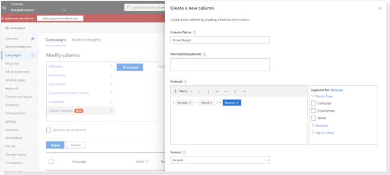

# Create custom columns to show data you want

If you’re performing customized calculations with your Microsoft Advertising reporting metrics, then custom columns will save you time. By adding your unique formula as a custom column, you no longer need to manually calculate metrics on your campaign performance.

Here are some examples of custom columns you can set up:

- "Desktop clicks" = **Clicks: Computer**
- "Cost per revenue" = **Spend ÷ Revenue**
- "Conv. per Dollar" = **Conv. ÷ Spend**
- "Gross Margin" = **(Revenue - Spend) ÷ Revenue**

You might also want to see how revenue or conversions relate to your ads' average position, or how phone call counts vary according to whether the customers are on computers or mobile devices. Custom columns let you create and show data meaningful to you, and make it available for any of the tables and reports you use.

## Create a custom column

When you create custom columns, you can add them to the table just like any other column. See [Customize what data shows in the table](./hlp_BA_CONC_CustomizeData.md)

1. Select the page you want to add columns to. For example, **Campaigns**, **Ad groups**, or **Keywords**.
1. Above the table, select **Columns** > **Modify columns** > **Custom columns** > **+ Column**.
1. Enter the column name and optional description.
1. Choose performance metrics for your custom formula. You can use the add, subtract, multiply, and divide operations.
1. Choose how you want to segment the data. For example: Device type, Network, Top vs. Other. If you want to see a ratio of items, select the metric followed by the segment with no math function.
1. Choose whether to format the column values as a number, percent, or currency.
1. Select **Save**.
1. Under **Selected columns**, drag and drop the columns to put them in the order you want and then select **Apply**.

Create as many custom columns as you want. You can reuse custom columns on other page tables in your account, except the **Accounts summary** page. Likewise, custom columns added to the **Accounts summary** page cannot be used on other pages.

