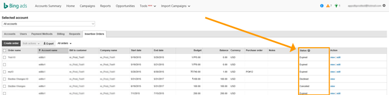

# How do I create and edit an insertion order?

If you have monthly invoice billing set up for your account, you need to have an active insertion order for your ads to be eligible for delivery. An insertion order is a contract that establishes the maximum amount you will spend on your account over a specified period of time. You still control your spend using your campaign budget, and you will only be charged for what you accrue. For example, if you had a month-long insertion order for $5,000 and accrued only $4,500 in charges over the billing period, then we will only deduct $4,500 from your insertion order budget.

> [!IMPORTANT]
> The insertion order budget only applies to ad spend, which is an important distinction if your business is in a country/region where online services are taxed. If you have a strict budget limit, you may need to account for taxes in your insertion order budget. To learn more about tax requirements in your business location, see [Tax or VAT information](./hlp_BA_CONC_TaxVATInfo.md).

## The insertion order process

You can create the insertion order in Microsoft Advertising or call your Microsoft Advertising account manager to create it for you. (Please note that you must also approve any insertion orders that your account manager creates on your behalf.)

If your Microsoft Advertising account is managed by an agency, your agency can also create and manage insertion orders on your behalf, even if they are not the bill-to customer responsible for advertising costs.

## Interested in monthly invoice billing?

You must meet [minimum requirements and pass a credit check](./hlp_BA_PROC_MonthlyInvoiceApply.md) in order to set up monthly invoice billing. Once you have been approved, you'll see the Insertion Orders page within Billing &amp; Payments. Only Super Admins or Standard Users have permissions to create, edit, approve, and cancel insertion orders. The agency user must be either a Super Admin or a Standard User. Learn more [about user roles](./hlp_BA_CONC_SSUserRoles.md).

For more information about monthly invoice billing, see [What you need to know about monthly invoice billing](./hlp_BA_CONC_MonthlyInvoiceBilling.md).

## How do I...

Here's a list of common tasks for managing your insertion orders.

## Create one insertion order
When you create an insertion order, it becomes active on its start date. However, if your Account Manager creates an order on your behalf, you must first approve it so that it's active upon its start date.

1. [!INCLUDE [ClickBilling](./includes/ClickBilling.md)]
1. Select **Insertion Orders** from the main menu.
1. Select **Create order** and select **Insertion order** to open the order form.
1. Select the account.
1. Enter the **Start date**, **End date**, and **Budget** amount.
1. Optional: Enter a purchase order number that you receive from your company's expense system to help track this insertion order.
1. Optional: Enter an **Order name**. 			We recommend that you create a simple, easy to identify order name to help track the insertion order when managing a large number of them.
1. Optional: Enter **Notes** that might be helpful to you regarding this insertion order.
1. If you want to add more insertion orders, select **Add another**.
1. When you are done, select **Submit**.

## Create a recurring insertion order
A recurring insertion order is a series of insertion orders that automatically renews according to its set frequency.

1. [!INCLUDE [ClickBilling](./includes/ClickBilling.md)]
1. Select **Insertion Orders** from the main menu.
1. Select **Create order** and select **Recurring insertion order** to open the order form.
1. Enter a **Series name** that will help identify a grouping of orders. A series name can have a maximum of 60 characters.
1. Select a **Frequency**, which defines how an order recurs in the series. You can choose: **Monthly**, **Every 2 months**, **Quarterly**, or **Yearly**.
1. Then you'll need to determine whether the series has an end date or if it ends after a number of occurrences. Your options are:
   - **Have an end date for the series**, which allows you to add a end date under **Series end date** if it's chosen
   - **Have no end date**, which will allow orders to recur indefinitely until the series is manually cancelled
   - **End after a number of occurrences**. You can enter a number from 1 to 60.

1. Select the account.
1. Enter the **Start date** (if you don't want to use the default of today's date) and the **End date** (if you've chosen to have an end date for the series).
1. In **Budget per order**, enter an amount. This amount will be used for each order in the series.
1. Optional: Enter a purchase order number that you receive from your company's expense system to help track this insertion order.
1. Optional: Enter an **Order name**.             We recommend that you create a simple, easy to identify order name to help track the insertion order when managing a large number of them.
1. Optional: Enter **Notes** that might be helpful to you regarding this insertion order.
1. When you are done, select **Submit** to create a series of orders.

## Approve or decline an insertion order created by Microsoft Advertising
If your account manager creates an insertion order for you, you'll need to approve it. You'll receive an email when there is an insertion order pending your review.
1. [!INCLUDE [ClickBilling](./includes/ClickBilling.md)]
1. Select **Insertion Orders** from the main menu.
1. Find the insertion order with the status **Pending your review**.
1. Next to that insertion order, in the **Action** column, click **approve** or **decline**.

## View and print an insertion order
You can view insertion order details, including a list of changes made to the insertion order, and you can print an insertion order.
1. [!INCLUDE [ClickBilling](./includes/ClickBilling.md)]
1. Select **Insertion Orders** from the main menu.
1. In the **Action** column, click **view**.
1. On the **Insertion order details** page, click the print icon .

## Edit an insertion order
Here are a few  things to keep in mind when editing an insertion order:

- Once the start date has passed, it can't be changed.
- You can reactivate an expired insertion order by changing its end date to one in the future.
- You can't change the insertion order budget so that it is less than the amount you've already spent.
- You can choose to edit one insertion order within a series. However, if you do so, you'll remove that order from the series, and it will become a standalone insertion order. Any subsequent changes you make to the series won't be applied to the new standalone order.

1. [!INCLUDE [ClickBilling](./includes/ClickBilling.md)]
1. Select **Insertion Orders** from the main menu.
1. In the **Action** column, click **edit**. If you edit an order that's part of series, you'll be asked whether you want to edit one order in the series or the entire series.
1. Make changes to the insertion order (or the series), and select **Save**. 			You'll receive an email to let you know that the changes have been approved or declined.

## Reactivate an expired insertion order
Reactivating an expired insertion order is as easy as changing its end date to one in the future. When you do, the insertion order will resume and start drawing from its existing budget. So, if you opt to the change the budget, set an amount that's higher than what's been spent so far.

1. [!INCLUDE [ClickBilling](./includes/ClickBilling.md)]
1. Select **Insertion Orders** from the main menu.
1. In the **Action** column, click **edit**.
1. Change the **End date** to a date in the future, and select **Save**.             You'll receive an email to let you know that the changes have been approved or declined.

## Approve or decline one insertion order added or edited by Microsoft Advertising
If your account manager adds a new insertion order or makes changes to one of your existing insertion orders, you'll need to approve that change. You'll receive an email when there is a change pending your review.

1. [!INCLUDE [ClickBilling](./includes/ClickBilling.md)]
1. Select **Insertion Orders** from the main menu.
1. Find the insertion order that you need to approve. (The status will be **Pending your review** for a new insertion order or **Change pending your review** for an existing insertion order that has been modified).
1. Next to that insertion order, select **approve** or **decline**.

## Approve or decline multiple insertion orders edited by Microsoft Advertising
If your account manager adds new insertion orders or makes changes to several existing insertion orders, you'll need to approve those changes. You'll receive an email when there are changes pending your review.

1. [!INCLUDE [ClickBilling](./includes/ClickBilling.md)]
1. Select **Insertion Orders** from the main menu.
1. From the table, select the check boxes next to insertion orders you want to export to approve or decline. (The status will be **Pending your review** for a new insertion order or **Change pending your review** for an existing insertion order that has been modified).
1. Just above the table, select **Bulk actions** to open the menu. Then, select **Approve** or **Decline**.

## Pre-approve an insertion order for account linking
You can now pre-approve an insertion order when you're scheduled to [take over billing on a linked account](./hlp_BA_CONC_MultiAccount.md).

If your account manager or Microsoft Advertising support creates an account linking request on your behalf, it will include an insertion order that you can pre-approve. The insertion order becomes active on the effective date only if the account link is accepted. A pre-approved insertion order eliminates downtime and ensures that ads continue to serve even as billing responsibility changes hands.

As with any insertion orders created by Microsoft Advertising staff, you'll need to approve it to before it becomes active. You'll receive an email when there is an insertion order pending your review.

1. [!INCLUDE [ClickBilling](./includes/ClickBilling.md)]
1. Select **Insertion Orders** from the main menu.
1. Find the insertion order that you need to approve. (The status will be **Pending your review** for a new insertion order or **Change pending your review** for an existing insertion order that has been modified).
1. Next to that insertion order, select **approve** or **decline**.

## Use filters to find an insertion order
At the top of the Insertion Orders grid, you'll find the **Filters** menu that allows you to filter for insertion orders in up to five of the following 13 dimensions: order name, account name, account number, bill-to customer name, company name, purchase order, notes, start date, end date, budget, balance, currency, and status.

1. [!INCLUDE [ClickBilling](./includes/ClickBilling.md)]
1. Select **Insertion Orders** from the main menu.
1. Select **Filters** to open the menu, and then click **Create filter**.
1. Select one of the 13 dimensions from the first list. Choose a filter from the second list (**contains**, **does not contain**, **begins with**, **end with**, **equals**, and **does not equal**). Add your filtering criteria in the third box.
1. Repeat as desired to add a filter on up to five dimensions.
1. If you wish to save your filter, check the box next to **Save filter** and add a filter name in the adjacent box.
1. Select **Apply** to filter the grid.

## Cancel an insertion order
1. [!INCLUDE [ClickBilling](./includes/ClickBilling.md)]
1. Select **Insertion Orders** from the main menu.
1. In the **Action** column, select **cancel**.
   - **For a standalone insertion order:**  Select **Cancel Order**.
   - **For a recurring insertion order:**  You'll be asked whether you want to cancel just one order or the entire series. Choose either **Just this order** or **The entire series**.

## Bulk tasks via file

Save time with bulk editing. By using the export and import process, you can add, approve, cancel, decline, and edit insertion orders—all at the same time through a single file.

## Export data to a file
If you have existing insertion orders, you can modify all or selected orders by exporting the data to a file. Each row in the file corresponds to an insertion. Once you finish your edits, you can import the modified file back in to Microsoft Advertising.

1. [!INCLUDE [ClickBilling](./includes/ClickBilling.md)]
1. Select **Insertion Orders** from the main menu.
1. To export all: Select **Export**, located just above the insertion orders table.             To export selected insertion orders: Select the check boxes next to insertion orders you want to export to a file, then click **Export**.
1. You'll receive exported data in a .csv file, which you can edit.

## Edit data in a file
If you've exported data of existing orders, you'll have a .csv file that contains these headings in the following order: Order ID, Order name, Account ID, Start Date, End Date, Budget, Purchase order, Notes, Status, DealPointID, Record ID, and Order type. Keep in mind that each row of data underneath the heading represents an insertion order.

Six categories are optional (Order name, Purchase Order, Notes, DealPoint ID, Record ID, and Order type). The remaining items are mandatory:

- **Order ID **is system generated for new orders (so leave that cell blank). For existing orders, the Order ID is returned in the exported file.
- **Account ID **specifies which account number the insertion order is for.
- **Start date **is the date when the order becomes active (subject to approval). It must be entered in the MM/DD/YYYY format.
- **End date **is the date when the order becomes expires. It must be entered in the MM/DD/YYYY format.
- **Budget **is the amount of the order.
- **Status **represents the action that you want to take on the order. Each row can have only one of the following statuses:
   - **active**, which means that you are adding a new order, modifying an existing order, or approving an existing order.
   - **canceled**, which means that you are canceling an active order.
   - **declined**, which means that you are declining a new order as part of the approval process.
   - **changecanceled**, which means that you are canceling submitted changes for an existing order as part of the approval process.
   - **changedeclined**, which means that you are declining submitted changes for an existing order as part of the approval process.
   - **changeapproved**, which means that you are approving submitted changes for an existing order as part of the approval process.

> [!NOTE]
> If you omit a mandatory item in your file, it will not upload during the import process, and you'll receive an error.

## Import from a file
Once you've modified exported order data, you'll be ready to import it back to Microsoft Advertising. You can also follow the instructions below if you prefer to build an import file from scratch.

1. [!INCLUDE [ClickBilling](./includes/ClickBilling.md)]
1. Select **Insertion Orders** from the main menu.
1. Select **Import**, located just above the insertion orders table.
1. You'll see a menu with two choices: **Import from file** and **Import history**. Click **Import from file**.
1. Select **Choose File** if you have an .csv, .tsv, or .xlsx file to upload, select your file, and then click **Continue**.          If you prefer to create a file from scratch (rather than using the export function), click **Download the import template**. You'll receive a .csv file that will allow you to properly format your data for import.
1. You'll see a high-level preview of the data you're importing. Click **Apply changes** to start the import.
1. Once the import process is complete, you'll see a summary of what was imported and any updates that were skipped.

> [!NOTE]
> If you omit a mandatory item in your file, it will not upload during the import process, and you'll receive an error.

## Review your import history
You can always review your import history, including import files and error logs, in the Import history page.

1. [!INCLUDE [ClickBilling](./includes/ClickBilling.md)]
1. Select **Insertion Orders** from the main menu.
1. Select **Import**, located just above the insertion orders table.
1. You'll see a menu with two choices: **Import from file** and **Import history**. Click **Import history**.
1. To review past imports: Click the file name to see the data within the file.
1. To review error logs: If an import failed, you'll see the **Download error file** link under **Error file**. Click that link to see the file.

## Insertion order status

Insertion order status can help you identify insertion orders that are running smoothly (**active**) and those that might require your attention (for example, **pending your review**).

## How to find insertion order status
1. [!INCLUDE [ClickBilling](./includes/ClickBilling.md)]
1. Select**Insertion Orders** from the main menu.

The status column is the second to last column.

Here's a list of insertion order statuses:

[!INCLUDE [IOStatus](./includes/IOStatus.md)]

