# Get Started with Microsoft Advertising

## Get on the path to Microsoft Advertising success!

<content_tile class="GetStartedLogo">      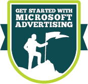    </content_tile>

## Getting started with Microsoft Advertising

Whether you’re coming from Google Ads or new to search engine marketing, it’s quick and easy to start advertising your business on Microsoft Advertising. Take a look at one of these video series to learn how Microsoft Advertising works and how to get started.

## Coming from Google Ads?
These videos will tell you all about Microsoft Advertising and how easy it is to import your Google Ads campaigns into Microsoft Advertising.

<bing_video id="video_newAdvertiser_01_differences">    
          What sets Microsoft Advertising apart from Google Ads?
          </bing_video>

<bing_video id="video_newAdvertiser_02_import">
Starting with Microsoft Advertising doesn't mean starting from scratch!
          </bing_video>

<bing_video id="video_newAdvertiser_03_check">
There are just a few things you need to pay attention to...
          </bing_video>

<bing_video id="video_newAdvertiser_04_payment">
Don't forget to set a payment method!
          </bing_video>

<bing_video id="video_newAdvertiser_05_next">
You're on your way!
          </bing_video>

## Want to create a campaign from scratch?
Familiar with search engine marketing? These videos show you the ins and outs of setting up Microsoft Advertising campaigns, expanding their reach, and getting the most out of them.

<bing_video id="video_gs1_basics">
Campaign basics
          </bing_video>

<bing_video id="video_gs2_create">
Create your campaign
          </bing_video>

<bing_video id="video_gs3_expand">
Expand your campaign
          </bing_video>

<bing_video id="video_gs4_activate">
Activate your campaign
          </bing_video>

<bing_video id="video_gs5_optimize">
Optimize your campaign
          </bing_video>

## New to search engine marketing?
These videos cover what you need to know about search engine marketing using Microsoft Advertising. All it takes is a little planning up front and regular checkups along the way!

<bing_video id="video_planGoal_GR">    
           Plan a successful campaign
          </bing_video>

<bing_video id="video_reach_GR">
Reach your customers
          </bing_video>

<bing_video id="video_ads_GR">
Create ads that get results
          </bing_video>

<bing_video id="video_budget_GR">
Set your budget and control your costs
          </bing_video>

<bing_video id="video_invest_GR">
Invest in what works
          </bing_video>

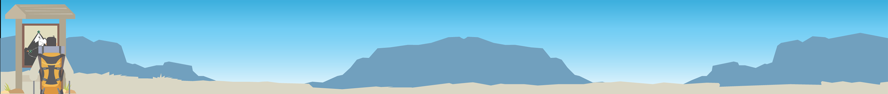              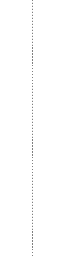      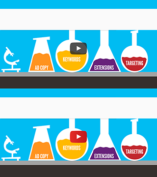    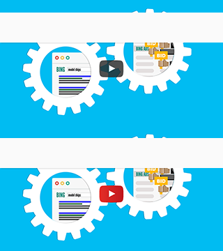    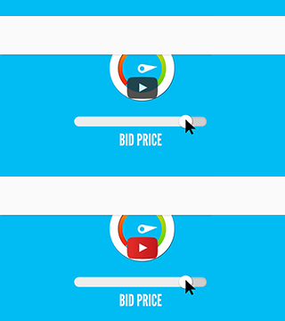    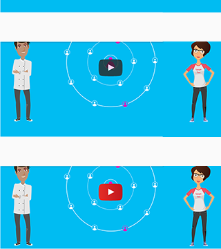    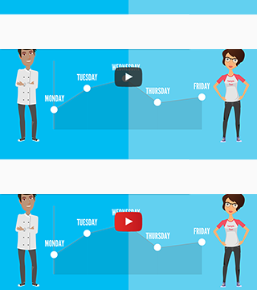    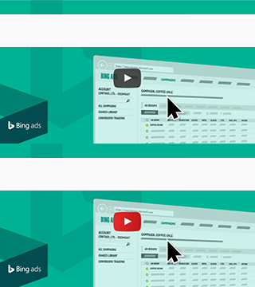    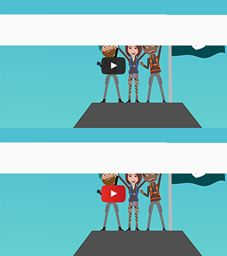    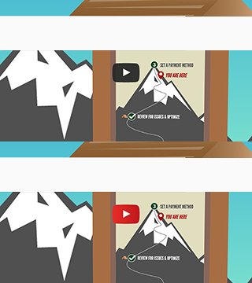    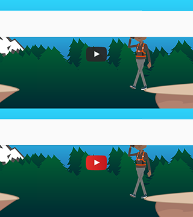    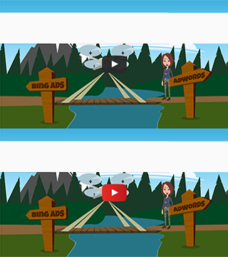      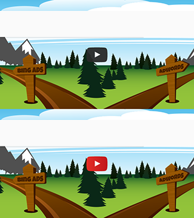      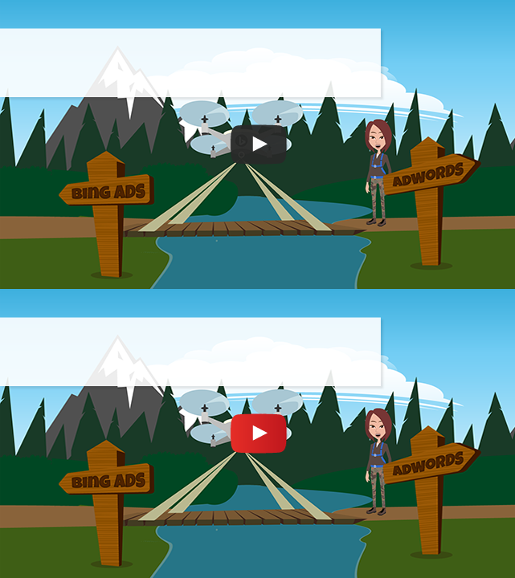      

