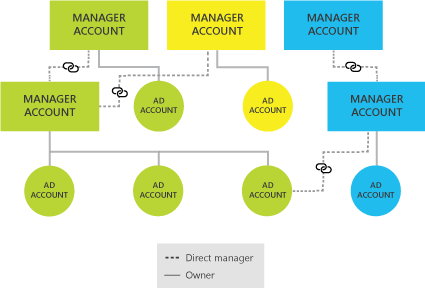

# Hierarchies in Microsoft Advertising

With hierarchies, you can scale Microsoft Advertising to meet the demands of your business, no matter its size. This feature allows you to create and arrange your Microsoft Advertising accounts so that they match the structure of your company, just like an org chart. Start with just one account and build up from there into a hierarchy of parent and subsidiary accounts.

This feature is geared towards agencies and large businesses to allow for easier and more centralized management of campaigns, users, access, and billing.

## How it works: A manager account vs. an account

When you sign up for a Microsoft Advertising account for the first time, you're technically getting two accounts in one:
- A **manager account** , which is a container for one account or for multiple accounts in a hierarchy. Additionally, a manager account can link to other manager accounts. Visually, think of a manager account as a file folder. A manager account is the parent account that allows you to share important items across several child accounts. Items that can be shared include:
   - Users and user roles
   - Payment methods
   - Universal Event Tracking (UET) tags
   - Remarketing lists

- An **account** , which is the account that directly serves ads. Continuing with the folder analogy with the manager account, think of an account as a file within the folder. An account contains:
   - Campaigns
   - Ad groups
   - Keywords
   - Budgets
   - Account settings, which can specify such things as currency and time zone

These two account types are complementary, meaning that you can't have a manager account without at least one account, and you can't have an account without a manager account. Both work in harmony to provide the flexibility you need to build a hierarchy, from the simple to the complex. So, whether you're a mom-and-pop shop or a global ad agency, we've got you covered.

A standard manager account can have up to six accounts (though advertisers who meet certain criteria and spend minimums are entitled to more accounts). Most small businesses have and need only one account. Why do you need both a manager account and an account? In a word: scale.

For example, imagine that you manage advertising for a large conglomerate. You want to create a nested account structure using manager accounts that reflect how your company is organized, with each layer nested under one another from top to bottom. Here's how you could order your setup:

- Parent company
- Geographic continent
- Market
- Brand name
- Product line

Each of those manager accounts has control over those below it. Each manager account can also have up to six accounts under it.

As a central folder, a manager account allows you to share important items—such as users, user roles, payment methods, and campaign resources like Universal Event Tracking (UET) tags and remarketing lists—across multiple accounts. And as you add accounts, you're able to leverage the manager account's central folder, thereby saving you time and effort by eliminating duplicate data entry.

When you go to the account level, you're freed to focus on campaign management within that space. Accounts are home to campaigns, ad groups, keywords, and budgets. The settings for accounts can also be customized to the needs of a marketplace. You can specify things such as an account's currency, time zone, and payment setting, which could all be different from account to account. You'll find this flexibility useful if, for example, your business targets customers in Canada, Mexico, and the United States, and you must track campaign performance by country and pay for advertising in different currencies.

## Using a manager account and an account

> [!NOTE]
> The account selector at the top of each Microsoft Advertising page helps you hop to any account you manage. Click the account selector to see all accounts in your hierarchy structure. You might need to click the arrow at the side of a manager account to show the accounts it manages. When you click any account in the selector, the data and information shown on Microsoft Advertising updates to reflect and apply to only the account you've selected.

Day to day, you'll work mostly within an account as you monitor and refine your campaigns. Occasionally, you may need to update a payment method or to add a user, both of which are managed in the overall manager account. Once you sign in to Microsoft Advertising, you'll be able to access both your manager account and your account. You won't need to sign in and out to go from one to the other.

Although you'll have a unique number for both a manager account and an account, you won't need to memorize either number, because they're listed in Microsoft Advertising in both the Accounts dashboard page and the account selector at the top of each page. Both types of numbers serve a specific purpose.

**Use a manager account number to:**
- Verify your manager account when you call in for support.
- Choose which account to sign in to through [multi-user access](./hlp_BA_CONC_UserNamePermissions.md), if you have access to more than one manager account (which is common for ad agencies or if you work with an ad agency to manage your Microsoft Advertising account).
- Send a linking request for access to another manager account.

**Use an account number to:**
- Review and compare performance data across accounts.
- Drill down into specific accounts.
- See spend by accounts on a billing document.
- Send a linking request to access another account.

## Building a hierarchy

You can build your hierarchy by [creating new accounts](./hlp_BA_PROC_CreateAcctSelfServe.md) and [linking to an existing ad or manager account](./hlp_BA_CONC_MultiAccount.md).

> [!NOTE]
> If you've already linked to all accounts within someone else's manager account, you can now gain greater control by linking to that manager account by [upgradingto a hierarchy](./hlp_BA_CONC_HierarchiesVersusMU.md).

To link to a manager account or to one or more accounts under a manager account, you will need the manager account number or account numbers of any account you want to link to. It's easiest to get that number from the account owner.
1. [!INCLUDE [ClickAccountaccessTab](./includes/ClickAccountaccessTab.md)]
1. On the **Accounts** page, in the table, in the **Account name** column, select the check box of the manager account that you want linked with another, then click **Link to accounts**.
1. Under **Enter Account IDs**, select whether you're linking to a manager account or to one or more accounts.
1. Enter the manager account number, or up to 20 account numbers, in the space provided, and click **Next**.
1. Under **Linking details**, set the start date for the link, select whether you want to set the permissions as Standard or Administrative, and click **Next**.
1. Under **Review details**, check to make sure the details are correct. Click **Send request**.
1. You can check the status of your request by going to the **Accounts summary** page, selecting the **Requests** tab, and clicking **Sent**.

## Shared library: UET tags and remarketing lists

Now that you can link previously separate manager accounts, you can take advantage of expanding the sharing scope of items within the shared library. You can create new and share existing UET tags and remarketing lists across accounts to simplify the management of conversion tracking and audiences.

## Managing an existing UET tag
There are two places you can manage your UET tags. The first is from **Accounts**, where you can see all the UET tags available for the manager account you've selected.

The other place where you can manage your UET tags is in the **Conversion tracking** section on your **Campaigns** page.
- In either place, you can check the UET tag's owner, sharing scope, and who it's used by in the UET tag table.
- If you're the owner of the UET tag or the owner's manager and a Super Admin user, you can share the existing UET tag by clicking **Manage scope** in the **Action** column.

The **Manage tag scope** pane will open where you can check and uncheck the accounts in your hierarchy that you want to use this tag. Keep in mind that the UET tag's owner can't be unchecked.

[Learn more about UET.](./hlp_BA_CONC_UETv2WhatIsTag.md)

## Managing an existing remarketing list
There are two places you can manage your remarketing lists. The first is in the **Shared Library** page that's accessible from the **Accounts** tab. There, you can see all the remarketing lists available for the manager account you've selected.

The other place where you can manage your remarketing lists is in the **Audiences** section on your **Campaigns** page.
- In either place, you can check the remarketing list's owner, sharing scope, and whom it's used by in the Audience table.
- If you're the owner of the remarketing list or the owner's manager and a Super Admin user, you can share the existing list by clicking **Edit**.

A pane will open where you can check and uncheck the accounts in your hierarchy that you want to use this remarketing list. Keep in mind that neither the remarketing list's owner nor the account created under that manager account can be unchecked.

[Learn more about remarketing.](./hlp_BA_CONC_Remarketing_FAQ.md)

