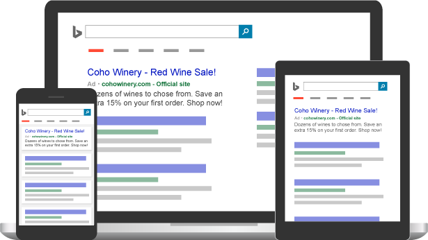

# Welcome to Microsoft Advertising Help

## Welcome to Microsoft Advertising Help!

Our videos, real-world examples, and how-to articles are here when you need them.   Let's get started!

[       New to Microsoft Advertising?     ](./hlp_BA_CONC_GetStarted2017.md)

## What's new in Microsoft Advertising?

Check out the new features to help you connect with customers and boost campaign performance.

[See what's new ](./hlp_BA_CONC_WhatsNew.md)

## Microsoft Advertising videos

We have dozens of videos to help you, whether you're a new or an experienced Microsoft Advertising advertiser.

[See videos](./hlp_BA_CONC_VidDirectory.md)

## Setup and Basics

Learn how to get your account up and running.

- [Get started with Microsoft Advertising](./hlp_BA_CONC_GetStarted2017.md)
- 
- 
- 
- 
- 

## Manage Ads

Find ways to optimize your ad campaigns.

- 
- 
- 
- 
- 
- 

## Measure Results

See how to track your campaign performance.

- 
- 
- 
- 

## Billing and Payments

Info on how to pay and what you can pay with.

- 
- 
- 
- 

## So what exactly is Microsoft Advertising anyway?

Microsoft Advertising is a powerful search advertising tool designed to get your ads in front of just the right customers. With Microsoft Advertising, your ads can appear on Bing, AOL, Yahoo, other Bing or Yahoo owned and operated sites, and syndicated search partner sites. That’s ad distribution you can’t get using Google Ads.

With Microsoft Advertising, search engine marketing (or SEM) works on a pay-per-click (PPC) basis. This means that you pay only when a potential customer clicks on your ad.  You tell us how much you want to spend on your ad campaign each day, and we make sure you get the best return on investment (ROI). We have tools that help you optimize your search ads to target and reach the perfect audience, get to the top of the search engine results page (SERP), and catch potential customers’ attention. And, using our reports, you can keep close tabs on your cost per click (CPC), click-through rate (CTR), and many more performance metrics – so you’ll always know you’re getting the most out of Microsoft Advertising.

Are you ready? [  Let's get on the path to Microsoft Advertising success!](./hlp_BA_CONC_GetStarted2017.md)

  

