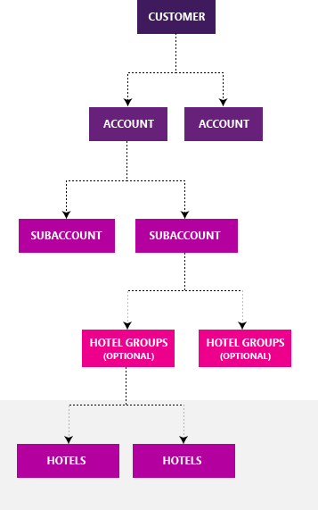

# Navigating Microsoft Hotel Center

> [!IMPORTANT]
> Hotel Ads is currently under controlled beta testing and is available to select advertisers only. Please contact your account manager for details on how you may be able to join.

Once you have been enabled for Hotel Ads, you can access Microsoft Hotel Center by clicking on **Tools** and then **Microsoft Hotel Center**. After you launch Microsoft Hotel Center, you’ll see three tabs that contain a set of core functionalities to assist with managing, scaling, and improving the performance of your hotel ads on Bing.

## The Overview tab

View hotel performance data and inline capabilities to set bids, budgets, and bid multiplier settings of your subaccounts.

The table in the Overview tab will display your subaccount’s hotel, hotel group, subaccount, date, device type, hotel country, length of stay, user country, and slot type data. You can view both active and inactive hotel performance and can download your subaccount’s data directly from the table.

## The Hotel Assignment tab

Create new, rename, or delete hotel groups; assign ungrouped hotels to a group; or move hotels from one hotel group to another in the Hotel Assignment tab.

## The Intelligence tab

Access tools and reports to improve the quality of your feeds and feed coverage from the Intelligence tab.

- **Feed Status**  allows you to track the latest updates regarding your feeds' processing.
- **Matching Report** helps you understand the data issues that may be preventing you from advertising on hotels.
- **Feed Upload** allows you to upload your hotel list in either CSV or XML format.

## Why use Hotel Ads?

- **Drive bookings** . When customers are searching for hotels, Hotel Ads will connect customers to you directly.
- **Showcase offerings** . Hotel Ads’ search experience showcases your hotel listings within the Bing search results page, as well as Bing Maps.
- **Get additional insight** . Learn about your potential customers by gaining insight with hotels and bookings reporting.
- **Complement existing text and dynamic search ad campaigns** .

## How does Hotel Ads fit within Microsoft Advertising?

Hotel Ads integrates seamlessly within your Microsoft Advertising customer level and account(s). We recommend that you create a new account within an existing customer level for Hotel Ads or enable Hotel Ads within an existing text ad and/or dynamic search ad account. You can create a new customer ID just for Hotel Ads but we don’t recommend this, as you’ll need create an additional UET tag to be placed on your site to properly track conversions across two separate accounts.

**How is Hotel Ads structured?**           
Microsoft Hotel Ads has five levels of organization: customer, accounts, subaccounts, hotel groups, and hotels.

- A **customer**  contains one or more accounts. A customer has a customer ID, which is associated with your business name and your address. At the customer level, at least one person is designated as the Super Admin. Super Admins have administrative access to all accounts.
- **Accounts**  contain one or more campaigns and include information about currency, time zone, whether you want to pay in advance (prepay) or pay later (postpay), your form of payment (primary payment method) and the people who have access to each account (users).
- **Subaccounts**  contain one or more hotel groups and specifies your daily budget, default bid and bid multipliers, and a maximum bid cap for all of your hotels. Note: You can only have one subaccount for now and all hotels from your feed belong within this subaccount.
- **Hotel groups**  are optional and belong within a single subaccount, containing one or more hotels. Once you’ve onboarded to Hotel Ads, all of your hotels will belong to the “Ungrouped” hotel group. A hotel group can override its subaccount’s bid or bid multipliers, or inherit them.
- **Hotels**  are at the lowest level where bids and bid multipliers can be set. Hotels can inherit bids and multipliers from a hotel group or directly from the subaccount. You can also specify bids and multipliers at the hotel level, which will override the hotel group or subaccount level settings.

## How do I get started with using Hotel Ads?

You need to work with your account manager to import your hotel and points of sale data to start using Hotel Ads. For details on Hotel Ads onboarding, check out this Bing Ads API article.

## FAQs
- **What bid amount should I use to start out?**              We recommend beginning with bids similar to what you use for your Google Hotel Ads. If you’re not currently using Google Hotel Ads, a fixed bid of 1 USD can be used to start. You can then adjust accordingly.
- **How should I organize my hotels?**              That depends on what your needs are. In general, if you require:
   1. **A different budget for different sets of hotels** , you can set up a unique subaccount for each set of hotels. This way, you can define the daily budget used for the hotels within the subaccount.
   1. **A different bid or bid multiplier for different sets of hotels** , you can set up hotels within hotel groups.
   1. **Different billing options** , you can create a separate Microsoft Advertising account and subaccount within it. For example, for international hotels, you can use the **Hotel Assignment** tab to move the desired hotels within the appropriate account/subaccount combination.

- **What's the difference between "Active hotels" and "All hotels"?**              “Active hotels” are currently live in your feed. “All hotels” include hotels currently live in your feed, as well as hotels that have been removed in the past and are no longer active. Removed hotels are included in “All hotels” to reflect an overall view of your historical performance data.

