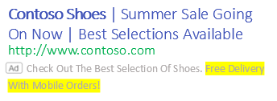
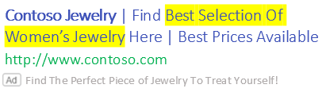

# About IF functions

Customize your ads to show specific text based on what potential customers are searching for by using IF functions. IF functions are specific parameters that are used in expanded text ads for the search network, so when a person is searching for something and the conditions are met, the parameter is replaced by the text you specify.

## Why use IF functions?

- **Save time!** IF functions reduce the need for you to create separate campaigns or ad groups for different devices and different audiences. You can customize a single Expanded Text Ad with messages based on a customer’s device or specific audience segment.
- **Send the right message** at the right time, to the right people. Your Expanded Text Ad gets customized based on two targets: device and audience.

Here are the supported targets for IF functions, with the syntax you’ll need to enter directly in the ads field:

<table type="type1">
  <tr>
    <th scope="col">Target</th>
    <th scope="col">Value</th>
    <th scope="col">Syntax</th>
    <th scope="col">How it appears</th>
  </tr>
  <tr>
    <th style="font-weight:normal;background-color:transparent;border-bottom:solid 1px #ccc" scope="row">
			Device
		</th>
    <td>Mobile</td>
    <td>{=IF (device = mobile, text to insert): default text}</td>
    <td>If the user is on a mobile device, the entire IF function is replaced with the value in “text to insert”. Otherwise, the “default text” that is provided will be used. Learn more about [targeting](./hlp_BA_PROC_TargetingAgeGender.md).</td>
  </tr>
  <tr>
    <th style="font-weight:normal;background-color:transparent;border-bottom:solid 1px #ccc" scope="row">
			Audience
		</th>
    <td>Any valid audience list name</td>
    <td>{=IF (audience IN (&lt;audience list 1&gt;, &lt;audience list 2&gt;), text to insert): default text}</td>
    <td>If the user is in audience list 1 or audience list 2, the IF function is replaced with the “text to insert”. Otherwise, the “default text” that is provided will be used. Learn more about [audience options](./hlp_BA_CONC_Audiences_Options.md).</td>
  </tr>
</table>

## How to add IF functions to your expanded text ad
From the main menu on the left, select **All campaigns**, then **Ads &amp; extensions**. Select the create ad button and then select an ad group. For **Ad type**, select **Expanded Text Ad**. IF functions are encased in brackets and inserted anywhere into an expanded text ad, except for the URL fields.

1. In **Title** or **Ad text** fields, enter a left curly bracket ( { ) where you want the IF function to appear. In the resulting drop-down menu, select IF function.
1. If you want to target by **Device** (mobile-only), enter the text you want to appear in the **Then** field. You can optionally add text in **Otherwise** for text to appear if the end-user isn’t on a mobile device.
1. If you want to target by **Audience**, select **Audience** from the dropdown field, then select the audience list to target. We recommend that you add text in **Otherwise** for text to appear, if the end-user doesn’t belong to any of the selected audience lists. This ensures that your ad always serves.

**Examples**
<table type="type1">
  <tr>
    <th scope="col">Microsoft Advertising</th>
    <th scope="col">Bing Search</th>
  </tr>
  <tr>
    <th style="font-weight:normal;background-color:transparent;border-bottom:solid 1px #ccc" scope="row">
						<strong>Headline 1</strong>: Contoso Shoes  
						<strong>Headline 2</strong>: Summer Sale Going On Now  
						<strong>Headline 3</strong>: Best Selections Available 
						<strong>Description</strong>: Check Out The Best Selection Of Shoes. {=IF (device = mobile,Free Delivery with Mobile Orders!): Free Delivery!}  

					</th>
    <td>
						<strong>Mobile</strong>
						 
						<para>
							
						</para>
						 
						<strong>Desktop</strong>
						 
						<para>
							
						</para></td>
  </tr>
  <tr>
    <th style="font-weight:normal;background-color:transparent;border-bottom:solid 1px #ccc" scope="row">
						<strong>Headline 1</strong>: Contoso Jewelry  
						<strong>Headline 2</strong>: Find {=IF(audience in(/Apparel&amp;Accessories), Best Selection Of Women’s Jewelry): Women’s Jewelry} Here  
						<strong>Headline 3</strong>: Best Prices Available 
						<strong>Description</strong>: Find The Perfect Piece Of Jewelry To Treat Yourself!  

					</th>
    <td>
						<strong>Audience</strong> = Apparal&amp;Accessories  
						<para>
							
						</para>
						 
						<strong>Other audiences</strong>
						 
						<para>
							
						</para></td>
  </tr>
</table>

## How to create an IF function manually
You can create an IF function manually by typing directly in the Create ad input boxes, by using a bulk upload spreadsheet, or by using Microsoft Advertising Editor. To ensure that you enter it correctly, here's an example of the IF function's components:

**{=IF (device = mobile,Free Delivery with Mobile Orders!): Free Delivery!} **
<table type="type1">
  <tr>
    <th scope="col">Component</th>
    <th scope="col">What you need to know</th>
  </tr>
  <tr>
    <th style="font-weight:normal;background-color:transparent;border-bottom:solid 1px #ccc" scope="row">{ ... }</th>
    <td>
						<strong>Mandatory</strong>. The entire IF function syntax must be within a pair of braces (also called curly brackets).
					</td>
  </tr>
  <tr>
    <th style="font-weight:normal;background-color:transparent;border-bottom:solid 1px #ccc" scope="row">=IF</th>
    <td>
						<strong>Mandatory</strong>. This component needs to be met so that the text defined in the <strong>Then</strong> box can appear in your title, path, or ad text fields.
					</td>
  </tr>
  <tr>
    <th style="font-weight:normal;background-color:transparent;border-bottom:solid 1px #ccc" scope="row">( ... )</th>
    <td>
						<strong>Mandatory</strong>. The other components of the syntax must be within a pair of parentheses. <strong>Note</strong>: Individual components within the parentheses must be separated by commas.
					</td>
  </tr>
  <tr>
    <th style="font-weight:normal;background-color:transparent;border-bottom:solid 1px #ccc" scope="row">"device"</th>
    <td>If the user is on a mobile device, the entire IF function is replaced with the value in “text to insert”. Otherwise, the “default text” that is provided will be used.
					</td>
  </tr>
  <tr>
    <th style="font-weight:normal;background-color:transparent;border-bottom:solid 1px #ccc" scope="row">"Free Delivery with Mobile Orders!"</th>
    <td>If the user is on a mobile device, the entire IF function is replaced with the value in “text to insert”. Otherwise, the “default text” that is provided will be used.
					</td>
  </tr>
  <tr>
    <th style="font-weight:normal;background-color:transparent;border-bottom:solid 1px #ccc" scope="row">"Free Delivery!"</th>
    <td>
						<strong>Optional</strong>: This is the text that will appear in your title, path, or ad text field if the IF function isn't met. 
					</td>
  </tr>
</table>

**{=IF(audience in(/Apparel&amp;AccessoriesAccessories), Best Selection Of Women’s Jewelry): Women’s Jewelry}**
<table type="type1">
  <tr>
    <th scope="col">Component</th>
    <th scope="col">What you need to know</th>
  </tr>
  <tr>
    <th style="font-weight:normal;background-color:transparent;border-bottom:solid 1px #ccc" scope="row">{ ... }</th>
    <td>
						<strong>Mandatory</strong>. The entire IF function syntax must be within a pair of braces (also called curly brackets).
					</td>
  </tr>
  <tr>
    <th style="font-weight:normal;background-color:transparent;border-bottom:solid 1px #ccc" scope="row">=IF</th>
    <td>
						<strong>Mandatory</strong>. This component needs to be met so that the text defined in the <strong>Then</strong> box can appear in your title, path, or ad text fields.
					</td>
  </tr>
  <tr>
    <th style="font-weight:normal;background-color:transparent;border-bottom:solid 1px #ccc" scope="row">( ... )</th>
    <td>
						<strong>Mandatory</strong>. The other components of the syntax must be within a pair of parentheses. <strong>Note</strong>: Individual components within the parentheses must be separated by commas.
					</td>
  </tr>
  <tr>
    <th style="font-weight:normal;background-color:transparent;border-bottom:solid 1px #ccc" scope="row">"audience in(/Apparel&amp;AccessoriesAccessories)"</th>
    <td>If the user is on an audience list, the entire IF function is replaced with the value in “text to insert”. Otherwise, the “default text” that is provided will be used.
					</td>
  </tr>
  <tr>
    <th style="font-weight:normal;background-color:transparent;border-bottom:solid 1px #ccc" scope="row">"Women's Jewelry"</th>
    <td>This is the text that will appear in your title, path, or ad text fields if the IF function conditions are met (must be within a pair of double quotation marks). 
					</td>
  </tr>
  <tr>
    <th style="font-weight:normal;background-color:transparent;border-bottom:solid 1px #ccc" scope="row">"Best Selection of Women's Jewelry"</th>
    <td>
						<strong>Optional</strong>: This is the text that will appear in your title, path, or ad text field if the IF function isn't met. 
					</td>
  </tr>
</table>

## How to escape special characters with backslashes (\)
Certain special characters used in an audience name or in the text field can break the syntax, so you’ll want to use backslashes (\) to escape the special characters. Below are the rules if these characters are referenced in the IF function syntax.

<table type="type1">
  <tr>
    <th scope="col">Syntax field</th>
    <th scope="col">Characters to escape</th>
    <th scope="col">Example</th>
    <th scope="col">System will detect as</th>
  </tr>
  <tr>
    <th style="font-weight:normal;background-color:transparent;border-bottom:solid 1px #ccc" scope="row">Audience name</th>
    <td>) and , </td>
    <td>{=IF(audience IN (Audiencelist\)te\,st),Insert text):Default text }</td>
    <td>Audience name =  Audiencelist)te,st</td>
  </tr>
  <tr>
    <th style="font-weight:normal;background-color:transparent;border-bottom:solid 1px #ccc" scope="row">Insert text</th>
    <td>)</td>
    <td>{=IF(audience IN (Audience list),Insert \)text):Default text }</td>
    <td>Insert text = Insert )text</td>
  </tr>
  <tr>
    <th style="font-weight:normal;background-color:transparent;border-bottom:solid 1px #ccc" scope="row">Default text</th>
    <td>}</td>
    <td>{=IF(device = mobile, Insert Text):Default\}text}</td>
    <td>Default text = Default }text </td>
  </tr>
  <tr>
    <th style="font-weight:normal;background-color:transparent;border-bottom:solid 1px #ccc" scope="row">All fields</th>
    <td>\</td>
    <td>{=IF(audience IN (Audience\\list),Insert text):Default text }</td>
    <td>Audience name = Audience\list</td>
  </tr>
</table>

## What you need to know

- These rules are less restrictive than Google Ads’ rules but the Google Ads rules will work in Microsoft Advertising. No changes will be required if you use expanded text ads from Google Ads.
- Audience names containing { } can’t be used in an IF function.
- Both device and audience cannot be referenced in one IF-function syntax.

