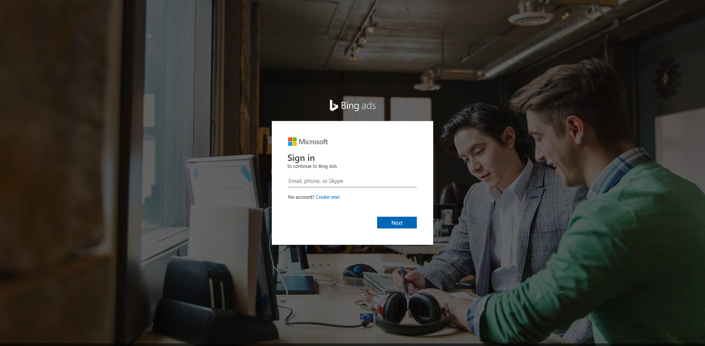

# We're changing the way you sign in

If you set up your Microsoft Advertising account prior to October 2013 and are still using a Microsoft Advertising user name and password to sign in, you'll need to transition to signing in with an email address (a Microsoft account). If you're already using an email address to sign in to Microsoft Advertising, you are good to go!

## How do I make the transition?

Periodically, when you sign in to Microsoft Advertising, you'll be redirected to a page where you'll be asked to provide an email address that will replace your user name. You can also visit the page directly to [change the way you sign in to Microsoft Advertising](https://go.microsoft.com/fwlink?LinkId=808861).     

You can choose from the following options:

- **Use an existing email address.**  You'll enter your email address and check its availability.
   - If this is an email address that you already use to sign in to Microsoft products, then you'll sign in and the transition will be complete.
   - If you've never used this email to sign in to a Microsoft product, then you'll go to Microsoft account and sign up for a new account.

- **Create a new email address.**  We'll take you to the Microsoft account sign-up page where you will sign up for a new email address.

After you complete the transition, you will no longer be able to sign in using your Microsoft Advertising user name and password.

## Which option should I choose?

If you aren't sure whether to use an existing or new email address, take a look at this table for more information.

[!INCLUDE [MSAChartv2](./includes/MSAChartv2.md)]
**Still have questions?**  Take a look at frequently asked questions.

## Why is Microsoft Advertising requiring customers to use an email address to sign in?
Using an email address (Microsoft account) to sign in offers two advantages:

- **Security.**  Microsoft account offers a two-step verification process that helps ensure the safety and integrity of your Microsoft Advertising account. If you choose to use [Two-step verification](https://go.microsoft.com/fwlink?LinkId=398313), you will be required to provide a security code, in addition to your email address and password, when accessing your account from any device that hasn't been previously authorized as a [trusted device](https://go.microsoft.com/fwlink?LinkId=398339).
- **Simplified sign in.**  Using one account to sign in to all your Microsoft products means you can get and stay           connected more easily.

## What is Microsoft account?
"Microsoft account" is the new name for what used to be called "Windows Live ID." Your Microsoft account is the          combination of an email address and a password that you use to sign in to services or devices, such as Office365, Skype, Hotmail, Messenger,          OneDrive, Windows Phone, Xbox LIVE, or Outlook.com. If you use an email address and password to sign in to these or other          services, you already have a Microsoft account. Or if you prefer, you can create a new Microsoft account using a personal email address (for example, Gmail or Yahoo).

## What if I've already linked an email address to Microsoft Advertising?
If you've already linked an account, you are one step ahead. We'll simply verify that you want to continue using this email address to          sign in to Microsoft Advertising, and you're done.

## What if multiple people are signing in using the same Microsoft Advertising user name?
A best practice for companies or agencies that have          multiple employees using a Microsoft Advertising account is to have each person sign in with a separate email address. Having separate user           accounts is more secure and also has the benefit of letting you use [change history](./hlp_BA_CONC_ChangeHistoryGraph.md)          to review changes made per user.

We suggest that an employee who has administrative access (Super Admin) transition to using an email address first, and then they can          invite users. To invite users, the Super Admin needs the Microsoft account email addresses of the employees          who want to sign in to Microsoft Advertising.           For more information on inviting users, see [How do I give someone access to my Microsoft Advertising account?](./hlp_BA_CONC_SSUserRoles.md)          And for information on signing in as an invited users, see [How do I access Microsoft Advertising as an invited user?](./hlp_BA_PROC_InviteNewUser.md)

## Will I be able to continue to use my Microsoft Advertising user name and password?
Until signing in with an email address is mandatory, you can continue to sign in with your Microsoft Advertising user name and password; however,          once you make the transition to signing in with an email address, you can no longer use your Microsoft Advertising user name and password to sign in.

## Does this change apply to other Microsoft Advertising products?
The email address that you use to sign in to Microsoft Advertising is the same one that you'll use with Microsoft Advertising Editor and Microsoft Advertising Intelligence.

[!INCLUDE [MSApubCenter](./includes/MSApubCenter.md)]

For API users, Bing Ads API Version 11 supports signing in with either Microsoft Advertising user name or your email address. Starting with Bing Ads API Version 12 and later, an email address with be required. For more information, read the Bing Ads API [Authentication with OAuth](https://go.microsoft.com/fwlink?LinkId=867179) technical guide.

## What if I have more than one Microsoft Advertising user name?
If you have more than one Microsoft Advertising user name, you will need to use a different email address for each one. You also have the option of combining user names (through your Account Manager or Support). See [Managing your user name to access multiple accounts](./hlp_BA_CONC_UserNamePermissions.md) for more information.

## I have transitioned to using an email address. Now where do I sign in?
If you are using an email address to sign in, you should [sign in on this page](https://go.microsoft.com/fwlink?LinkId=398315):

## I signed up with the wrong email address. How do I change to a different email address?
To change your email address, you or someone who has administrative access needs to [invite you as a new user](./hlp_BA_CONC_SSUserRoles.md). When you sign up this time, make sure to use the email address that you want to sign in with moving forward. Then, you or the administrator can delete your old user account.

If you need help with this change, you can [contact support](https://go.microsoft.com/fwlink?LinkId=398371).

## I'm getting an error (Sign up Error 450) saying that I've reached the limit for creating Microsoft accounts. What can I do?
Microsoft limits customers from setting up more than three Microsoft accounts from the same IP address within 24 hours. Please wait a day to set up additional accounts.

## After signing in using my email address, why do I still see my Microsoft Advertising user name?
When you first sign in after transitioning to an email address, you might see your old user name in the upper-right corner of the website. After a short period, or the next time you sign in, you'll see your email address instead.

