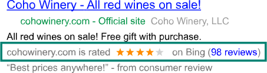

# What are merchant ratings?

Merchant ratings are Automated Extensions that display your business rating and link to highly rated reviews in your ads to show what people are saying about your business. Potential customers will be able to see your star rating and view reviews from third-party sources.

Here is what an ad might look like with a merchant rating:

## How merchant ratings work

A merchant rating is an Automated Extension that is added to qualifying ads, with no action required from you. Your business rating and links to highly rated reviews are displayed, showing what people are saying about your business. These reviews and ratings primarily reflect customers’ overall consumer experience with your business, not their response to particular products. We match these reviews to your ad by pairing the domain of the display URL to the advertiser’s domain from the review source on Bing.

Merchant ratings are based on several sources, including:

- Yahoo! Shopping
- Epinions
- bizrate
- TrustPilot
- PriceGrabber
- ReviewCentre
- ShopperApproved
- eKomi
- Feefo
- Verified Reviews
- Revoo.com

## Improve your merchant ratings

While you cannot modify your merchant ratings directly, you can take steps to help increase your ratings. Here are some tips:

- **Provide great customer service** . When your customers are happy, they will be willing to provide ratings for you and share their positive experiences with others.
- **Be proactive** . Pay attention to reviews about your business and other ways you measure customer satisfaction. If you have an unhappy customer, be proactive and quickly try to resolve any issues with that customer.
- **Keep your business name and website consistent** . Customers can leave reviews about your business on aspects that you don’t have control over, such as delayed shipping by the shipping company. Generally speaking, a few ratings like this shouldn’t impact your overall rating, as merchant ratings come from several sources. To make sure that your customers are leaving correct reviews for your business, make sure your business name and website information is consistent throughout different review sites and your [Microsoft Merchant Center](./hlp_BA_CONC_AboutBingMerchantCenter.md) account, if you have one.

## Get qualified for merchant ratings

Not all ads are eligible to have a merchant rating. To qualify for a merchant rating:

- Your campaign should be set up as a **Search campaign**.
- Your business must have at least 30 unique reviews, each from the past 12 months, and a composite rating of at least 3.5 stars or higher. However, we may show ratings for merchants with fewer than 30 reviews if we have sufficient data from other sources to determine an accurate rating.

## Modify or opt out of merchant ratings

Merchant ratings are displayed when the criteria mentioned above are met. When eligible, a merchant rating will automatically display, with no needed action from you. Because merchant ratings are provided by third-party sources, you are unable to modify the rating.

If you want to opt out of this feature, contact your Account Manager or [contact support](https://go.microsoft.com/fwlink?LinkId=398371). If you change your mind later, you can always opt back in.

## Learn more about automated extensions

Just like merchant ratings, automated extensions for ads require no action from you. Learn how [automated extensions](./hlp_BA_CONC_AutomatedExtensions.md) can enhance your ads.

 

