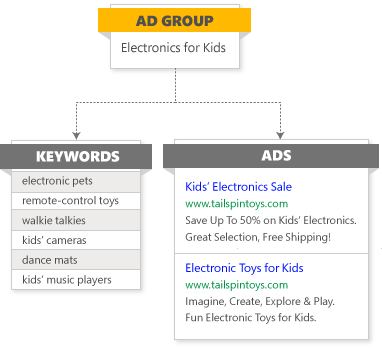

# Create a new ad group

Ad groups are the best way to organize your campaigns by specific products or services that you offer. An ad group contains a set of keywords and ads that are related to a common theme. Not only do they make it easier to manage related ads and keywords, well-organized ad groups make your ads more relevant to users’ searches. This, in turn, can help improve your ROI.

For example, Sarah owns a toy store and wants to create ads to highlight specials she will be offering. She could create different ad groups for “electronics for kids” and “riding toys,” which will each contain different sets of keywords and ads.  When she wants to make adjustments to these ads, she can easily make changes to all the ads in a given ad group simultaneously.

## Create an ad group
1. From the **Campaigns** page, click the **Ad Groups** tab (or from the main menu on the left, click **All campaigns** and then **Ad groups**).
1. Click **Create ad group** and select which campaign you want to create the ad group in.
1. Enter **Ad group settings**, including ad group name (up to 256 characters) and language.
1. Create at least one ad for this ad group. You can always create more ads later. [Learn more about creating ads](./hlp_BA_PROC_CreateEXTA.md).
1. Create a keyword list for this ad group. [Learn more about keyword lists](./hlp_BA_CONC_NewAd_BuildCampaign_Keywords.md).
> [!NOTE]
> Ad group names, ad titles and text, and keywords cannot contain scripts, HTML, or other markup language.

1. Under **Advanced ad group settings**, you have the option to specify the **Ad schedule** (a start and and date for ads) and **Ad distribution** (Where on the internet you want to show your ads) for ads in this ad group.
1. Review your **Ad group targets**. By default, these are set to use the campaign's settings, but you have the option here to customize them for each ad group.
1. Click **Save**.

## Edit an ad group
1. From the **Campaigns** page, click the **Ad Groups** tab (or from the main menu on the left, click **All campaigns** and then **Ad groups**).
1. Select the ad group you want to edit.
1. Click **Settings** and make any necessary changes.
1. Click **Save**.

