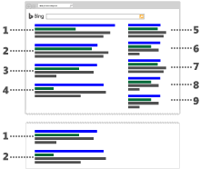
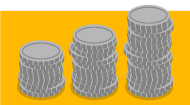

# Learn how Microsoft Advertising works

## How do keywords trigger ads?

Keywords are the words or phrases that you associate with your ads so that potential customers who are searching the web can find your ads. For example, Paul is the owner of Contoso Bistro. Since he wants to increase his lunch take-out business, he uses "lunch take-out" as a keyword for his ad. When someone searches for "lunch take-out" his ad will show on the Microsoft Search Network search results page.

You can choose how closely you want the words or phrases a customer searches to match your keywords. You can use exact match, which is just that—the search query must match your keywords exactly for your ad to show. Using exact match gives you the ability to show your ads to specific audiences, as your keywords are targeted more precisely. If Paul chooses his exact match keyword to be "lunch take out," the search query has to be exactly "lunch take out" as well.

On the other hand, you can use broad match, which means that your ads can show even when a relevant variation of your keyword is included when a customer does a search. Using broad match can show your ad to a wider range of customers without having to spend a lot of time building keyword lists. So, if Paul decides to use broad match for his campaign, his keyword of "lunch take-out" could be triggered by a search query for "lunch delivery."

 
## Where do ads show up?

Now that you know what can trigger your ad and where it can appear, let's take a quick look at ad position. When a customer does a search on Bing, AOL, or Yahoo, an auction determines which ads are shown and where they're placed on the page. This placement is what we call ad position, and it's where your ad appears on the Bing, AOL, or Yahoo search results page—on top of the search results, on the side of the page, or at the bottom of the page. It's generally more desirable to have your ad appear higher along the page, as it's more likely that customers will be able to see it.

Ad position is determined by a variety of factors:
- The amount you bid for your keyword.
- The amount the competition bid for that keyword.
- Your ad's relevance.
- Your ad's performance.

> [!NOTE]
> Text ads no longer serve in the sidebar on Bing owned and operated sites in the United States, United Kingdom, Germany, France, Canada, or Australia.

 
## How much will it cost?

How much you want to spend is up to you. You decide on the bid amount for keywords, which is the price you want to pay each time your ad is clicked. Then, every time someone does a search on the Microsoft Search Network, an auction determines which ads are shown and where they'll appear on the search results page. If your ad is eligible and appears in the search results page, you'll only be charged when the ad is clicked.

The actual pay-per-click (PPC) amount is, at the most, the bid amount you set and never more than that and you can pay now (prepay) or later (postpay) for those charges. When you prepay for your clicks, charges are deducted from funds you add to your account. Once you run out of funds, your account is put on hold until more money is added. When you pay later, charges accumulate as your ads are clicked. You then pay either on your monthly billing date or when you reach your billing threshold (a spending limit before we automatically bill you), whichever comes first.

What's next? How about learning [how to create a Microsoft Advertising account](./hlp_BA_CONC_NewAd_CreateABingAdsAcct.md)?

