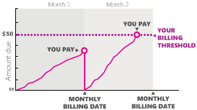

# Setting up your billing

Before your campaigns can go live and your ads run, you need to make some choices about how you are billed. If you create ad campaigns for your own business, it’s more common to set up postpay threshold accounts, which means you pay for clicks after charges add up and not ahead of time. For other billing options, including prepay and monthly invoice, see [What are my billing options? Pay now or pay later](./hlp_BA_CONC_HowBillingWorks.md).

## How postpay threshold accounts work

With postpay threshold accounts, Microsoft Advertising automatically bills you on your monthly billing date (the date of the month you signed up) or when your charges reach a specific amount, whichever comes first. This predetermined amount, called your billing threshold, is the credit limit of your account. As you make payments, your billing threshold will increase. Read more [about billing threshold](./hlp_BA_CONC_BillingThreshold.md).

## Set up your billing

When you’re ready to go live with your Microsoft Advertising campaigns, you’ll need to set up your billing information. Remember, with Microsoft Advertising pay-per-click advertising, you’re not charged until someone clicks your ad.

## How to enter your billing information for the first time
[!INCLUDE [Redesign](./includes/Redesign.md)]
1. [!INCLUDE [ClickBilling](./includes/ClickBilling.md)]
1. Click **Payment Methods** from the main menu.
1. Click **Add card** or another payment method of your choice.
1. Select the **country** of your billing address, and then select your **billing options**, including **how you pay (payment setting)** and **what you pay with (payment method)**.
1. Enter the required information based on the payment method you select.

For instructions on adding each of the different payment methods, see [Paying by credit and debit card](./hlp_BA_PROC_AddBilling.md) To find out which payment methods you can use based on the country of your billing address, see [Choosing a payment method for Microsoft Advertising](./hlp_BA_CONC_PaymentMethodsV2.md)

 

