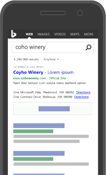

# Where your ads will appear with Microsoft Advertising

Advertise with Microsoft Advertising to have your ads display across the Internet. Keep your customers in mind when planning where you want your ads to appear and what kind of ads you want to create. Try to think about where your customers are located or what they might like. How could you create ads that will resonate with customers, leading to more visits to your website and a higher return on investment?

## Show your ads on Bing and other search sites

Your ads can appear on search results page when a customer does a search on Bing, AOL, Yahoo, and syndicated partner sites (like MSN.com or Bing.co.uk). Where your ad appears on search results pages is determined by the keywords you use to associate your ads. For example, Sarah owns a toy store and wants to create ads for kids’ electronics. She might include keywords like "walkie-talkies", "electronic pets", and "kids’ music players" so her ads could be more relevant to customers’ searches, and show above or next to the search results.

Learn more about [ad position](./hlp_BA_CONC_WhatIsAdPosition.md) and [getting to the top of the search results page](./hlp_BA_CONC_ImproveAdPosition.md).

## Show your ads on smartphones and tablets

Your ads can appear specifically for customers on the go, who use their smartphones and tablets to search and browse the Internet. Or you can create ads that appear on both desktops and smartphones but prioritize where you want the ads to appear more often.

## Show your ads for specified locations or certain languages

You can show your ads to customers in specific locations, like cities or countries. For example, Sarah wants only local customers to see her ads. She can set your ads to appear to customers within a 20-mile radius around her shop by using radius targeting.

You can also set your ads to the languages your customers speak, which will influence where your ads will appear. For example, if Sarah wants her ads to be in German, her ads can appear not only in Germany but Austria and Switzerland as well. [Learn more about how ad language and location targeting affect who can see your ads](./hlp_BA_CONC_LocTargetAndLang.md)

