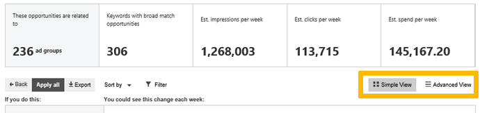

# Use Microsoft Advertising Opportunities for ideas to improve your campaign

On the Opportunities page, you will see several suggestions for improving the performance of your campaign. Here's an example of what your Opportunities page might look like:

You can select any of the View Opportunities buttons to see suggestions in either a Simple View, which is the default view, or an Advanced View, which gives you a more detailed, tabular way to review, apply, and dismiss opportunities. You can toggle between Simple View and Advanced View, and we'll remember your last setting.

> [!NOTE]
> You might not see opportunities if Microsoft Advertising doesn't have enough historical performance data to provide suggestions or your account or all of your campaigns are inactive or paused.
> Opportunities are automatically generated estimates based on historical campaign performance. The actual performance of Opportunities may vary and are not guaranteed.

These suggestions can include any or all of the following:

## Add new keywords

Keyword suggestions are based on your existing campaigns’ ads, landing pages, and existing keywords. We’ll also provide bid suggestions and an estimated performance impact of those new keywords. [Learn more](./hlp_BA_CONC_AboutKW.md)

## How to apply new keyword opportunities
1. Go to the **Opportunities** page.
1. If a suggestion is available to **Add new keywords so that more potential customers can see your ads**, select **View Opportunities**.
1. select **Apply**. (To see more details, select **View**, or to remove the opportunity, select **Dismiss**.)

## Add broad match to your existing keywords

If you're missing traffic that’s relevant to your existing exact and phrase match keywords, we might suggest using some broad match keywords as well. And, in order to help you decide which broad match terms make the most sense for your specific business, we’ll provide you a list of top search terms which might trigger those broad match keywords. [Learn more](./hlp_BA_CONC_BroadMatchModifier.md)

## How to apply broach match type to existing keywords
1. Go to the **Opportunities** page.
1. If the suggestion is available to **Add broad match versions of your exact and phrase match keywords to show your ads to more potential customers**, select **View Opportunities**.
1. select **Apply**. (To see more details, select **View**, or to remove the opportunity, select **Dismiss**.)

## Add broad match modifier keywords

If you want more relevant traffic with good quality control, we suggest adding some broad match modifier keywords as well. We'll suggest broad match modifier keywords based on current exact or phrase match keywords, or we'll suggest new keywords based on the content of your campaign. We will also provide bid suggestions and the estimated performance impact of those new keywords. [Learn more](./hlp_BA_CONC_BroadMatchModifier.md)

## How to add broach match modifier keywords
1. Go to the **Opportunities** page.
1. If the suggestion is available to **Add broad match modifier keywords **, select **View Opportunities**.
1. select **Apply**. (To see more details, select **View**, or to remove the opportunity, select **Dismiss**.)

## Increase your bids to move your ads to mainline

If your ads can be shown in better positions with a reasonable bid increase, we’ll suggest bids that will help move your ads to the mainline (top of page) position. [Learn more](./hlp_BA_PROC_Location_Opportunity.md)

## How to increase your bids to move your ads to mainline
1. Go to the **Opportunities** page.
1. If the suggestion is available to **Increase keyword bids to move your ads to the mainline**, select **View Opportunities**.
1. select **Apply**. (To see more details, select **View**, or to remove the opportunity, select **Dismiss**.)

## Increase your bids to move your ads to best position

If your ads can be shown in better positions with a reasonable bid increase, we’ll suggest bids that will help move your ads to the best (position one) position. [Learn more](./hlp_BA_PROC_Location_Opportunity.md)

## How to increase your bids to move your ads to best position
1. Go to the **Opportunities** page.
1. If the suggestion is available to **Increase keyword bids to move your ads to the best position**, select **View Opportunities**.
1. select **Apply**. (To see more details, select **View**, or to remove the opportunity, select **Dismiss**.)

## Increase your bids to move your ads to first page

If your ads can be shown in better positions with a reasonable bid increase, we’ll suggest bids that will help move your ads to the first page of search results. [Learn more](./hlp_BA_PROC_Location_Opportunity.md)

## How to increase your bids to move your ads to first page
1. Go to the **Opportunities** page, you can get there by clicking **Opportunities** at the top of the page.
1. If the suggestion is available to **Increase keyword bids to move your ads to the first page**, select **View Opportunities**.
1. select **Apply**. (To see more details, select **View**, or to remove the opportunity, select **Dismiss**.)

## Increase your bids to show your ads more often than other advertisers' ads

If your ads can be shown more often than your competitors' ads, we'll suggest that you raise the bids for keywords that are triggering      your ads and the ads of other advertisers, identified by domain URL, that are competing for the same traffic. You can track your success by reviewing your impression share, which is the number of times an ad was shown on the Microsoft Search Network divided by the total eligible impressions.      These bid suggestions are based on your competitors’ impression share from the [auction insights report](./hlp_BA_CONC_AuctionInsighs.md). [Learn more](./hlp_BA_CONC_AboutAdvancedBidding.md)

## How to increase your bids to show your ads more often than other ads
1. Go to the **Opportunities** page.
1. If the suggestion is available to **Increase keyword bids to show your ads more often than other advertisers’ ads**, select **View Opportunities**.
1. select **Apply**. (To see more details, select **View**, or to remove the opportunity, select **Dismiss**.)

## Lower your bids to increase clicks

If your campaign is limited by budget and we have determined that you can get more clicks by lowering your bids, we’ll suggest lowering your bid along with details of the potential impact. [Learn more](./hlp_BA_CONC_AboutAdvancedBidding.md)

## How to lower your bids to increase clicks for the same budget amount
1. Go to the **Opportunities** page.
1. If the suggestion is available to **Lower your bids to increase clicks for the same budget amount**, select **View Opportunities**.
1. select **Apply**. (To see more details, select **View**, or to remove the opportunity, select **Dismiss**.)

> [!NOTE]
> The suggested bid change percent will be applied to all bids under this campaign.
> This opportunity will only be available for campaigns that are limited by budget and meet certain criteria. Not all budget-limited campaigns will have this opportunity.
> The estimated impact reflects how lower bids might have affected your impressions, clicks, and spend in the past. It isn't meant to predict or guarantee future performance.

## Increase your budget

If your ads are not showing as often as they can because of budget limitations, we’ll suggest increases to your budget along with details of the potential impact. [Learn more](./hlp_BA_CONC_NewAd_SetCampaignBudgetAndBidAmounts.md)

## How to increase your budget
1. If not already on the **Opportunities** page, you can get there by clicking **Opportunities** at the top of the page.
1. If the suggestion is available under **Increase your campaign budgets to show your ads more frequently**, select **View Opportunities**.
1. Make sure you are in the Simple View.
1. If you can edit the suggestion, select **View** to make changes.
1. If you want to accept the suggestion, review the estimated improvement and then select **Apply**.
1. If you want to delete the suggestion,  select **Dismiss**.

## Location bid adjustment

You can set up location bid adjustments to bid more or less competitively depending on where people are located. Microsoft Advertising can also tell you the likelihood of clicks and conversions from people in some of your target locations based on your account’s conversion history. [Learn more](./hlp_BA_CONC_AboutAdvancedBidding.md)

## How set a location bid adjustment
1. If not already on the **Opportunities** page, you can get there by clicking **Opportunities** at the top of the page.
1. If the suggestion is available under **Set location bid adjustments to focus on areas where you're getting more business**, select **View Opportunities**.
1. If you can edit the suggestion, select **View** to make changes.
1. If you want to accept the suggestion, review the estimated improvement and then select **Apply**.
1. If you want to delete the suggestion,  select **Dismiss**.

## Keep customers coming back

By keeping track of the customers that have visited your website, the remarketing bid strategy opportunity can give you more specific bid adjustment suggestions by leveraging that data. To take full advantage of this opportunity, make sure to [create a remarking list](./hlp_BA_CONC_Audiences_CreateAudience.md) which will help document who previously visited your website. [Learn more](./hlp_BA_CONC_Audiences_Remarketing.md)

## How set a remarketing bid strategy opportunity
1. If not already on the **Opportunities** page, you can get there by clicking **Opportunities** at the top of the page.
1. If you can edit the suggestion, select **View** to make changes.
1. If you want to accept the suggestion, review the estimated improvement and then select **Apply**.
1. If you want to delete the suggestion,  select **Dismiss**.

## Promote popular or unique aspects of your business

Get extra space to highlight your website with Callout Extensions. They can be used for special offers or for better product descriptions to entice customers. [Learn more](./hlp_BA_PROC_AddCalloutExtension.md)

## How set a Callout Extension opportunity
1. If not already on the **Opportunities** page, you can get there by clicking **Opportunities** at the top of the page.
1. If you can edit the suggestion, select **View** to make changes.
1. If you want to accept the suggestion, review the estimated improvement and then select **Apply**.
1. If you want to delete the suggestion,  select **Dismiss**.

## Increase your ad's select-through rate

Sitelink Extensions are one way to improve your ad’s select-through rate (CTR). It adds to your ad copy a handful of deep links to specific pages on your website such as product categories, quick actions, or contact info. This extension also helps your ad be more visible to search users that can result in more clicks to your website. [Learn more](./hlp_BA_PROC_AddSitelinkExtension.md)

## How set a Sitelink Extension opportunity
1. If not already on the **Opportunities** page, you can get there by clicking **Opportunities** at the top of the page.
1. If you can edit the suggestion, select **View** to make changes.
1. If you want to accept the suggestion, review the estimated improvement and then select **Apply**.
1. If you want to delete the suggestion,  select **Dismiss**.

## Align your bids with the unique value of each customer

You can use bid adjustments, also known as incremental bids, to increase or decrease your bid for certain target customers. Bid adjustments can be made for demographics such as gender, age, and location. You can also target customers who are searching on certain days and/or time of day. [Learn more](./hlp_BA_DEFN_IncBid.md)

## How set an ad scheduling bid adjustment opportunity
1. If not already on the **Opportunities** page, you can get there by clicking **Opportunities** at the top of the page.
1. If you can edit the suggestion, select **View** to make changes.
1. If you want to accept the suggestion, review the estimated improvement and then select **Apply**.
1. If you want to delete the suggestion, select **Dismiss**.

## Make the right adjustments

Each keyword can have a different cost per conversion, so Microsoft Advertising has created a way for you to dynamically adjust your bids based on your keywords’ conversion history. With the keyword bid adjustment opportunity, you can lower unnecessarily high bids or spend more on high-performing keywords, resulting in a better return on investment for each campaign. [Learn more](./hlp_BA_PROC_SearchTerm.md)

## How set a keyword bid adjustment opportunity
1. If not already on the **Opportunities** page, you can get there by selecting **Opportunities** at the top of the page.
1. If you can edit the suggestion, select **View** to make changes.
1. If you want to accept the suggestion, review the estimated improvement and then select **Apply**.
1. If you want to delete the suggestion, select **Dismiss**.

## Import campaigns directly from Google Ads

If you already are using Google Ads to advertise on Google, you can import these campaigns into Microsoft Advertising so that you can run the same ads on Bing. This is an easy way to expand your online advertising reach. [Learn more](./hlp_BA_PROC_ImportCampaign.md)

> [!NOTE]
> Import opportunities are generated based on a range of inputs including analysis of your past imports, campaign performance, and information from external sources.

## How set an import opportunity
1. If not already on the **Opportunities** page, you can get there by clicking **Opportunities** at the top of the page.
1. If you can edit the suggestion, select **View** to make changes.
1. If you want to accept the suggestion, review the estimated improvement and then select **Apply**.
1. If you want to delete the suggestion, select **Dismiss**.

<anchor id="BMD" />

## Know where your keywords are sourced

One of the first and most important tasks of running a search marketing campaign is to choose your keywords. To help you reach a wider set of customers, Microsoft Advertising generates new keyword suggestions from multiple sources. This opportunity helps you clearly identify these keywords and where they came from.        [Learn more](./hlp_BA_CONC_AboutKW.md)

## How to apply an opportunity to generate new keyword suggestions from multiple sources
1. If not already on the **Opportunities** page, you can get there by clicking **Opportunities** at the top of the page.
1. If you can edit the suggestion, select **View** to make changes.
1. If you want to accept the suggestion, review the estimated improvement and then select **Apply**.
1. If you want to delete the suggestion,  select **Dismiss**.

 

