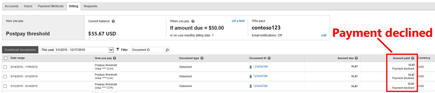
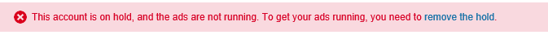

# How do I fix a declined payment?

Payments can fail for a number of reasons but typically the credit card company declines the payment.

## Common reasons credit card companies decline a payment
**Card has expired.**   If your card has expired, your credit card company might block payments until you update the expiration date. See [Update your credit card expiration date](./hlp_BA_PROC_AlertCardExpire.md).

**Billing address has changed.**  If your billing address has changed, your credit card company might block payments until you update your billing address.

**Card has reached the transaction limit.**   We might have tried to process a transaction after your card had reached its credit limit, or we might have charged your card more than your credit card company allows for a single transaction.

**Card is blocked.**   If your card was reported as stolen or lost, or your credit card company suspects fraudulent activity, your card might be temporarily blocked.

**Card requires that Microsoft Advertising be an approved merchant.**   If you have purchased additional theft protection services through your credit card company, those services might require you to confirm that Microsoft Advertising is an approved merchant.

**Strong customer authentication is required.**   Your bank might require multi-factor authentication to help prevent online fraud and unauthorized access to your account. You can make a manual payment and authenticate your card.

If your payment has been declined, you will receive an email from us and a notification will be posted on the Billing tab showing “Payment declined” and the amount we tried to charge.

## Fixing a declined payment

1. [!INCLUDE [ClickAccounts](./includes/ClickAccounts.md)]
1. **If you have one account:** Click the ellipsis next to **Errors** to expand the description. Click **Remove hold**.           **If you have multiple accounts:** In the **Errors** column, click the ellipsis to expand the description. Find the account that contains the **Hold** status, and click **Remove hold**.
1. Click **Fix declined payments** in the **How do I remove the hold** column. From there, you'll be guided through a form to add a payment method or to update the declined card (which will be marked in red with the date it was declined).

Once you update your declined card or add a new one, we will charge you for the balance due. Accounts hold will be lifted as soon as the payment is successfully processed. We will also replace your primary payment method if you choose a different form of payment or add a new one.

## Still having problems?

If you have contacted your bank and you're still having problems, please [contact support](https://go.microsoft.com/fwlink?LinkId=398371).

## Declined payments can lead to account hold

After a payment is declined, we'll let you know via email that we couldn't process your payment. We'll also try to process the payment again in case there was a temporary system issue or the problem with your card has been resolved. Here's how that works:

- If we process your card two times and payment fails, we will place a hold on all the accounts associated with that card. Ads that are in those accounts will no longer be eligible to run. We'll also let you know via email which of your accounts are on hold.
- When an account goes on hold due to payment issues, we'll identify the declined payment method with a red label marked "On hold" in the Payment Methods page.      
- We will try to process the payment three more times (for a total of five attempts). If you have other cards that fail, **all of your accounts **may go on credit hold. In that case, none of your ads will be eligible to run.

If your account is put on hold, you’ll see a banner notification at the top of Microsoft Advertising with a link to help you resolve the issue:

For more information, see [Why is my account on hold?](./hlp_BA_PROC_AlertAcctHold.md)

