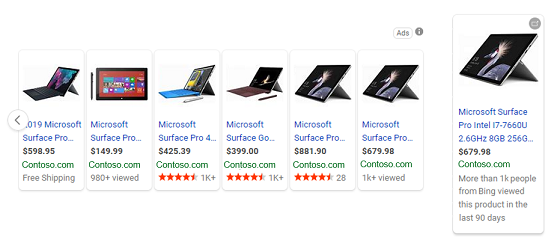
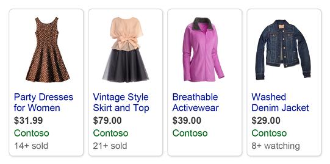

# Enhance product ads with Automated Extensions

Microsoft Advertising can enhance your product ads with Automated Extensions.  The visibility and performance of your ads are improved by displaying extra information about your business - more clicks means more customer traffic! Automated Extensions are automatically added to your product ads if Microsoft Advertising determines that the Automated Extension can improve your product ad performance.

Automated Extensions show data from any of the sources – your ad landing pages, ad copies, and domains your ad copy points to. Certain data, like reviews and ratings, may be provided from third-party providers.

All advertisers are eligible for Automated Extensions, however, they are not always guaranteed to show in the product ads.

Here are the different types of Automated Extensions available **only** for product ads from Microsoft Advertising. Keep in mind that these are examples only and your ad might look a little different than shown below.

## Automated Extensions available for product ads

## Elite Merchant Badge
The clickable Elite Merchant Badge provides consumers with an easy way to identify ads from high-quality advertisers.

The badge is based on merchant rating scores, which are aggregated from third-party rating sources. Websites with a high merchant rating score are eligible for the Elite Merchant Badge. Keep in mind that a high merchant rating score does not guarantee that the badge will be shown in your ad.

**Eligible to serve on ads in the following markets** :

Microsoft Search Network:

- Australia
- Canada
- France
- Germany
- India
- Italy
- Netherlands
- Spain
- Sweden
- Switzerland
- United Kingdom
- United States

**Devices** : Desktop and tablet devices

## Price Drop
Price reductions in your product feed are automatically detected by Bing and triggers the Price Drop Extension for your ad.

**Eligible to serve on ads in the following markets** :

Microsoft Search Network:

- Australia
- Canada
- France
- Germany
- India
- United Kingdom
- United States

**Devices** : Desktop and tablet devices

## Product Ratings
Display ratings from customers' sites and trusted third parties on your ads. [Learn more](./hlp_BA_CONC_BSC_ProductRatings.md)

**Eligible to serve on ads in the following markets** :

Microsoft Search Network:

- Australia
- Canada
- France
- Germany
- India
- Italy
- Netherlands
- Spain
- Sweden
- Switzerland
- United Kingdom
- United States

**Devices** : Desktop and tablet devices

## Top Viewed
Display the popularity of a product by showing the number of times the item was viewed to help potential customers make decisions to purchase.

**Eligible to serve on ads in the following markets** : United States

**Devices** : Desktop

## Items Sold
Share how many items have sold or how many people are watching an item to help entice customers to purchase before the items are no longer available.

**Eligible to serve on ads in the following markets** : United States

**Devices** : Desktop

## How do I opt out of Automated Extensions for product ads?

If you decide you want to opt out of Automated Extensions for product ads, please contact [Microsoft Advertising support](https://go.microsoft.com/fwlink?LinkId=398371).

Keep the following in mind:

- It will take approximately one week for your account to be opted out of Automated Extensions.
- Opt-out is only available at the customer level. All products in the stores within the customer level will not have Automated Extensions.
- Choosing to opt out of an Automated Extension will opt out the account from all Automated Extensions.

> [!NOTE]
> Automated Extensions may or may not appear in ads, depending on predicted impact.

