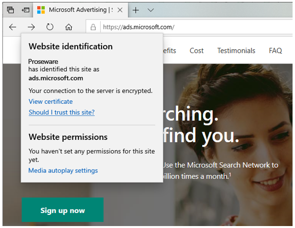

# Best practices to help protect your Microsoft Advertising account

We take your security and safety very seriously and have dedicated teams working to mitigate and help prevent any fraudulent activity. However, it is critical for you to also protect your Microsoft Advertising account, personal information, password, and internet-connected devices from unwelcome activity. In the event an issue arises, taking swift action can help minimize the damage from any compromise of your Microsoft Advertising credentials.

Here are some safety tips to help protect your Microsoft Advertising account as well as some suggestions about what you can do if your account has been compromised.

## Best practices for signing in to (Microsoft Advertising)
If you’re still signing in to Microsoft Advertising with a username and password, we recommend that you start using a Microsoft account instead. Signing in with the Microsoft account that you use to access other Microsoft products allows you to take advantage of additional security features. These features make it more difficult for someone else to sign in, even if they have learned your password.

- **Turn on two-step verification:**  Two-step verification helps protect your account by making it more difficult for a hacker to sign in, even if they have your password. Any time you sign in from a device that isn't trusted, you'll be prompted to enter a security code.  Learn more [about turning on two-step verification](https://go.microsoft.com/fwlink?LinkId=398313).
- **Use the Microsoft Authenticator app:**  This is the most effective way to protect your account. The Microsoft Authenticator app provides an easy way to use the multiple forms of identification that you have provided, to get you signed in fast using two-step verification. Some examples of different forms of identification include: Your password, your fingerprint, face recognition, or a PIN. Download the [Microsoft Authenticator app.](https://go.microsoft.com/fwlink/?linkid=2114126)
- **Identify yourself with a security code:**  When you access sensitive Microsoft Advertising information or make changes (your password, for example), you’ll be asked to enter a security code that has been sent to your phone or an email address. After you enter the code, you can access and manage your information.

## Use one email address and password per person
We know people sometimes share sign-in information, but this practice is not recommended for a number of reasons:

- **Security:**  When everyone is sharing the same sign-in information, it can be difficult to keep your Microsoft Advertising accounts secure, particularly  when people transition in and out of a company.
- **Privacy:**  If you are signing in with an email address, you need to remember that the email address has personal information associated with it (for example, a telephone number and birth date). The email address can also be used to sign in to other Microsoft products that coworkers probably wouldn’t want to share (for example, Outlook, Skype, Xbox Live).
- **Change history:**  Reviewing your change history to see who made changes to an account and how those changes impacted performance is more difficult. Maintaining an accurate change history requires each user to sign in with a different user name or email address.

## Create strong passwords and keep them private
- Secure company routers and online accounts with strong passwords or PINs. Strong passwords are long phrases or sentences, and mixed capital and lowercase letters, numbers, and symbols.
- Use a unique password on each account or device containing personal or business data.
- Don’t disclose passwords or PINs to coworkers.

## Avoid phishing scams
Before you sign in, make sure that you are signing in to the real Microsoft Advertising website and not a look-alike website that is trying to "phish" for your user name and password. Here are three easy things to look for in the address bar to make sure you're signing in to Microsoft Advertising:

- Look at the address bar to see that you are at the legitimate Microsoft Advertising site: https://ads.microsoft.com
- Ensure that the web address is secure: it starts with "https," not "http."
- Verify that the web site has a valid security certificate:

## Defend your computer
- Strengthen your computers’ defenses:
   - Keep all software, including your web browser current with automatic updating (or follow the directions of your IT department).
   - Install legitimate antivirus and antispyware software.
   - Never turn off your firewall.
   - Use flash drives carefully to minimize the chance that you’ll infect your company network with malware.
   - Make sure all computers and devices are locked when they are left unattended.

- Don’t be tricked into downloading malicious software. Think carefully before you open attachments or click links in unusual email, instant messages (IM), or text messages on social networks or in random pop-up windows. If you’re unsure if a message is legitimate, even if it’s from a coworker, contact the sender, ideally using a different device and another account.

## Protect company data and financial assets
- Don’t put **confidential** information in email, instant messages, or text messages; they may not be secure.
- For the most sensitive transactions, such as Automated Clearing House (ACH) payments and payroll, consider using a dedicated computer not used for email or web browsing.
- Treat all public Wi-Fi networks as a security risk. Never make financial and other sensitive transactions on any device over public wireless networks.
- Learn more about [how to help keep your Microsoft Advertising safe and secure.](https://go.microsoft.com/fwlink/?linkid=2113247).

 
## What to do if there are problems

If you think your Microsoft Advertising account has been compromised because of theft or loss of a laptop, smartphone, or other device, or because of a breach of network security or an account, please [notify Support](https://go.microsoft.com/fwlink?LinkId=398371) immediately and change all passwords used to log on to the device.

