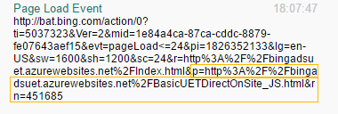
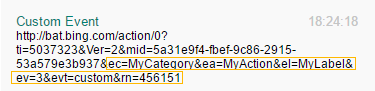
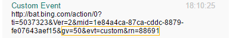

# Test conversion goals and audiences with UET Tag Helper

UET Tag Helper is a browser extension that validates the implementation of the Microsoft Advertising Universal Event Tracking (UET) tag—and the functionality of conversion goals—on any given webpage. It is available in Microsoft Edge and Google Chrome. To learn more about UET tags, see [What is UET and how can it help me?](./hlp_BA_CONC_UETv2WhatIsTag.md)

UET Tag Helper allows you to:

- **Validate and troubleshoot UET tags.**  You can validate UET tags right in the browser instead of checking the tag status in Microsoft Advertising after a few hours. The UET Tag Helper icon tells you how many UET tags you have on a webpage and if they are working or not. If your tags are not working, the helper tells you what the issue is and what you can do to fix it.
- **Test your conversion goals.**  Show UET Tag Helper which conversion you want to test and then navigate your website, and it will tell you what conversion events it records, what problems it encounters, and how to fix them.

## Set up UET Tag Helper
1. Download the [UET Tag Helper](https://go.microsoft.com/fwlink?LinkId=2134986) in Edge.
1. Select **Get**, and then **Add extension**.  			  By installing the UET Tag Helper, you agree to the  [Microsoft Service Agreement](https://go.microsoft.com/fwlink?LinkId=789244) and [Microsoft Privacy Statement](https://go.microsoft.com/fwlink?LinkId=517636).
1. Once installed, you will see the UET Tag Helper icon in Edge.

1. Download the [UET Tag Helper](https://go.microsoft.com/fwlink?LinkId=847466) in Chrome.
1. Select **Add to Chrome**, and then **Add extension**.  			  By installing the UET Tag Helper, you agree to the  [Microsoft Service Agreement](https://go.microsoft.com/fwlink?LinkId=789244) and [Microsoft Privacy Statement](https://go.microsoft.com/fwlink?LinkId=517636).
1. Once installed, you will see the UET Tag Helper icon in Chrome. 			

## Validate UET tags
1. In Edge or Chrome, go to a webpage that you want to check, and then select the UET Tag Helper icon.
1. In UET Tag Helper, flip the toggle **On**, and then refresh the browser page.
1. Review the UET Tag Helper icon status. The color of the badge shows the status, and the number in the badge shows how many times there was a UET tag request from the webpage.
<table>
  <tr>
    <th scope="col">Badge type</th>
    <th scope="col">What it looks like</th>
    <th scope="col">What it means</th>
  </tr>
  <tr>
    <th scope="row">No badge</th>
    <td style="min-width:120px; text-align:center; border-top:1px solid #ccc">
					
					</td>
    <td style="vertical-align:middle; border-top:1px solid #ccc">
					This can mean several things:<ul><li>There is no UET tag installed on the page so you need to add it.</li><li>The UET tag is formatted incorrectly so the UET Tag Helper doesn't recognize it. You need to reinstall the UET tag.</li><li>The UET tag is installed on the website's conversion page only (for example, the purchase confirmation page) so you need to navigate to the conversion page with the UET Tag Helper turn on.</li></ul></td>
  </tr>
  <tr>
    <th scope="row">Green badge</th>
    <td style="min-width:120px; text-align:center">          
					
				  </td>
    <td style="vertical-align:middle">
				  There are tags on this webpage and they are working correctly. No action required.
				  </td>
  </tr>
  <tr>
    <th scope="row">Yellow badge</th>
    <td style="min-width:120px; text-align:center">
				   
					
				  </td>
    <td style="vertical-align:middle">
					The tags on this webpage are working correctly but can be improved. Select the UET Tag Helper icon to see what the issue is and how you can resolve it. 
				  </td>
  </tr>
  <tr>
    <th scope="row">Red badge</th>
    <td style="min-width:120px; text-align:center">
				
					
				  </td>
    <td style="vertical-align:middle">
				  The tags on this webpage are not working correctly and need to be fixed. Select the UET Tag Helper icon to see what the issue is and how you can resolve it.
				  </td>
  </tr>
</table>

> [!NOTE]
> The number in the badge indicates how many times there was a UET tag request from the webpage. So the first time you visit a webpage, it shows you the number of UET tags on that webpage but if you refresh the webpage again the number increases.

## Fix issues

1. Select the UET Tag Helper icon to open the tag details.
1. On the **Results** tab, review the errors and the suggestions on how to fix the issue.
1. Fix the issues and check the webpage again.

## Test conversion goals
UET Tag Helper can now test your conversion goals. Show it which conversion you want to test and then navigate your website, and it will tell you what conversion events it records and what problems it encounters.
1. [!INCLUDE [ConversionGoals](./includes/ConversionGoals.md)]
1. Go to the **Tracking status** for this conversion goal and select **Test this conversion goal**.
1. Select the UET Tag Helper icon in your browser's extension menu.
1. Enter your landing page URL in the helper and select **Start test**.
1. Navigate through your website and attempt to trigger your conversion goal event.
1. When you see either **Conversion found** or **Problem encountered**, select **View report** for a summary of what was passed back to Microsoft Advertising.
1. For the **Problems encountered**, follow the instructions in the report to fix the issues.
1. Wait at least 24 hours and then check to see if you're recording conversions and variable revenue accurately.

## Test audience lists
You can test audiences such as Dynamic remarketing lists with the UET tag helper. Show it which audience that you want to test and then navigate through your website, and the UET tag helper will tell you what events it records and what problems it encounters.
1. [!INCLUDE [Audiences](./includes/Audiences.md)]
1. Go to the **Audience status** column in the list of audiences and hover over the status of the audience that you want to test. Select **Test this audience**.
1. Select the UET Tag Helper icon in your browser's extension menu.
1. Enter your landing page URL in the helper and select **Start test**.
1. Navigate through your website and attempt to trigger updates to the audience.
1. When you are ready to see the results, select **End test** and select **View report** for a summary of what was passed back to Microsoft Advertising.
1. For the **Problems encountered**, follow the instructions to resolve any issues.

## UET Tag Helper FAQ
## Can UET Tag Helper be installed on computers that don't have admin privileges?
Yes, UET Tag Helper can be installed on computers with standard access privileges. However, you need the Edge or Chrome browser installed on your computer and it might require admin approval to install.

## Will the UET Tag Helper validate my entire website?
UET Tag Helper validates one webpage at a time. To troubleshoot your entire website, you need to run UET Tag Helper on each webpage in the your browser.

## How can I get the latest version of the UET Tag Helper?
When there is an update available, it will be automatically installed within 24 hours of release.

## What does the Events tab show?
The Events tab shows the UET events that were triggered on the webpage. There are three types of events you can see:

- **Page load event:**  If you added a JavaScript UET tag to your webpage, this will show for conversion goals and remarketing lists that don't have a custom event. The URL of the current page is recorded in this event with the ‘P’ parameter (Page URL): 						  
- **Custom event:**  If you added a JavaScript UET tag to your webpage, this will show for conversion goals and remarketing lists that have a custom event. The event parameters passed in the custom event script can be found in the **ec** (category), **ea** (action), **el** (label) and **ev**  (value) parameters: 						   						  Variable revenue will also show in a custom event. The recorded revenue value will be recorded in the  **gv** parameter: 						  
- **Beacon:**  If you added a Non-JavaScript UET tag to your webpage, this will show for all conversion goals and remarketing lists.  						  

## What does the Tracking code tab show?
The tracking code for each UET tag. 					  

## Why do I need to check P parameter?
Most of the time, the webpage you go to after you select the ad and where the UET tag is firing from (Referrer URL) is the same. This might not be the case if you use an iFrame.

An iFrame or Inline Frame is used to embed another document within the current HTML page. If the UET tag is embedded in an iFrame, the Referrer URL of the webpage and the iFrame can be different. In this case, Microsoft Advertising might receive two different Referrer URLs. This is why we should always use the **P** parameter when checking for Destination URL.

## How to validate a destination URL conversion goal?
After you have installed the UET tag on your webpage, waited 24 hours, and received clicks on your ad, you can validate your conversion goal. First in Microsoft Advertising, you want to find out the conversion goal status, and then if the status is **Tag inactive**, you can use UET Tag Helper to validate if the issue is caused by the UET tag.

1. [!INCLUDE [ConversionGoals](./includes/ConversionGoals.md)]
1. Review the **Tracking status** column.
## Unverified
**What it is**:  Microsoft Advertising hasn’t received any user activity data from the UET tag on your website. It can take up to 24 hours for Microsoft Advertising to verify. If you still see this status, you either have not added the UET tag tracking code to your website or there is an issue with the setup that you need to fix.

**What to do:**  Nothing

## No recent conversions
**What it is**:  Microsoft Advertising has seen your UET tag, but haven't recorded any conversions in the last 7 days. This is most likely because you either have created the goal incorrectly, have not tagged your entire website, especially the pages that have the conversion action or you don't have any users converting on your site.

**What to do:**  Nothing

## Recording conversions
**What it is**:  Microsoft Advertising has seen your UET tag and has recorded conversions within the last 7 days. If your conversion window is greater than 7 days and you are filtering on the last 7 days, you may see this status even if no conversions are shown in the **Conversions** column, as conversions are reported at the time of the select.

**What to do:** Nothing

## Tag inactive
**What it is**:  Microsoft Advertising has not received any user activity data from the UET tag in the last 24 hours. Make sure that the UET tag tracking code is still on your website.

**What to do:**  Validate with UET Tag Helper

1. If the status is **Tag inactive**, go the destination URL associated with the conversion goals in your browser, turn UET Tag Helper **ON**, and then validate if the tag is working or not.
   - If the UET tag is working, check the **Events** tab to make sure there is a **Page Load event** and the **P** parameter matches the URL define in the conversion goal.
   - If the UET tag is not working, use UET Tag Helper to troubleshoot the issue.

> [!NOTE]
> If the conversion goal uses a Begins, Contains or Regx operator to define the destination URL, you will need the specific URL for the conversion page (for example, the purchase confirmation page) or navigate to the conversion page with the UET Tag Helper turn on.

## How to validate a custom event conversion goal?
After you have installed the UET tag on your website, waited 24 hours and received select on your ads, you can validate your conversion goal. First in Microsoft Advertising, you want to find out the conversion goal status, and then if the status is **Tag inactive**, you can use UET Tag Helper to validate if the issue is caused by the UET tag.

1. [!INCLUDE [ConversionGoals](./includes/ConversionGoals.md)]
1. Review the **Tracking status** column.
## Unverified
**What it is**: Microsoft Advertising hasn’t received any user activity data from the UET tag on your website. It can take up to 24 hours for Microsoft Advertising to verify. If you still see this status, you either have not added the UET tag tracking code to your website or there is an issue with the setup that you need to fix.

**What to do:**  Nothing

## No recent conversions
**What it is**:  Microsoft Advertising has seen your UET tag, but haven't recorded any conversions in the last 7 days. This is most likely because you either have created the goal incorrectly, have not tagged your entire website, especially the pages that have the conversion action or you don't have any users converting on your site.

**What to do:**  Nothing

## Recording conversions
**What it is**:  Microsoft Advertising has seen your UET tag and has recorded conversions within the last 7 days. If your conversion window is greater than 7 days and you are filtering on the last 7 days, you may see this status even if no conversions are shown in the **Conversions** column, as conversions are reported at the time of the select.

**What to do:**  Nothing

## Tag inactive
**What it is**:  Microsoft Advertising has not received any user activity data from the UET tag in the last 24 hours. Make sure that the UET tag tracking code is still on your website.

**What to do:**  Validate with UET Tag Helper

1. If the status is **Tag inactive**, in your browser, turn UET Tag Helper **ON**, complete the steps needed to trigger the custom event, and then validate if the tag is working or not.
   - If the UET tag is working, check the **Events** tab to make sure there is a **Page Load event** and a **Custom event** and that the custom event matches what is defined in the custom event conversion goal.
   - If the UET tag is not working, use UET Tag Helper to troubleshoot the issue.

## How to validate a conversion goal with variable revenue?
After you have installed the UET tag on your website, waited 24 hours and received select on your ads, you can validate your conversion goal. First in Microsoft Advertising, you want to find out the conversion goal status, and then if the status is **Tag inactive**, you can use UET Tag Helper to validate if the issue is caused by the UET tag.

1. [!INCLUDE [ConversionGoals](./includes/ConversionGoals.md)]
1. Review the **Tracking status** column.
## Unverified
**What it is**:  Microsoft Advertising hasn’t received any user activity data from the UET tag on your website. It can take up to 24 hours for Microsoft Advertising to verify. If you still see this status, you either have not added the UET tag tracking code to your website or there is an issue with the setup that you need to fix.

**What to do:**  Nothing

## No recent conversions
**What it is**:  Microsoft Advertising has seen your UET tag, but haven't recorded any conversions in the last 7 days. This is most likely because you either have created the goal incorrectly, have not tagged your entire website, especially the pages that have the conversion action or you don't have any users converting on your site.

**What to do:**  Nothing

## Recording conversions
**What it is**:  Microsoft Advertising has seen your UET tag and has recorded conversions within the last 7 days. If your conversion window is greater than 7 days and you are filtering on the last 7 days, you may see this status even if no conversions are shown in the **Conversions** column, as conversions are reported at the time of the select.

**What to do:**  Nothing

## Tag inactive
**What it is**:  Microsoft Advertising has not received any user activity data from the UET tag in the last 24 hours. Make sure that the UET tag tracking code is still on your website.

**What to do:**  Validate with UET Tag Helper

1. If the status is **Tag inactive**, in your browser, turn UET Tag Helper **ON**, complete the steps needed to trigger the conversion goal, and then validate if the tag is working or not.
   - If UET tag is working, check the **Events** tab to make sure there is a **Page Load event** and a **Custom event**,  revenue isn't missing, and **gv and gc** are not blank. If the revenue is missing, you need to add the revenue code to your website. If the gv or gc value is blank, there is something wrong with your revenue function. For more information, see [How to track custom events with UET](./hlp_BA_CONC_UETv2CustomEvent.md)
   - If the UET tag is not working, use UET Tag Helper to troubleshoot the issue.

## How to validate a remarketing list?
For remarketing lists, you  need to verify that the UET tag on the webpage defined in the remarketing list is working.

- If you selected one of the **Visitor of a page** options, go the destination URL defined in the remarketing list, turn UET Tag Helper **ON**, and then validate if the tag is working or not.
- If you selected the **Custom events**, in your browser, turn UET Tag Helper **ON**, complete the steps needed to trigger the custom event, and then validate if the tag is working or not.

## How can I fix the "UET tag outside of head or body" issue?
You need to move the UET tag into the head or body section of the webpage.

Paste the UET tag tracking code on every page of your website, either in the head or body sections.					  In the image, the UET tag is pasted at the top of the body section of the webpage.  					  
> [!NOTE]
> The UET tag tracking code can be added anywhere on the webpage, in the head section (before the closing head tag &lt;/head&gt;) or the body section (before the closing body tag &lt;/body&gt;).

## How can I fix the "UET tag contains incorrect HTML" issue?
Delete the current UET tag from the webpage, copy the UET tag from Microsoft Advertising, and then add it to the webpage again.

1. Sign in to Microsoft Advertising.
1. In the left navigation pane, select **Conversion Tracking** and then **UET tags** (or from the global menu at the top of the page, select **Tools** and then **UET tags**).
1. In the table, find the UET tag that you want to use and in the far right column, select **View tag**.					  
1. In the **UET tag tracking code** box, select **Copy** and then **Done**.  					  Note: If your website doesn't support JavaScript, select the **Non-JavaScript** tab before you select **Copy**.					  
1. Paste the UET tag tracking code on every page of your website, either in the head or body sections.					  In the image, the UET tag is pasted at the top of the body section of the webpage.  					  

## How can I fix the "Incorrect variable revenue value" issue?
Enter a value between 0 and 9999999 with up to 3 decimal places for the revenue value.  To learn more, see [How to report variable revenue with UET](./hlp_BA_CONC_UETv2RevenueVariables.md).

## How can I fix the "Incorrect currency code" issue?
Enter the currency code for the variable revenue defined in the conversion goal. To find the complete list of currencies available for conversion goals, see [Conversion Goal Revenue Currencies](https://go.microsoft.com/fwlink?LinkId=834524).

## How can I fix the "Incorrect event value" issue?
Enter a value between 0 and 9999999 with up to 3 decimal places for the event value.  To learn more, see [How to track custom events with UET](./hlp_BA_CONC_UETv2CustomEvent.md).

## How can I fix the "UET tag ID is invalid" issue?
Make sure that the tag ID you're using contains only numerals. To find the correct UET tag ID:
1. Sign in to Microsoft Advertising.
1. In the left navigation pane, select **Conversion Tracking** and then **UET tags** (or from the global menu at the top of the page, select **Tools** and then **UET tags**).
1. In the table, find the UET tag that you want to use and in the far right column, select **View tag**.
1. Copy the numerals that appear next to **ID**.

## How can I fix the "UET tag can't send data to Microsoft Advertising" issue?
Delete the current UET tag from the webpage, copy the UET tag from Microsoft Advertising, and then add it to the webpage again.

1. Sign in to Microsoft Advertising.
1. In the left navigation pane, select **Conversion Tracking** and then **UET tags** (or from the global menu at the top of the page, select **Tools** and then **UET tags**).
1. In the table, find the UET tag that you want to use and in the far right column, select **View tag**.					  
1. In the **UET tag tracking code** box, select **Copy** and then **Done**.  					  Note: If your website doesn't support JavaScript, select the **Non-JavaScript** tab before you select **Copy**.					  
1. Paste the UET tag tracking code on every page of your website, either in the head or body sections.					  In the image, the UET tag is pasted at the top of the body section of the webpage.  					  

## How can I fix the "There is no UET tag on this webpage" issue?
We can’t find the UET tag tracking code on this webpage but Microsoft Advertising received tracking data. Most likely you are using a tag management tool to manage your tags.					If this is what you want to do, you can ignore this message. If you want to add a UET tag tracking code to your website, follow these instructions.

1. Sign in to Microsoft Advertising.
1. In the left navigation pane, select **Conversion Tracking** and then **UET tags** (or from the global menu at the top of the page, select **Tools** and then **UET tags**).
1. In the table, find the UET tag that you want to use and in the far right column, select **View tag**.					  
1. In the **UET tag tracking code** box, select **Copy** and then **Done**.  					  Note: If your website doesn't support JavaScript, select the **Non-JavaScript** tab before you select **Copy**.					  
1. Paste the UET tag tracking code on every page of your website, either in the head or body sections.					  In the image, the UET tag is pasted at the top of the body section of the webpage.  					  

## How can I fix the "The JavaScript and Non-JavaScript UET tag tracking code on this webpage have the same tag ID" issue?
You should remove the Non-JavaScript UET tag tracking code from this webpage. 					To learn about the difference between the two different UET tag tracking codes, see [Using the JavaScript UET tag tracking code](./hlp_BA_CONC_UETv2NonJS.md).

## How can I fix the “UET event is fired from within an iFrame” issue?
We recommend that you place your UET tag outside of an iFrame and use a JavaScript tracking code. This placement will ensure that your conversions are accurately tracked and measured.

## How can I fix the "Non-JavaScript UET tag tracking code on this webpage" issue?
We recommend that you use the JavaScript tracking code instead. This will ensure your conversions are accurately tracked and measured. It also means that you don’t have to update the JavaScript code if Microsoft Advertising releases future changes to the UET tag tracking code. To learn more about the difference between the two different UET tag tracking codes, see [Using the JavaScript UET tag tracking code](./hlp_BA_CONC_UETv2NonJS.md).

## How can I fix the "Multiple UET tags on this webpage use the same event name" issue?
If you have more than one UET tag on the page, we recommend that you have a different name for each event.

By default, the global event tracker object created by Universal Event Tracking script is named uetq.					If needed the global event tracker can be renamed to a desired value by replacing the default event tracker name parameter value in the original tracking code.  Microsoft Advertising does not support any customization of the Non-JavaScript UET tag tracking

**Example:**

Here is what the code would look like if there are two different UET tags sending revenue value from the same webpage.

Account 1: X12345678

UET tag 1 (JavaScript): 					&lt;script&gt;					(function(w,d,t,r,u){var f,n,i;w[u]=w[u]||[],f=function(){var o={ti:"12345678"};o.q=w[u],w[u]=new UET(o),w[u].push("pageLoad")},n=d.createElement(t),n.src=r,n.async=1,n.onload=n.onreadystatechange=function(){var s=this.readyState;s&amp;&amp;s!=="loaded"&amp;&amp;s!=="complete"||(f(),n.onload=n.onreadystatechange=null)},i=d.getElementsByTagName(t)[0],i.parentNode.insertBefore(n,i)})(window,document,"script","//bat.bing.com/bat.js","**uetq1**");					&lt;/script&gt;										&lt;noscript&gt;					&lt;img&nbsp;src="//bat.bing.com/action/0?ti=12345678&amp;Ver=2" height="0" width="0" style="display:none; visibility: hidden;" />						&lt;/noscript&gt; 

Revenue Tracking for Account 1 					&lt;script&gt; 					  window.**uetq1** = window.**uetq1** || []; 					window.**uetq1**.push({ 'revenue_value': Revenue});  // Pass the computed revenue					&lt;/script&gt; 

Account 2:  X87654321

UET tag 2 (JavaScript): 					&lt;script&gt;(function(w,d,t,r,u){var f,n,i;w[u]=w[u]||[],f=function(){var o={ti:"87654321"};o.q=w[u],w[u]=new UET(o),w[u].push("pageLoad")},n=d.createElement(t),n.src=r,n.async=1,n.onload=n.onreadystatechange=function(){var s=this.readyState;s&amp;&amp;s!=="loaded"&amp;&amp;s!=="complete"||(f(),n.onload=n.onreadystatechange=null)},i=d.getElementsByTagName(t)[0],i.parentNode.insertBefore(n,i)})(window,document,"script","//bat.bing.com/bat.js","**uetq2**");&lt;/script&gt;				  &lt;noscript&gt;					&lt;img&nbsp;src="//bat.bing.com/action/0?ti=87654321&amp;Ver=2" height="0" width="0" style="display:none; visibility: hidden;" />					&lt;/noscript&gt; 

Revenue Tracking for Account 2 					&lt;script&gt; 					window.**uetq2** = window.**uetq2** || []; 					window.**uetq2**.push({ 'revenue_value': Revenue});  // Pass the computed revenue					&lt;/script&gt; 

## What if the Microsoft Click ID (MSCLKID) is lost due to URL redirection?
If server redirects are causing the Microsoft Click ID (MSCLKID) to be missing from your landing page’s URL, have your webmaster or developer edit your web server redirect configuration and confirm that the Microsoft Click ID (MSCLKID) parameter is being passing through to your landing page. Please note that the Microsoft Click ID (MSCLKID) helps to ensure conversions are accurately tracked and measured.

