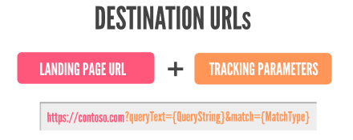

# What are Upgraded URLs and how do I upgrade?

If you have set up [tracking in Microsoft Advertising](./hlp_BA_CONC_UpgradeURL_WhatIsTracking.md) by adding URL parameters to your destination URLs, you will be interested in Upgraded URLs.

Upgraded URLs separate the landing page URL from the tracking or URL parameters so if you want to edit your URL parameters, your ad doesn't have to go through another editorial review. It also allows you to define a separate mobile landing page URL if you have a website that is optimized for smaller devices.

||
|---|
|**To replay animation, in your browser, click Refresh or Reload.**|

The 4 new fields added with Upgraded URLs are **final URL**, **mobile URL**, **tracking template**, and **custom parameters**. A tracking template can be added to an account, campaign, ad group, ad, keyword and Sitelink Extension. When your ad is served the lowest level tracking template will be appended to your landing page URL. We recommend setting the tracking template at the account level so that it is applied to all campaigns, ad groups, etc.

## Benefits of Upgraded URLs

- **More efficient tracking management:**  Manage and update tracking information of multiple URLs with a single shared tracking template. Turn hundreds or thousands of URL edits into one quick change.
- **Less down time; more conversions and clicks:**  Updates to tracking templates don't require an editorial review. This means your ads keep on running, so you don’t lose out on potential conversions.
- **Additional tracking insights:**  Ability to add both [URL parameters](./hlp_BA_CONC_UpgradeURL_URLParameters.md) and [custom parameters](./hlp_BA_CONC_UpgradeURL_TrackTemplateCustomParam.md) to your tracking template      to gain additional insights about the source of your ad clicks.

## How to upgrade

We have two different ways that you can upgrade your existing destination URLs to Upgraded URLs.

> [!IMPORTANT]
> If you use a tool provider or agency to manage your ads, check with them to take advantage of any upgrade support and documentation they might offer specific to their platform and service.

## Import from Google Ads in either Microsoft Advertising or Microsoft Advertising Editor
The easiest way to upgrade your account URLs is to use **Import from Google Ads** in either Microsoft Advertising or Microsoft Advertising Editor. Here are instructions for importing in Microsoft Advertising.

1. In Microsoft Advertising, click **Import Campaigns** or **Import**, and then click **              Import from Google Ads            **.
1. Click **Sign in to Google**.
1. Enter your Google sign-in information, click **Sign in** and then **Accept**.
1. Select the Google Ads campaigns you want to import, then click **Continue**.
1. Under **Choose Microsoft Advertising account & import options**, do the following:
   - Choose the Microsoft Advertising account you want to import to.
   - Choose the appropriate time zone.
   - Under **What to import**, select **Account-level URL options**. The account level tracking template will appear under the checkbox.
   - Choose the options you want for **Bids and budgets**.
   - Choose the options you want for **Landing page URLs**.
   - Choose the options you want for **Tracking templates**.

1. Click **Import**.

That's it! Since Google Ads uses Upgraded URLs, all your final URLs, mobile URLs, tracking templates, and custom parameters are added to Microsoft Advertising. As with any import, you will want to review the Campaign settings to make sure they are set up as you like. To learn more see, [What gets imported from Google Ads](./hlp_BA_CONC_ImportWhatInfo.md)

## Move existing destination URLs to final URL/tracking template using Microsoft Advertising Editor
You can export your destination URLs, separate the tracking information from the final URLs, and then upload using [Microsoft Advertising Editor](./hlp_BA_CONC_AboutDesktop.md).

1. Open your Microsoft Advertising account in the latest version of Microsoft Advertising Editor.
1. Select **Export** and then **Export whole account**.
1. In the file, make sure you can see the **Destination URL**, **Final URL**, and **Tracking Template** columns. If you don't see the columns, you can add the columns to the file.
1. In the **Destination URL** column, copy the tracking portion of your destination URL and paste it into the **Tracking template** column. Then insert {lpurl} where your original landing page URL once appeared.
1. In the **Destination URL** column, copy the landing page portion of your destination URL and paste it into the **Final URL** column.
1. Delete the contents of the destination URL column. This column should be empty before you import the file.
1. Optional: Enter a mobile URL in the **Mobile Final URL** column.
1. Optional: Enter custom parameters in the **Custom parameter** column.
1. Save the file.
1. In Microsoft Advertising Editor, select **Import** and then **Import from file**.
1. Verify that the Upgraded URL columns are correctly mapped to the Microsoft Advertising fields.
1. Select **Post** to save the changes to Microsoft Advertising.

> [!NOTE]
> In Microsoft Advertising, you can set tracking templates at the account-level, so that you only need to update it once and it applies to all your campaigns. In Microsoft Advertising Editor, you can't set an account-level tracking template so you need to do this in Microsoft Advertising. To learn more, see [How do I create an account tracking template?](./hlp_BA_CONC_UpgradeURL_TrackTemplateGlobalParam.md).

