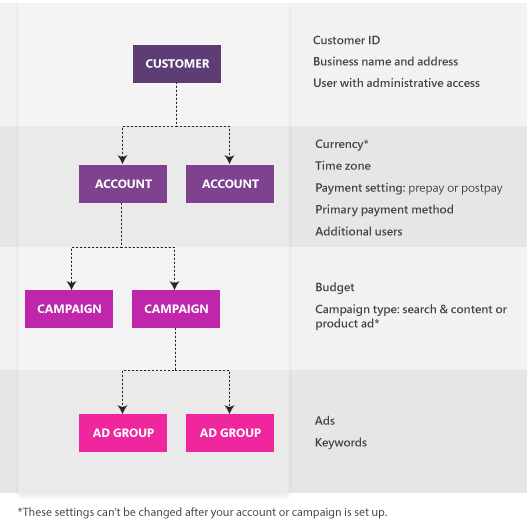

# How is my Upgraded URL created?

Upgraded URLs separates the landing page URL from the URL parameters. When your ad is served, Microsoft Advertising combines the different fields to create your URL. The following URL expansion rules define which fields are used.

To understand the rules, you first need to understand how Microsoft Advertising is structured. Here is the Microsoft Advertising structure from highest to lowest:

Now that you know the structure, here are the rules that define how the URLs are created:

## Which URL is used

You can add URLs at three different levels (from highest to lowest):

- **Ad:**  Use the final URL or mobile URL defined in the ad.
- **Keyword:**  Use the final URL or mobile URL defined at the keyword level or default to the ad final or mobile URL.
- **Sitelink Extension:**  Use the final URL or mobile URL defined at the Sitelink Extension.

> [!NOTE]
> Mobile URLs are only used if the ad is being served on a mobile device.
> App URLs are reserved for future use.

## Which tracking template is used

When applying the tracking template, Microsoft Advertising will use the tracking template defined at the lowest Microsoft Advertising entity. For example, if you have a tracking template defined at the campaign and ad level, the tracking template at the ad level will be applied.

The entity hierarchy from highest to lowest is: **Account** > **Campaign ** > **Ad group** > **Ad** > **Keyword** > **Sitelink Extension**.

** Example: Override an ad tracking template with a keyword tracking template**

If the ad tracking template is:  {lpurl}?ad={adid}

And the keyword tracking template is: {lpurl}?ad={adid}&amp;keyword={targetid}

Microsoft Advertising will use the keyword tracking template: {lpurl}?ad={adid}&amp;keyword={targetid}

When your ad is served, Microsoft Advertising:

- Replaces the {lpurl} with your final URL, www.contoso.com
- Replaces the variable {adid} with the ad id, 15701653091
- Replaces the variable {keyword} with the target id, kwd-123

The landing page URL would look like this: www.contoso.com?ad=15701653091&amp;keyword=kwd-123

If there is no tracking template found when your ad is served, the default {lpurl} will be used.

## Advanced expansion URL examples
If your account structure looks like the following, these examples are ways that your URLs can be created using the URL expansion rules:

Account - Campaign A

&nbsp;&nbsp;-Ad group A: Ad A, Keyword A (flowers), Keyword B (shoes)

&nbsp;&nbsp;-Ad group B: Ad B, Ad C, Keyword C (laptops)

Sitelink Extension A

|Entity|Tracking template|Final URL and Mobile URL|Custom parameters|
|---|---|---|---|
|Account|http://account-tracking.com/?{_id}&amp;url={lpurl}|||
|Campaign A|||{_campaign}=CampaignA|
|Ad Group A|http://adgroup-a-tracking.com/?{_campaign}&amp;url={lpurl}&amp;{_id}||{_id}=AdGroupA|
|Ad Group B|||{_id}=AdGroupB|
|Ad A||Final URL: http://contoso.com/Ad-A?{keyword}{ignore}&amp;{_id}&amp;{_campaign}||
|Ad B||Final URL: http://contoso.com/Ad-B?{keyword}{ignore}&amp;{_id}|{_id}=AdB|
|Ad C|http://ad-c-tracking.com/?{_campaign}|Final URL: Ad URLs always need a Final URL||
|Keyword A - flowers||Final URL:  http://contoso.com/Keyword-A?{keyword}{ignore}&amp;{_campaign} Mobile URL: http://m.contoso.com/Keyword-A?{keyword}{ignore}&amp;{_id}|{_id}=KeywordA|
|Keyword B - shoes||||
|Keyword C - laptops||||
|Sitelink Extension A||Final URL: http://contoso.com/Sitelink-A?{keyword}{ignore}&amp;{_campaign} Mobile URL: http://m.contoso.com/Sitelink-A?{keyword}{ignore}&amp;{_id}||

## Example #1 - Ad A is triggered by Keyword A

<table>
  <tr>
    <th scope="col">Property</th>
    <th scope="col">Value</th>
    <th scope="col">Inherited from</th>
  </tr>
  <tr>
    <th scope="row">Tracking template</th>
    <td>
        http://adgroup-a-tracking.com/?{_campaign}&amp;url={lpurl}&amp;{_id}
      </td>
    <td>Ad Group A</td>
  </tr>
  <tr>
    <th scope="row">Final URL</th>
    <td>
        http://contoso.com/Keyword-A?{keyword}{ignore}&amp;{_campaign}
      </td>
    <td>Keyword A</td>
  </tr>
  <tr>
    <th scope="row">Mobile URL</th>
    <td>
        http://m.contoso.com/Keyword-A?{keyword}{ignore}&amp;{_id}
      </td>
    <td>Keyword A</td>
  </tr>
  <tr>
    <th scope="row">Custom parameters</th>
    <td>{_campaign}=CampaignA 
        {_id}=KeywordA
      </td>
    <td>Campaign A 
      Keyword A
      </td>
  </tr>
  <tr>
    <th scope="row">Expanded URL</th>
    <td>
        Desktop: http://contoso.com/Keyword-A?flowers&amp;CampaignA 
        Mobile: http://m.contoso.com/Keyword-A?flowers&amp;KeywordA
      </td>
    <td>-</td>
  </tr>
  <tr>
    <th scope="row">Expanded tracking template</th>
    <td>
        http://adgroup-a-tracking.com/?CampaignA&amp;url={lpurl}&amp;KeywordA
      </td>
    <td>-</td>
  </tr>
  <tr>
    <th scope="row">Expanded serving URL</th>
    <td colspan="2">
        Desktop: http://adgroup-a-tracking.com/?CampaignA&amp;url=http%3A%2F%2Fcontoso.com%2FKeyword-A%3Fflowers%26CampaignA&amp;KeywordA 
        Mobile: http://adgroup-a-tracking.com/?CampaignA&amp;url=http%3A%2F%2Fm.contoso.com%2FKeyword-A%3Fflowers%26KeywordA&amp;KeywordA
      </td>
  </tr>
</table>

## Example #2 - Ad A is triggered by Keyword B

<table>
  <tr>
    <th scope="col">Property</th>
    <th scope="col">Value</th>
    <th scope="col">Inherited from</th>
  </tr>
  <tr>
    <th scope="row">Tracking template</th>
    <td>
        http://adgroup-a-tracking.com/?{_campaign}&amp;url={lpurl}&amp;{_id}
      </td>
    <td>
        Ad Group A
      </td>
  </tr>
  <tr>
    <th scope="row">Final URL</th>
    <td>
        http://contoso.com/Ad-A?{keyword}{ignore}&amp;{_id}&amp;{_campaign}
      </td>
    <td>
        Ad A
      </td>
  </tr>
  <tr>
    <th scope="row">Mobile URL</th>
    <td></td>
    <td>
        -
      </td>
  </tr>
  <tr>
    <th scope="row">Custom parameters</th>
    <td>
        {_campaign}=CampaignA 
        {_id}=AdGroupA
      </td>
    <td>
        Campaign A 
        Ad Group A
      </td>
  </tr>
  <tr>
    <th scope="row">Expanded URL</th>
    <td>
        http://contoso.com/Ad-A?shoes&amp;AdGroupA&amp;CampaignA
      </td>
    <td>
        -
      </td>
  </tr>
  <tr>
    <th scope="row">Expanded tracking template</th>
    <td>
        http://adgroup-a-tracking.com/?CampaignA&amp;url={lpurl}&amp;AdGroupA
      </td>
    <td>
        -
      </td>
  </tr>
  <tr>
    <th scope="row">Expanded serving URL</th>
    <td colspan="2">
        http://adgroup-a-tracking.com/?CampaignA&amp;url=http%3A%2F%2Fcontoso.com%2FAd-A%3Fshoes%26AdGroupA%26CampaignA&amp;AdGroupA
      </td>
  </tr>
</table>

## Example #3 - Ad B is triggered by Keyword C

<table>
  <tr>
    <th scope="col">Property</th>
    <th scope="col">Value</th>
    <th scope="col">Inherited from</th>
  </tr>
  <tr>
    <th scope="row">Tracking template</th>
    <td>
        http://account-tracking.com/?{_id}&amp;url={lpurl}
      </td>
    <td>
        Account
      </td>
  </tr>
  <tr>
    <th scope="row">Final URL</th>
    <td>
        http://contoso.com/Ad-B?{keyword}{ignore}&amp;{_id}
      </td>
    <td>
        Ad B
      </td>
  </tr>
  <tr>
    <th scope="row">Mobile URL</th>
    <td></td>
    <td></td>
  </tr>
  <tr>
    <th scope="row">Custom parameters</th>
    <td>
        {_id}=AdB 
        {_campaign}=CampaignA
      </td>
    <td>
        Ad B 
      Campaign A
      </td>
  </tr>
  <tr>
    <th scope="row">Expanded URL</th>
    <td>
        http://contoso.com/Ad-B?laptops&amp;AdB
      </td>
    <td></td>
  </tr>
  <tr>
    <th scope="row">Expanded tracking template</th>
    <td>
        http://account-tracking.com/?CampaignA&amp;url={lpurl}
      </td>
    <td></td>
  </tr>
  <tr>
    <th scope="row">Expanded serving URL</th>
    <td colspan="2">
        http://account-tracking.com/?CampaignA&amp;url=http%3A%2F%2Fcontoso.com%2FAd-B%3Flaptops%26AdB
      </td>
  </tr>
</table>

## Example #4 - Sitelink A is matched with Ad A triggered by Keyword A

<table>
  <tr>
    <th scope="col">Property</th>
    <th scope="col">Value</th>
    <th scope="col">Inherited from</th>
  </tr>
  <tr>
    <th scope="row">Tracking template</th>
    <td>
        http://adgroup-a-tracking.com/?{_campaign}&amp;url={lpurl}&amp;{_id}
      </td>
    <td>
        Ad Group A
      </td>
  </tr>
  <tr>
    <th scope="row">Final URL</th>
    <td>
        http://contoso.com/Sitelink-A?{keyword}{ignore}&amp;{_campaign}
      </td>
    <td></td>
  </tr>
  <tr>
    <th scope="row">Mobile URL</th>
    <td>
        http://m.contoso.com/Sitelink-A?{keyword}{ignore}&amp;{_id}
      </td>
    <td></td>
  </tr>
  <tr>
    <th scope="row">Custom parameters</th>
    <td>
        {_campaign}=CampaignA 
        {_id}=KeywordA
      </td>
    <td>
        CampaignA 
        KeywordA
      </td>
  </tr>
  <tr>
    <th scope="row">Expanded URL</th>
    <td>
        Desktop: http://contoso.com/Sitelink-A?flowers&amp;CampaignA 
        Mobile: http://m.contoso.com/Sitelink-A?flowers&amp;KeywordA
      </td>
    <td></td>
  </tr>
  <tr>
    <th scope="row">Expanded tracking template</th>
    <td>
        http://adgroup-a-tracking.com/?CampaignA&amp;url={lpurl}&amp;KeywordA
      </td>
    <td></td>
  </tr>
  <tr>
    <th scope="row">Expanded serving URL</th>
    <td colspan="2">
        Desktop:
        http://adgroup-a-tracking.com/?CampaignA&amp;url=http%3A%2F%2Fcontoso.com%2FSitelink-A%3Fflowers%26CampaignA&amp;KeywordA 

        Mobile:
        http://adgroup-a-tracking.com/?CampaignA&amp;url=http%3A%2F%2Fm.contoso.com%2FSitelink-A%3Fflowers%26KeywordA&amp;KeywordA
      </td>
  </tr>
</table>

## Example #5 - Sitelink A is matched with Ad A triggered by Keyword B

<table>
  <tr>
    <th scope="col">Property</th>
    <th scope="col">Value</th>
    <th scope="col">Inherited from</th>
  </tr>
  <tr>
    <th scope="row">Tracking template</th>
    <td>
        http://adgroup-a-tracking.com/?{_campaign}&amp;url={lpurl}&amp;{_id}
      </td>
    <td>
        Ad Group A
      </td>
  </tr>
  <tr>
    <th scope="row">Final URL</th>
    <td>
        http://contoso.com/Sitelink-A?{keyword}{ignore}&amp;{_campaign}
      </td>
    <td>
        Sitelink A
      </td>
  </tr>
  <tr>
    <th scope="row">Mobile URL</th>
    <td>
        http://m.contoso.com/Sitelink-A?{keyword}{ignore}&amp;{_id}
      </td>
    <td>
        Sitelink A
      </td>
  </tr>
  <tr>
    <th scope="row">Custom parameters</th>
    <td>
        {_campaign}=CampaignA 
        {_id}=AdGroupA
      </td>
    <td>
        Campaign A 
        Ad Group A
      </td>
  </tr>
  <tr>
    <th scope="row">Expanded URL</th>
    <td>
        Desktop: http://contoso.com/Sitelink-A?shoes&amp;CampaignA 
        Mobile: http://m.contoso.com/Sitelink-A?shoes&amp;AdGroupA
      </td>
    <td></td>
  </tr>
  <tr>
    <th scope="row">Expanded tracking template</th>
    <td>
        http://adgroup-a-tracking.com/?CampaignA&amp;url={lpurl}&amp;AdGroupA
      </td>
    <td></td>
  </tr>
  <tr>
    <th scope="row">Expanded serving URL</th>
    <td colspan="2">
        Desktop:
        http://adgroup-a-tracking.com/?CampaignA&amp;url=http%3A%2F%2Fcontoso.com%2FSitelink-A%3Fshoes%26CampaignA&amp;AdGroupA 
        Mobile: http://adgroup-a-tracking.com/?CampaignA&amp;url=http%3A%2F%2Fm.contoso.com%2FSitelink-A%3Fshoes%26AdGroupB%0A&amp;AdGroupA
      </td>
  </tr>
</table>

## Example #6 - Sitelink A is matched with Ad B triggered by Keyword C

<table>
  <tr>
    <th scope="col">Property</th>
    <th scope="col">Value</th>
    <th scope="col">Inherited from</th>
  </tr>
  <tr>
    <th scope="row">Tracking template</th>
    <td>
        http://adgroup-a-tracking.com/?{_campaign}&amp;url={lpurl}&amp;{_id}
      </td>
    <td>
        Ad Group A
      </td>
  </tr>
  <tr>
    <th scope="row">Final URL</th>
    <td>
        http://contoso.com/Sitelink-A?{keyword}{ignore}&amp;{_campaign}
      </td>
    <td>
        Sitelink A
      </td>
  </tr>
  <tr>
    <th scope="row">Mobile URL</th>
    <td>
        http://m.contoso.com/Sitelink-A?{keyword}{ignore}&amp;{_id}
      </td>
    <td>
        Sitelink A
      </td>
  </tr>
  <tr>
    <th scope="row">Custom parameters</th>
    <td>
        {_campaign}=CampaignA 
        {_id}=AdB
      </td>
    <td>
        Campaign A 
        Ad B
      </td>
  </tr>
  <tr>
    <th scope="row">Expanded URL</th>
    <td>
        Desktop: http://contoso.com/Sitelink-A?laptops&amp;CampaignA 
        Mobile: http://m.contoso.com/Sitelink-A?laptops&amp;AdB
      </td>
    <td></td>
  </tr>
  <tr>
    <th scope="row">Expanded tracking template</th>
    <td>
        http://adgroup-a-tracking.com/?CampaignA&amp;url={lpurl}&amp;AdB
      </td>
    <td></td>
  </tr>
  <tr>
    <th scope="row">Expanded serving URL</th>
    <td colspan="2">
        Desktop: http://adgroup-a-tracking.com/?CampaignA&amp;url=http%3A%2F%2Fcontoso.com%2FSitelink-A%3Flaptops%26CampaignA&amp;AdB 
        Mobile: http://adgroup-a-tracking.com/?CampaignA&amp;url=http://m.contoso.com/Sitelink-A?laptops&amp;AdBhttp%3A%2F%2Fm.contoso.com%2FSitelink-A%3Flaptops%26AdB%0A&amp;AdB
      </td>
  </tr>
</table>

## Example #7 - Sitelink A is matched with Ad C triggered by Keyword C

<table>
  <tr>
    <th scope="col">Property</th>
    <th scope="col">Value</th>
    <th scope="col">Inherited from</th>
  </tr>
  <tr>
    <th scope="row">Tracking template</th>
    <td>
        http://ad-c-tracking.com/?{_campaign}
      </td>
    <td>
        Ad C
      </td>
  </tr>
  <tr>
    <th scope="row">Final URL</th>
    <td>
        http://contoso.com/Sitelink-A?{keyword}{ignore}&amp;{_campaign}
      </td>
    <td>
        Sitelink A
      </td>
  </tr>
  <tr>
    <th scope="row">Mobile URL</th>
    <td>
        http://m.contoso.com/Sitelink-A?{keyword}{ignore}&amp;{_id}
      </td>
    <td>
        Sitelink A
      </td>
  </tr>
  <tr>
    <th scope="row">Custom parameters</th>
    <td>
        {_campaign}=CampaignA 
        {_id}=AdGroupB
      </td>
    <td>
        Campaign A 
        Ad Group B
      </td>
  </tr>
  <tr>
    <th scope="row">Expanded URL</th>
    <td>
        Desktop: http://contoso.com/Sitelink-A?laptops&amp;CampaignA 
        Mobile: http://m.contoso.com/Sitelink-A?laptops&amp;AdGroupB
      </td>
    <td></td>
  </tr>
  <tr>
    <th scope="row">Expanded tracking template</th>
    <td>
        http://ad-c-tracking.com/?CampaignA 

        Note: Not used since the static ad-level tracking template does not have a {lpurl} parameter.
      </td>
    <td></td>
  </tr>
  <tr>
    <th scope="row">Expanded serving URL</th>
    <td colspan="2">
        Desktop: http://contoso.com/Sitelink-A?laptops&amp;CampaignA 
        Mobile: http://m.contoso.com/Sitelink-A?laptops&amp;AdGroupB
      </td>
  </tr>
</table>

## Which custom parameter is used

When applying custom parameters, Microsoft Advertising will use the value of the custom parameter that is defined at the lowest Microsoft Advertising entity. For example, if you have a custom parameter defined at the ad level and one at the keyword level, the custom parameter at the keyword level will be applied.

The entity hierarchy from highest to lowest is: **Account** > **Campaign ** > **Ad group** > **Ad** > **Keyword** > **Sitelink Extension**.
> 
> [!NOTE]
> It's possible to have more than 3 custom parameters referenced in a single URL. Considering campaign, ad group, ad and keyword and extensions (5 entities), Upgraded URLs gives you the flexibility to define a unique name and value combination at each level which then can be referenced in your tracking template or URL.

There are also substitution rules that you should know about:

## Substitute parameters in final URL
Microsoft Advertising recognized parameters will be substituted with their respected values at the time of impression. Parameters that are not supported by Microsoft Advertising (example: {NotOfficiallySupported}) will not be substituted at the of impression and remain in the URL when the ad is clicked.

Custom parameters are named prefixing with an underscore. Example: {_market}. Custom parameters that do not have a matching name at the time of impression will always be substituted with an empty string. Custom parameters that are referenced in Destination URLs are always substituted with an empty string.

To learn more see, [Can I use custom parameters?](./hlp_BA_CONC_UpgradeURL_TrackTemplateCustomParam.md)

> [!NOTE]
> A parameter, enclosed by { } that tells Microsoft Advertising what data you want returned when an ad is clicked. The specific parameters to choose from are listed in the table below.

## Substitute {lpurl} in tracking template
After all the parameters have been substituted in the Final URL, the {lpurl} tag or one of its variations will be the tracking template. If there is not a tracking template found at the time of impression after walking the account hierarchy, the default value {lpurl} will be used which represents the Final URL of the ad at the time of impression.

To learn more, see the Tracking Templates only section [What tracking or URL parameters can I use?](./hlp_BA_CONC_UpgradeURL_URLParameters.md)

## Substitute parameters in tracking template
After the final URL has been substituted into the tracking template, any remaining parameters that are used in the tracking template will be substituted using the same notes as above.

