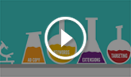
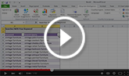
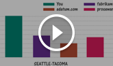
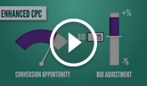

# Microsoft Advertising video tutorials

## Welcome to Microsoft Advertising Video

Our videos will guide you through Microsoft Advertising and many of its features. Whether you need help getting started, managing your existing ads or optimizing your campaigns, you've come to the right place.

## Videos to help you get started

Coming from Google Ads?

<bing_video id="video_newAdvertiser_01_differences">
                  
                  What sets Microsoft Advertising apart from Google Ads?
                </bing_video>

<bing_video id="video_newAdvertiser_02_import">
                  
                  Starting with Microsoft Advertising doesn't mean starting from scratch!
                </bing_video>

<bing_video id="video_newAdvertiser_03_check">
                  
                  There are just a few things you need to pay attention to...
                </bing_video>

<bing_video id="video_newAdvertiser_04_payment">
                  
                  Don't forget to set a payment method!
                </bing_video>

<bing_video id="video_newAdvertiser_05_next">
                  
                  You're on your way!
                </bing_video>

Get Results with Microsoft Advertising

<bing_video id="video_planGoal_GR">
                  
                  Plan a successful campaign
                </bing_video>

<bing_video id="video_reach_GR">
                  
                  Reach your customers
                </bing_video>

<bing_video id="video_ads_GR">
                  
                  Create ads that get results
                </bing_video>

<bing_video id="video_budget_GR">
                  
                  Set your budget and control your costs
                </bing_video>

<bing_video id="video_invest_GR">
                  
                  Invest in what works
                </bing_video>

Get Started in Microsoft Advertising

<bing_video id="video_gs1_basics">
                  
                  Campaign basics
                </bing_video>

<bing_video id="video_gs2_create">
                  
                  Create your campaign
                </bing_video>

<bing_video id="video_gs3_expand">
                  
                  Expand your campaign
                </bing_video>

<bing_video id="video_gs4_activate">
                  
                  Activate your campaign
                </bing_video>

<bing_video id="video_gs5_optimize">
                  
                  Optimize your campaign
                </bing_video>

More videos to help you get started

<bing_video id="video_quicktour">
                  
                  Take a tour of Microsoft Advertising
                </bing_video>

<bing_video id="video_plan_conc">
                  
                  Understanding the structure of a Microsoft Advertising account
                </bing_video>

## Videos to help you manage your ads

<bing_video id="video_google_import">
                  
                  Import campaigns from Google Ads into Microsoft Advertising
                </bing_video>

<bing_video id="video_bae">
                  
                  Welcome to Microsoft Advertising Editor
                </bing_video>

<bing_video id="video_bai">
                  
                  Build better keyword lists with Microsoft Advertising Intelligence
                </bing_video>

## Videos to help you improve campaign performance

<bing_video id="video_CompetitionTab">
                  
                  Stay ahead of the pack with the Competition Tab
                </bing_video>

<bing_video id="video_BidStrategies">
                  
                  Let Microsoft Advertising take care of your bids... with Bid Strategies
                </bing_video>

<bing_video id="video_InMarketAudiences">
                  
                  Know your audience - with In-market Audiences
                </bing_video>

<bing_video id="video_OfflineConversions">
                  
                  Get the whole picture with Offline Conversion tracking
                </bing_video>

<bing_video id="video_AdExtensions">
                  
                  Get more clicks by accessorizing your ads with ad extensions!
                </bing_video>

<bing_video id="video_EXTA">
                  
                  Engage with search users before they click on your ads
                </bing_video>

<bing_video id="video_UURLs">
                  
                  Upgraded URLs makes it easier to manage tracking URLs
                </bing_video>

<bing_video id="video_KeywordPlanner">
                  
                  Keyword Planner: Find new keywords and estimate their impact
                </bing_video>

<bing_video id="video_NativeAds">
                  
                  How to set up Microsoft Audience Ads (formerly known as Bing Native Ads)
                </bing_video>

<bing_video id="video_ConversionTracking">
                  
                  Conversion Tracking: Are your campaigns achieving your goals?
                </bing_video>

<bing_video id="video_Remarketing">
                  
                  Remarketing: Targeting people who have visited your site before
                </bing_video>

<bing_video id="video_AutoRules">
                  
                  Automate your campaigns
                </bing_video>

<bing_video id="video_qualityscores">
                  
                  Understanding quality scores and their impact
                </bing_video>

          

