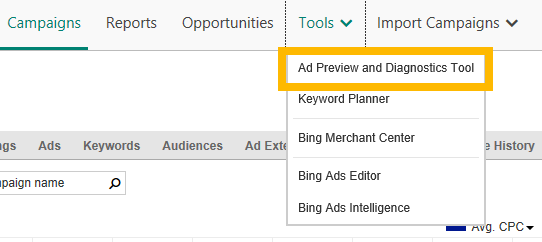

# Why can't I find my ad?

Can't find your ad on Microsoft Search Network search results pages? Here are the top Microsoft Advertising resources for figuring out what's going on.

 

## Check the delivery status

You can learn how to solve many issues by looking at the **Delivery** column of your **Campaigns**, **Ad Groups**, **Ads**, and **Keywords** tables. If there is an issue with delivery status, click the ellipsis icon  next to (or hover over) the status to see what you can do to fix the issue.

## Use our diagnosis tool

The Ad Preview and Diagnostics Tool can tell you why your ad may not be appearing. Find it by clicking **Tools**&nbsp;&gt;&nbsp;**Ad Preview and Diagnostics Tool**.

 
[Learn more about using the Ad Preview and Diagnostics Tool](./hlp_BA_PROC_UsingAdPreviewTool.md)

## Try these troubleshooters

The most likely culprits revolve around campaign, ad group, ad, or keyword status; your budget or bid settings; and your targeting settings.

Select the option below that best describes your situation to see possible reasons you're not seeing your ad, and some suggested actions:

## I created an ad but I don't see it on Microsoft Search Network search results pages.
Your ad may not be appearing for several reasons. Here are some things to check:

- **Did you just create this ad, keyword, or campaign?**  New ads and keywords go through a Microsoft Advertising editorial review before they can run.
   - It can take several hours for ads and keywords to be approved (most are approved and eligible within 24 hours).
   - Product ads are on a similar timeline. Offers from your feed are typically processed within 48 hours after we receive the feed. However, if you wait to create your product ad campaign until the feed is approved, that can take another 24 hours for the ads to be eligible to be served.
   - Learn more about the [editorial review](./hlp_BA_CONC_EditProcess.md) and [how to fix disapprovals](./hlp_BA_CONC_EditorialDisapprovalReasons.md).

- **Valid payment method** : Microsoft Advertising requires a payment method on file before your ads can display. For info on payment methods, see [Choosing a payment method for Microsoft Advertising](./hlp_BA_CONC_PaymentMethodsV2.md)
- **Targeting** : Your targeting settings may be keeping you from seeing your ad, if you are targeting other geographic areas, device types, ages, or genders. Also, if you have scheduled your ad to run only on certain hours of the day or days of the week, you may be looking for your ad at the wrong time. [Learn more about targeting](./hlp_BA_CONC_Targeting.md)
- **Enabled status** : Ads won't run if the related campaign, ad group, or keywords are not enabled. Take a look at the **Status** column of your **Campaigns**, **Ad Groups**, **Ads**, and **Keywords** tables and make sure nothing is unexpectedly paused. For information on changing statuses, see [Change your status, bid, and other settings](./hlp_BA_PROC_ChgSettings.md).
- **Account errors** : When an account has an error, the ads in it don't run. Any errors are displayed in the **Errors** column of the **Accounts &amp; Billing** page. [Learn more about account errors](./hlp_BA_CONC_AccountErrors.md)
- **Issue with a keyword** : Check the [Delivery status](./hlp_BA_CONC_EditorialStatus.md) of your keywords on the **Keywords** table. If a keyword's status is anything but **Eligible**, click the ellipsis icon  next to (or hover over) the status for an explanation of the problem and how to fix it.

## I created my ad days ago, everything's been approved and has an enabled status, and my payment method is valid. But I still haven't seen my ad.
Here are some possible reasons why you're not seeing your ad, and what you can do:

- **Poor ad position due to low keyword bids** : If your bids are too low for you to compete effectively in the marketplace, your ads may not be appearing on the first page of search results. They may not even be getting any impressions. Use the [Ad Preview and Diagnostics Tool](./hlp_BA_PROC_UsingAdPreviewTool.md) to confirm that your ad's delivery can be resolved by raising the bid. If this is the case, the tool will suggest "Bid too low" in its **Reason for not showing** column.            The tool will then suggest a bid to test (you can also enter your own test bids), allowing you to check if your ad will show based on the different bids. To learn more, see [Did I bid high enough?](./hlp_BA_CONC_BiddingStrategy.md) For information on changing your bids, see [Set your campaign budget and bid amounts](./hlp_BA_CONC_NewAd_SetCampaignBudgetAndBidAmounts.md).
- **Low budget** : Ads stop running when your daily budget is depleted. Daily budgets refill at the start of the next day. For more info, see [What are my budget options?](./hlp_BA_CONC_AboutBudgetType.md)
- **Targeting** : Your targeting settings may be keeping you from seeing your ad, if you are targeting other geographic areas, device types, ages, or genders. Also, if you have scheduled your ad to run only on certain hours of the day or days of the week, you may be looking for your ad at the wrong time. [Learn more about targeting](./hlp_BA_CONC_Targeting.md)
- **Feed file not uploaded correctly (Product ads)** : You must have a valid feed file uploaded successfully before your ads will display. For more information, see [About Microsoft Shopping Campaigns feed files](./hlp_BA_CONC_BMCWhatIsCatalog.md).

## I know my ad's running because I saw it yesterday, but now I can't find it.
There are several reasons why you may not be seeing your ad today:

- **Enabled status** : We list this issue multiple times in this article because it can be a very common issue. Ads won't run if the related campaign, ad group, or keywords are not enabled. Consider any changes you might have made since you last saw your ads. Did any of these changes inadvertently pause some of your keywords or ad groups? Go check — you might be surprised. For information on changing keyword and ad group statuses, see [Change your status, bid, and other settings](./hlp_BA_PROC_ChgSettings.md). Also make sure you don't have any [account errors](./hlp_BA_CONC_AccountErrors.md).
- **Ad position** : If your ad appeared on the first search results page but isn't there now, first try checking the second (and later) pages. Changes by your competitors to their bids could be affecting your ad position — for example, causing your ad to drop to another search results page. See [What is "ad position"](./hlp_BA_CONC_WhatIsAdPosition.md) to learn more.
- **Quality score** : Check the **Qual. score** column of your **Keywords** table. If the quality score of a keyword is below 6, your ads may have limited eligibility to be served for that keyword. For more information, see [Quality score in depth](./hlp_BA_CONC_AboutQualityScore.md).
- **Budget issues** : Ads stop running when your campaign budget is depleted.
   - The daily - standard budget option distributes impressions throughout the day, so you may not see your ad because other people just saw it. [Learn more about budget options](./hlp_BA_CONC_AboutBudgetType.md)
   - If you use a shared budget, it's possible that another campaign depleted your budget. [Learn more about shared budgets](./hlp_BA_CONC_SharedBudgets.md)

- **Targeting** : Have you changed your targeting settings recently? Your targeting settings may be keeping you from seeing your ad, if you are targeting other geographic areas, device types, ages, or genders. Also, if you have scheduled your ad to run only on certain hours of the day or days of the week, you may be looking for your ad at the wrong time. [Learn more about targeting](./hlp_BA_CONC_Targeting.md)

## Why isn't the Ad Preview and Diagnostics Tool showing my ad?
The [Ad Preview and Diagnostics Tool](./hlp_BA_PROC_UsingAdPreviewTool.md) gives you a preview of which ads are appearing on the first search results page. If your ad is lower than ad position 9, the tool will not preview it for you. For info on improving your ad position, see [Get my ad to the top of the search results page](./hlp_BA_CONC_ImproveAdPosition.md).
## I'm targeting my ads at potential customers in Paris, France, but my ads aren't appearing.
If your ad group is targeted to specific geographical locations, times of day, or other target settings, you need to search using those same settings. For more information, see [How can I get my ads in front of my customers?](./hlp_BA_CONC_Targeting.md) and [What are keyword match types, and how do I use them?](./hlp_BA_CONC_MatchOptions.md)

 
> [!IMPORTANT]
> Still having trouble finding your ad? Get some [free Microsoft Advertising coaching](https://go.microsoft.com/fwlink?LinkId=398320), or you can always [contact support](https://go.microsoft.com/fwlink?LinkId=398371).

 
## Once you find your ad

Here are some other resources to make sure you're getting the most out of Microsoft Advertising:

- **Keyword Planner** : Make sure you're bidding on the right keywords and that you're bidding effectively. [Learn more](./hlp_BA_CONC_KeywordPlannerIntro.md)
- **Performance Insights** : Review significant fluctuations in your accounts and campaigns, identify the possible causes, and suggest actions to optimize them.  [Learn more](./hlp_BA_CONC_PerformanceInsights.md)
- **Share of Voice Report** : See how many ad impressions and clicks you're missing out on. [Learn more](./hlp_BA_CONC_ImprShareReports.md)

 

