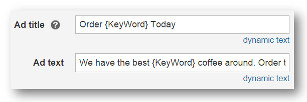
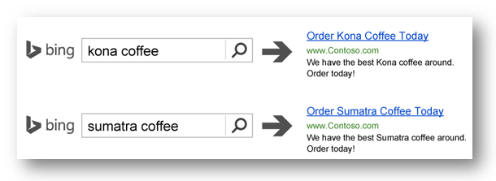

# Dynamic text - Definition

## What it is

Dynamic text is a word or phrase that is automatically inserted into your ad title, ad text, or display URL.

## Why it's important

Using dynamic text helps create more relevant ad copy and tailors ads to a user's actual searched term. This can help you get more clicks and conversions.

## What you need to know

There are different types of dynamic text:

- **Keyword:**  Customize your ad title or text based on search queries
- **Display URL:**  Change the display URL based on search queries

You can also use dynamic text to update multiple ads ad once. Details are in the links below.

## An example

Here's how you create an ad with dynamic text:

And here's the result:

 
{KeyWord} is an example of dynamic text. When you use {KeyWord} in your ad title and text, Microsoft Advertising automatically inserts your keyword, or the term the customer searched on that matches your keyword, into the ad when that ad is displayed.

## Get more information

- [Automatically customize your ads with dynamic text parameters](./hlp_BA_CONC_AboutParameters.md)
- [Dynamic text: Capitalization of the keyword placeholder](./hlp_BA_CONC_AboutParametersKeyWord.md)

