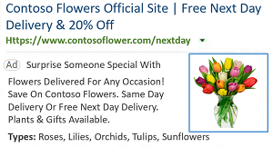
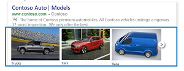

# Image extensions: Add images to your ad

Adding visual elements to your ads not only helps them stand out, but also gives customers a better idea of what to expect when they click your ad. Adding an image extension (with one or more images) to your ad is free and as with any ad, you only pay when your ad is clicked.

 
## Single-image layout

Up to six images can be associated with each account, campaign, or ad group and all uploaded images will be rotated one at a time. The single-layout image displays on desktop displays as a rectangle, cropped in various aspect ratios. Single-layout images displayed on mobile are cropped to a 1:1 square aspect ratio.

 

 
**Ability to set up in:** All Bing markets

**Serves in**: All Bing markets, except China

 
## Multi-image layout

On desktop devices, three images are displayed, and the user can advance the carousel to see more. On mobile devices, one image is displayed with the option for the user to swipe to see more.

 

**Ability to set up in:**  All Bing markets

**Serves in** : All Bing markets, except China

 
## Get to know image extensions

Before you [create your image extension](./hlp_BA_CONC_AboutAdExtensions.md), consider how you would like them to appear in your search ad. Both layout types can appear as the first or second ad on the mainline only. Both layout options can be used with any keyword. Keep in mind, though, that keywords must be relevant to the images and ad copy. Keywords can include brand, product, and category terms.

- **Single-image layout** : If you only have one image to share (such as your logo), choose the **Single Image Extension** layout. You can select multiple images and we'll shown one at a time in your ads.
- **Multi-image layout** : If you want us to show multiple images in an ad, choose the **Multi-Image Extension** layout. For this extension to serve, a minimum of five images must be chosen and you must select at least four image extensions to enable multi-image extensions. Multi-image extensions can appear with other ad extensions, however they will not serve with sitelink, enhanced sitelink, dynamic product, dynamic data, or price extensions. If you want to maximize multi-image extension delivery, we recommend adding them to campaigns or ad groups that do not have these other type of extensions.

> [!NOTE]
> You can associate up to 1,000 campaigns and 1,000 ad groups with image extensions.

Also consider our image policies and how to best leverage stock images:

- [Image guidelines and policies](./hlp_BA_CONC_ImageGuidelines.md)
- [About stock images](	hlp_BA_CONC_StockImages)

## Get started with image extensions

[!INCLUDE [AboutAdExtensions](./includes/AboutAdExtensions.md)]

