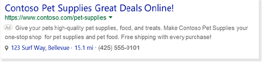
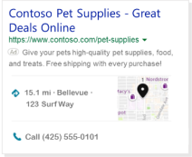

# Location Extensions: Show your business address

When you enable a Location Extension, you can choose to show the address of your business location that is closest to the customer and also include a local phone number. Better yet, if the customer is viewing your ad on a smartphone, they can click that number to give you a call.

             
A particularly powerful feature of Location Extensions is that the address shown to the customer is typically the business location that is closest to them. If you have multiple business locations set up for your campaign, Microsoft Advertising will display the address and phone number for the location that is closest to the customer. The radius for the location display is about 50 miles. If you don't have a business location entered that is within 50 miles of the customer, no location will be shown in your ad.

In addition to showing your address, Location Extensions also offer iPhone users an easy way to call for a ride to your business from your ad. The [Get a Ride feature](./hlp_BA_CONC_GetARideExtension.md) for Location Extensions is like an annotation, where it could be automatically included and requires no additional set-up. A customer can click the ride icon in your ad that launches the Uber app, and if they are logged in to their Uber account, the destination will be pre-populated with your address. If you want to opt out of Get a Ride, please contact your Account Manager or [contact support](https://go.microsoft.com/fwlink?LinkId=398371).

Locations that you create apply to all your campaigns within the manager account. Also, note that you enable Location Extensions at the campaign level and they get applied to all ad groups and ads in the campaign.

**Ability to set up in:** All Bing markets, except Belgium and China

**Serves in**: All Bing markets, except Belgium and China.

Location Extensions can be created or edited at the account or campaign level. To select the level you want to make the changes in, select **Account** or **Campaign** below the **Ad Extensions** tab.

## Get to know Location Extensions

- Business address can be displayed without a phone number but phone numbers cannot be displayed on their own.
- Location Extensions are displayed on Bing but not on the syndicated network.
- All business locations can include the same phone number.
- Bulk support of Location Extensions is only available through the Microsoft Advertising Campaign page and the Bing Ads API.
- Location Extensions can be added at the account level and used for different campaigns.
- Premium rate and charge-free phone numbers are not allowed.

## What if I have multiple business locations?

If you have multiple locations for business, Location Extensions will show the nearest business location within 50 miles (80 kilometers) or the value selected for radius targeting.

 
## Get started with Location Extensions

Head over to the [About ad extensions](./hlp_BA_CONC_AboutAdExtensions.md) page for instructions to:

- Add, edit, and delete ad extensions
- Associate ad extensions to campaigns and ad groups

