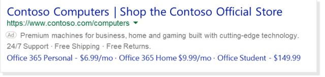
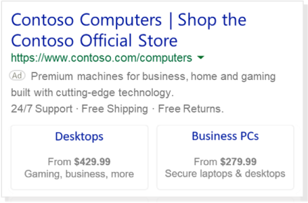

# Price Extensions: Add prices of your products or services

Price Extensions are a pay-per-click extension that display your products or services, along with their corresponding prices, to searchers. Price Extensions will only show on ads listed at the very top of the results page. This allows searchers to see exactly what they’re looking for when they’re looking for it. This helps to increase your clicks and drive potential customers straight to your converting experiences.

 

 
An account, campaign, or ad group can have up to 20 Price Extensions. Like any extension, Price Extensions are free to add to your ad and may not always show for every query. You only pay the standard ad headline cost-per-click for clicks you receive on Price Extensions.

> [!NOTE]
> All Price Extensions are subject to an editorial review to ensure that the listed prices match the price shown on your landing pages. [Learn more](./hlp_BA_CONC_EditProcess.md) about editorial reviews.

Here are the definitions for the different fields you need to fill in for your Price Extensions.

|Field|Definition|
|---|---|
|Language|The language you'll write your Price Extension text. The Price Qualifier (optional) and Unit (optional) will be automatically translated into this language.|
|Type|The category that best defines your Price Extension items and specifies the corresponding editorial checks which will be applied to them.|
|Currency|The currency symbol that will be displayed in the ad (for example, $ for USD).            You can use the following currencies for Price Extensions: ARS, AUD, BRL, CAD, CHF, CLP, CNY, COP, DKK, EUR, GBP, HKD, INR, MXN, NZD, PEN, PHP, PLN, SEK, SGD, TRY, TWD, USD, VEF, and ZAR.|
|Header|Similar to ad headline, the header introduces your products or services and appears as a clickable link that directs customers to your final URL. Your header can have up to 25 characters.|
|Description|Additional information about your products or services. Your description can have up to 25 characters. Please note, that you can include 3rd party retailers in your price extension by using the following text pattern: Product name. Product type. – 3rd party retailer name. Price.|
|Price Qualifier (optional)|Indicate prices for a given product or service, starting from a specific price and up to a maximum price. Please note, that you can choose any price value starting at zero. Negative values, however, are restricted.|
|Unit (optional)|Allows you to specify the service cost in terms of hour, day, week, etc.|
|Final URL|The landing page where customers will be taken after clicking your header. Prices on this page should accurately reflect the prices specified in the extension.|
|Mobile final URL|An optional landing page link that is only displayed on mobile devices. If no mobile final URL is provided, the default final URL will be used.|

> [!IMPORTANT]
> All extension details must adhere to our [Price Extension policies](https://go.microsoft.com/fwlink?LinkId=746651).
> Each Price Extension must have a minimum of three items and a maximum of eight items (Header, Description, Price qualifier, Price, Unit, Final URL, or Mobile final URL).

**Availability**: All Bing markets, except China, Taiwan, and Hong Kong.

## Get started with Price Extensions

Head over to the [About ad extensions](./hlp_BA_CONC_AboutAdExtensions.md) page for instructions to:

- Add, edit, and delete ad extensions
- Associate ad extensions to campaigns and ad groups

